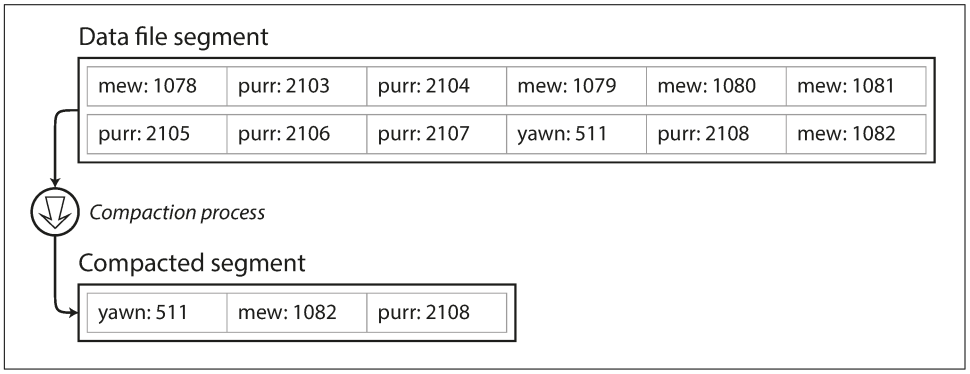
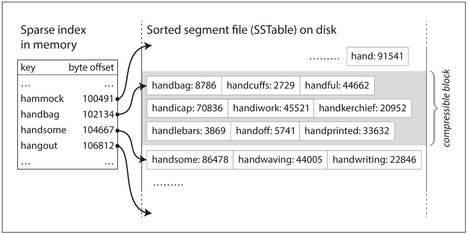
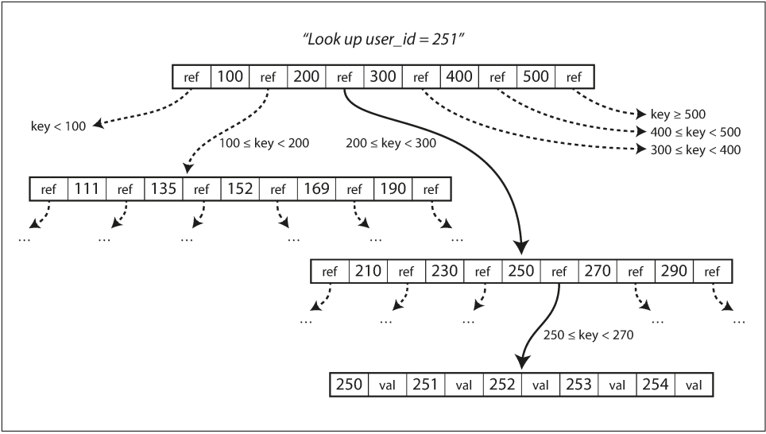

# chapter 3. 저장소와 검색
- 요약: 저장소엔진 (storage engine) 의 내부와 데이터베이스가 디스크에 어떻게 배치되는지 알아봄. 다양한 저장소 엔진은 서로 다른 작업 엔진에 최적화되며 올바른 저장소 엔진을 선택하는 것은 성능에 큰 영향을 줌

- DB가 데이터를 저장하는 방법과 다시 찾는 방법 설명
    - application 에 적합한 엔진을 선택
    - 데이터 구조
        - 로그 구조(log-structured) 계열 저장소 엔진
        - 페이지 저향(page-oriented) 계열 저장소 엔진 - B트리(B-tree) 등)
    
    

- 데이터베이스를 강력하게 만드는 데이터 구조
    - 색인의 구조
        - 색인은 기본 데이터(primary data)에서 파생된 추가적인 구조다. (DB 내용에는 영향X)
        - 색인은 질의 성능에 영향을 준다.
        - 쓰기 과정에서 오버헤드가 발생한다.
        - 데이터를 쓸 때마다 색인을 갱신해야 하기 때문이다.
    - 색인의 선택
        - 색인 선택에는 **트레이드오프(trade-off)**가 발생한다.
        - 색인을 잘 선택했다면 읽기 질의 속도가 향상시킨다.
            - 모든 색인은 쓰기 속도를 떨어 뜨린다.

- 해시 색인
    - 사전 타입(Dictionary type) 매우 유사하고, Hash map(Hash table)으로 구현

    - 디스크 공간 부족의 해결책
        - 특정 크기에 도달하면 세그먼트 파일을 닫고 새로운 세그먼트 파일에 이후 쓰기를 수행한다. 그러고 세그먼트 파일에 대해 **컴팩션(compaction)**을 수행한다.
        - 컴팩션(compaction)란? 로그에서 중복된 키를 버리고 각 키의 최신 갱신 값만 유지
            
            
    - 추가 전용(append-only) 로그의 이점
        - 순차적인 쓰기 작업이기 때문에 보통 무작위 쓰기보다 빠름
        - 추가 전용이나 불변이면 동시성과 고장 복구가 간단
        - 병합은 시간이 지남에 따라 조각화되는 데이터 파일 문제를 피함
    - 해시테이블은 문제
        - 메모리에 저장하므로 키가 너무 많으면 문제
        - range query

- SS (Sorted String Table) 테이블 & LMS (Log-Structred Merge-Tree, LSM) 트리
    - SS테이블 :  각 키가 병합된 세그먼트 파일 내에는 한번만 나타남 (이미 컴팩트 과정이 이를 이미 보장).
        1. 위의 그럼서 봤던 것처럼 여러 sement 파일을 하나로 병합
        2. in memory 색인 이용
            
        3. 읽기 요청은 요청 범위 내에서 key-value 를 스캔. 따라서 record를 블록으로 그룹화 하고 디스크에 쓰기 전에 압축한다. 그러면 key는 압축된 블록의 시작을 가리킴 (disk 공간을 절약하는 것 외에도 I/O를 줄임)

    - SS테이블에서 LSM 트리 만들기
        - levelDB, rocksDB 에서 사용. cassandra, hbase 도 유사 저장 엔진 사용
        - LSM 저장소 엔진: 정렬된 파일 병합과 컴팩트 원리를 기반으로 하는 저장소 엔진
            - 백그라운드에서 연쇄적으로 SS 테이블을 지속적으로 병합

    - 성능 최적화
        - **블룸 필터(bloom filter)**라는 것을 사용한다. (블룸 필터는 집한 내용을 근사한(approximating) 메모리 효율적 구조이다. 키가 데이터베이스에 존재하지 않음을 알려주므로 불필요한 디스크 읽기를 줄일 수 있다.)
        - 컴팩션
            - 크기 계층 컴팩션: 상대적으로 좀 더 새롭고 작은 SS테이블을 오래되고 큰 SS테이블에 연이어 병합한다.(HBase, 카산드라)
            - 레벨 컴팩션: 키 범위를 더 작은 SS테이블로 나누고 오래된 데이터는 개별 “level” 로 이동하기 때문에 컴팩션을 점진적으로 진행해 디스크 공간을 덜 사용 (level DB, rocks DB)

- B 트리
    - 4KB 크기(때로는 더 큰)의 고정 블록이나 페이지로 나누고 한번에 하나의 페이지에 읽기 또는 쓰기를 한다.
디스크가 고정 크기 블록으로 배열되기 때문에 하드웨어와 더 밀접한 관련이 있다.
        
    - root, leaf page, branching factor (한 페이지에서 하위 페이지 참조하는 수)
        - n개의 키를 가진 B 트리는 깊이가 항상 O(logn) 이다. 대부분 DB에서 깊이는 3~4 단계면 충분하다.
        - 분기 계수 500의 4KB페이지의 4단계 트리는 256TB 까지 저장

    - 데이터 고장시 복구
        - 쓰기전 로그(Write-ahead log, WAL, (재실행 로그, redo log)라고도 함)라는 데이터 구조를 추가 B-Tree를 구현
    - B 트리 최적화 (B-tree optimizations) 
        - 페이지 덮어쓰기와 WAL을 유지하는 대신, 쓰기 시 복사 방식(copy-on-write scheme)을 사용한다. 변경된 페이지는 다른 위치에 기록하고 트리 상위 페이지의 새로운 버젼을 만들어 새로운 위치를 가르킴

- 중간정리 (btree vs LMS)
    - LSM은 쓰기에 빠르고 B-tree 는 읽기에 더 빠르다. 읽기가 보통 LSM 트리에서 더 느린 이유는 컴팩트 단계에 있는 여러 데이터 구조와 SS 테이블을 확인해야 하기 때문
    - B-Tree
        - 색인은 모든 데이터 조각을 최소한 두번 기록한다.
        - 쓰기 전 로그(WAL)에 한번, 트리 페이지에 한번(페이지가 분리될 때 다시 기록) 이다.
        - 해당 페이지 내 몇 byte 만 바뀌어도 전체 페이지를 기록해야 하는 오버헤드가 존재하기도 한다.
        - 일부 엔진은 전원 장애가 발생했을 때 일부만 갱신된 페이지로 끝나지 않게 두번 덮어 쓴다.(innoDB)
        - 키가 색인의 한 곳에만 정확하게 존재
    - LSM (로그 구조화 색인)
        - SS테이블의 반복된 compaction, merge 로 여러번 다시쓴다.
        - LSM 트리는 B 트리보다 쓰기 처리량을 높게 유지
        - LSM 트리는 압축률이 좋다 (더 적은 파일을 생성, B tree 는 파편화가 생김)

- 기타 색인 구조
    - 보조 색인(secondary index)을 사용하기도 한다. 기본키와의 차이점은 키가 고유하지 않는다는 것이다. 즉, 같은 키를 가진 많은 로우(문서, 정점)가 있을 수 있다.
    - 이를 해결할 방법으로 색인의 각 값에 일치하는 row 식별자 목록을 만드는 방법 또는 row 식별자를 추가해서 각 키를 고유하게 만드는 방법이 있다.(대리키)
    - Rtree (special spatial index) : postGIS은 Rtree로 지리 공간 색인
    - 색(RGB)는 3차원 + 날짜,기온은 2차원 : vectorDB (postgresql)

- 색인 안에 값 저장하기
    - **클러스터드 색인(clustered index)** : 색인 안에 바로 색인된 로우를 저장
        - MySQL의 InnoDB의 경우 PK는 언제나 clustered index 이고 보조 색인은 기본키를 참조
    - 클러스터드 색인과 비-클러스터드 색인(non-clustered index) 사이의 절충안을 커버링 색인(covering index) 혹은 포괄열이 있는 색인(index with included column)이라고 함
        - index가 질의를 커버: 색인만을 이용해 질의에 응답 가능 

- 다중 칼럼 색인 (Multi-column indexes) 
    - 다중 컬럼에 동시에 질의할 때 사용
    - 다차원 색인은 지리 공간 데이터에 중요하게 사용되는데, 경위도에 대해 다음과 같은 이차원 범위 질의가 필요

- 전문 검색 색인과 퍼지 색인
    - 철자가 틀린 단어와 같이 유사한 혹은 애매모호한(fuzzy) 질의
        - 편집거리 (edit distance) 1: 한글자 추가나 삭제나 교체
        - 유한 상태 오토마톤으로 트라이(trie), 레벤슈타인 오토마톤 (levenshtein automation)

- 모든 것을 메모리에 보관
    - 안티 캐싱(anti-caching)은 메모리가 충분하지 않을 때 사용하는데 최근에 사용하지 않는 데이터를 디스크로
    - non-vlatile memory (NVM) 비휘발성 메모리

- 트랜젝션 처리나 분석
    - 온라인 트랜잭션 처리(OnLine Transaction Processing, OLTP)
        - 레코드가 사용자 입력을 기반으로 삽입되거나 갱신됨
    - 온라인 분석 처리(OnLine Analytic Processing, OLAP)
        - 데이터 분석 용도
        - 많은 수의 레코드를 스캔해 레코드당 일부 칼럼만 읽어 집계 통계

- 데이터 웨어하우징
    - OLTP 작업에 영향을 주지 않고 마음껏 질의할 수 있는 개별 데이터베이스
    - 회사 내의 모든 다양한 OLTP 시스템에 있는 데이터의 읽기 전용 복사본
    - ETL(Extract-Transform-Load)

- 분석용 스키마: 별 모양 스키마와 눈꽃송이 모양 스키마
    - row는 개별 이벤트를 담고, 차원 이벤트(테이블)는 (dimension table) 누가,언제,어디서,무엇을,어떻게,왜 담음
    - 별 모양 스키마(star schema - 차원 모델링 dimensional modeling)로 알려진 정형화된 방식을 사용한다.
        - 사실 테이블(fact table)이 가운데에 있고 차원 테이블로 둘러싸고 있는 모양사실 테이블(fact table)이 가운데에 있고 차원 테이블로 둘러싸고 있는 모양
        - 스타 스키마에는 비정규화된 차원 테이블이 있고, 눈송이 스키마에는 정규화된 차원 테이블이 있습니다.

- 컬럼 지향 저장소
    - 컬럼 지향 저장소: 모든 값을 하나의 로우에 저장하지 않고 모든 값(column)을 함께 저장
    - 컬럼 압축 : 데이터를 압축하면 디스크 처리량을 줄일 수 있다. 
        - 컬럼 저장소는 대개 압축에 적합
        - 컬럼의 데이터에 따라 다양한 압축 기법

- 메모리 대역폭과 백터화 처리 
    - 단일 명령 다중 데이터(Single Instruction Multi Data, SIMD) 명령을 사용
    - 벡터화 처리 (vectorized processing): 한 번에 처리하는 데이터의 양을 늘려서 CPU 사용률을 높이고 처리속도를 빠르게 하는 기법 비트 AND와 OR같은 연산자는 압축된 칼럼 데이터 덩어리를 바로 연산할 수 있게 설계

- 다양한 순서 정렬 
    - 데이터마다 서로 다른 방식으로 정렬해서 저장 → 질의를 처리할 때 패턴에 적합한 버전 사용 가능

- 칼럼 지향 저장소에 쓰기 
    - 칼럼 지향 저장소, 압축, 정렬은 모두 읽기에 더 빠르다.
    - 제자리 갱신(update-in-place) 불가
        - 쓰기를 위한 해결책은 LSM 트리 구조가 적절

- 집계: 데이터 큐브와 구체화 뷰 
    - 구체화 집계(materialized aggregate): SQL에 COUNT, SUM, AVG, MIN, MAX 같은 집계 함수
    - 구체화 뷰(materialized view): 원본 데이터를 변경하면 구체화 뷰를 갱신
    - 데이터 큐브(data cube) 또는 OLAP 큐브라고 알려려진 구체화 뷰는 일반화된 구체화 뷴의 특별한 사례

- 키워드
    - SS table, LMS, Btree, Rtree
    - index
    - hash
    - appendonly
    - column-Oriented

- 관련 자료 
    - ****Local key-value 스토리지가 고민일땐 RocksDB 어때? - 이동규_NE DAY 23.10****
        - https://www.youtube.com/watch?v=NsKvCCMuJdY

    - star vs snowflake schema
        - https://www.thoughtspot.com/data-trends/data-modeling/star-schema-vs-snowflake-schema
        - https://www.geeksforgeeks.org/difference-between-star-schema-and-snowflake-schema/