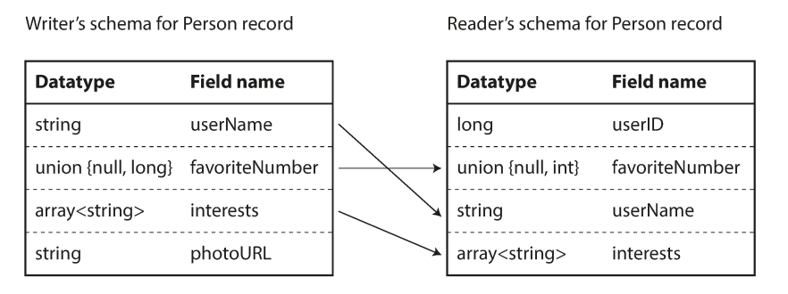

# chapter 4. 부호와 발전
- 요약: 다양한 데이터 부호화(encoding: 직렬화) 포맷을 비교한다. 애플리케이션 요구사항이 변경되고 시간이 지남에 따라 스키마를 변경해야 하는 환경에서 어떻게 사용되는지 살펴본다.

- **Application 코드가 바로 적용되지 않는 이유**
    - code의 update 방식은 rolling update 방식으로 진행된다. (게임과 같이 점검시간을 갖는 배포 제외)
    - client의 경우 업데이트를 바로 하지 않는 사용자도 있기 때문이다.

- **호환성**
    - 하위 호환성
        - 새로운 코드는 이전 코드가 기록한 데이터를 읽을 수 있어야 한다. (그나마 안어려움)
            
    - 상위 호환성
        - 이전 코드는 새로운 코드가 기록한 데이터를 읽을 수 있어야 한다. (적용이 어렵)

- 데이터 부호화 형식 
    - 데이터 구조는 CPU에서 효율적으로 접근하고 조작할 수 있게 최적화 됨
    - 인메모리 표현
        - 바이트열로의 전환을 부호화(직렬화 또는 마샬링).
        - 그 반대를 복호화 (파싱, 역직렬화, 언마샬링) 
    - 자바 직렬화는 성능 좋지 않고 비대하기로 유명

- JSON과 XML, 이진 변형 
    - SON, XML은 유니코드 문자열은 잘 지원, 그러나 이진문자열을 지원하지 않음. 이러한 결점에도 JSON, XML, CSV는 사용하기 충분하고 인기
    - Binary Encoding (이진 부호화): 공간이 훨씬 적게..

- thrift & protocol buffer (protobuf)
    - 두 프로토콜 모두, 스키마를 이용해 바이트수가 급격히 줄었다. 가장 큰 차이점은 필드이름 대신 필드 태그(1,2,3)을 포함 (스키마 정의에 나타난 숫자)

- 아브로 (Apache Avro)
    - 스리프트가 하둡의 사용 사례와 적합하지 않아 2009년 하둡에 하위 프로젝트로 시작
        - 두개의 스키마 (하나는 사람용 IDL, 하나는 기계용 json 기반)
        - 정확히 같은 스키마여야 올바르게 복호화

    - 쓰기 스키마와 읽기 스키마 
        - file, db, network를 통해 전송 목적으로 부호화하기 위해 사용
        - application이 빌드하는 동안 스키마 생성. 쓰기, 읽기의 스키마가 다를 수 있다.
        

- 데이터 플로 모델
    - DB: 미래의 자신에게 보내는 메시지 (무언가 저장하므로)
    - 서비스 호출 (서비스를 배포와 변경에 독립적으로 만들어 application 변경과 유지보수 더 쉽게)
        - REST
            - HTTP를 원칙을 토대로 설계한 원칙
            - URL을 사용해 Resource를 식별하고 캐시 제어, 인증, 콘텐츠 유형 협상
        - SOAP
            - 네트워크 API 요청을 위한 XML 기반 프로토콜
            - HTTP 상에서 일반적으로 사용하지만, HTTP와 독립적이며 HTTP 기능을 사용하지 않는다.
            - 그대신 다양한 기능을 추가한 광범휘하고 복잡한 여러 관련 표준을 제공
            - 사람이 읽을 수 없도록 설계되어 도구나 IDE에 크게 의존한다.
            - 대부분은 RESTful API 를 통한 간단한 접근 방식을 선호한다.
        - 원격 프로시저 호출(RPC)
            - 원격 network 서비스 요청을 같은 process 안에서 특정 method를 호출
    - 비동기 메시지: 메시지 전달 데이터플로: 비동기 메시지 전달 시스템 (메시지 브로커가 버퍼처럼 동작, 메시지 유실을 방지, • 송신자가 수신자의 IP 주소나 포트 번호를 알 필요가 없다. 여러 수신자로 전송)
        - 메시지 브로커
            - rabbit MQ, Active MQ, kafka 등
            - 토픽은 단방향 데이터플로만 제공
        - 분산 액터 프레임워크: 단일 프로세스안에서 동시성을 위한 프로그래밍 모델
            - akka, erlang 등
            - 스레드 경쟁 조건, 잠금, 교착상태를 직접 처리하는 대신 로직이 액터에 캡슐화
            - 각 액터는 하나의 클라이언트나 엔티티
            - 로컬 상태를 가질수 있고 비동기 메시지의 송수신으로 다른 액터와 통신
            - 메세지 전달을 보장하지 않는다

- 키워드
    - json, xml
    - thrift, protobuf, avro
    - web service (rest, soap)

- 관련 자료 
    - https://github.com/apache/avro