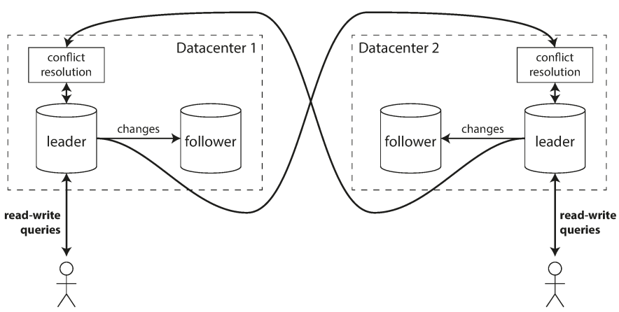

# part 2. 분산 데이터
- 1부에서는 단일 장비에서 데이터를 저장할 때 적용하는 데이터 시스템 측면
- 2부에서는 저장소와 데이터 검색에 여러 장비가 관여하는 경우
    - 분산 DB 필요 이유 : 확장성, 내결함성/고가용성, 지연시간

# chapter 5. 복제
- 요약: 같은 데이터의 복제본을 다른 위치에 여러 노드에 유지. 일부 노드가 사용 불가라도 남은 노드로 제공 가능. 성능 향상에도 도움

-  필요한 이유
    - 지리적으로 사용자와 가깝게 > 지연시간을 줄인다.
    - 시스템 일부에 장애 발생해도 지속적으로 동작 > 내결함성, 고가용성 달성
    - 읽기 질의 제공 장비의 수 확장 > 읽기 처리량
- 종류
    - 단일 리더(single-leader), 다중 리더(multi-leader), 리더가 없음(leaderless)

## 5.1 리더와 팔로워
- 복제 서버(replica) 데이터 베이스의 복사본을 저장하는 각 노드
    - 모든 복제 서버에 모든 데이터가 있다는 보장 -> 일반적인 해결 : 리더 기반 복제(leader-based replication), 쓰기는 리더만 허용
    

- 동기식 비동기식
    
    - 반동기식(semi-synchronous)

- 새로운 팔로워
    - 리더의 데이터베이스 스냅샷 가져옴 (데이터베이스를 잠그지 않고, 일부는 서드파티 도구 필요)
    - 스냅샷을 새로운 팔로워 노드에 복사
    - 이후 팔로워는 리더에 연결해 스냅샷 이후 발생한 모든 데이터 변경 내역을 요청한다. (log seq 등)
    - 요청한 데이터 변경 미처리분(backlog)을 모두 처리하면 팔로워가 리더를 따라잡았다고 말한다. 이제 팔로워는 리더의 데이터 변경을 처리

- 노드 중단 처리
    - 팔로워 장애: 데이터 변경로그를 이용해 마지막 트랜젝션 알아냄 (이후 변경을 모두 요청)
    - 리더 장애 : failover 필요
        - 리더가 장애인지 판단 (계획된 or 장애) -> 팔로워 중 하나를 새로운 리더로 승격
        - 클라이언트는 새로운 리더로 쓰기를 전송해야 함. -> 재설정이 필요하다.
    - 위험성
        - 스플릿 브레인(Split Brain): 특정 결함 시나리오에서 두 노드가 자신이 리더라고 인식
            - fencing: 노드 확실하게 죽이기 (두 리더 감지 시 한 노드 종료)
        - 죽었다고 판단하기에 적절한 타임아웃 값을 정하기가 어려움
            - 타임아웃이 길면 -> 복구에 너무 오랜 시간이 소요
            - 타임아웃이 짧으면 -> 불필요한 장애복구 발생

- 복제 로그 구현 
    - 구문(Statement) 기반 복제: 요청받은 구문을 기록하고 쓰기를 실행한 다음 구문을 팔로워에게 전송
        - 비결정적인 요인에 의해 복제가 깨짐 (now 등)
        - MySQL은 비결정성 요인이 있으면 로우 기반 복제 방식으로 변경
    - 쓰기 전 로그(WAL, write-ahead log) 배송
        - 일반적으로 데이터베이스의 모든 쓰기는 로그에 기록
        - 리더는 디스크에 로그 기록 및 팔로워에게 네트워크로 로그 전송
        - 제일 저수준 데이터를 기술 (leader/follower의 sw 버전 변경 문제 -> follower 부터 버전업)
    - 논리적(로우 기반) 로그 복제
        - 삽입된 로우 : 모든 컬럼의 새로운 값을 포함
        - 삭제된 로우 : 로우를 식별하기 위한 정보(보통 기본 키)를 포함
        - 갱신된 로우 : 로우를 식별하기 위한 정보 + 모든 컬럼의 새로운 값 또는 변경된 컬럼의 새로운 값
        - 변경 데이터 캡쳐(CDC, change data capture)
    - 트리거 기반 복제
        - 위 세 복제 방식은 애플리케이션의 관여 없이 DB 시스템에 의해 구현 (유연성을 위해 application 이 관여하는 방식)
            - Oracle의 GoldenGate : 데이터베이스 로그를 읽어 애플리케이션이 데이터를 변경할 수 있도록 함
            - 많은 RDBMS : 트리거, 스토어드 프로시저 제공
        - 트리거(trigger) : 사용자 정의 애플리케이션 코드를 등록
        - 다른 복제 방식보다 많은 오버헤드 + 데이터베이스에 내장된 복제보다 버그나 제한 사항이 더 많이 발생
            - 유연성 떄문에 사용

## 5.2 복제 지연 문제
- 읽기 확장(read-scaling) 아키텍처
    - 하나의 리더와 여러 팔로워로 구성
    - 리더는 읽기 + 쓰기, 팔로워는 읽기 요청 처리 (웹 서비스의 경우 읽기 요청이 대부분, 쓰기 요청은 작은 비율로 구성)

- 최종적 일관성 (Eventual Consistency)
    - 분산 컴퓨팅 환경에서 사용되는 일관성 모델 중 하나. 일시적으로는 데이터의 일관성이 깨지는 것을 허용

- 복제 지연: 정상적인 경우 복제 지연으로 인한 데이터 불일치는 찰나의 순간
    - 자신이 쓴 내용 읽기 : 사용자가 페이지를 리로딩하면 자신이 제출한 모든 갱신을 볼수 있음을 보장한다. (다른 사용자껀 보장 X)
        - 사용자가 수정한 내용을 읽을 때에는 리더 (이외는 팔로워)
        - 시간을 기준으로 판단하기 (예를 들어 1분 이내는 리더)
        - 클라이언트가 기억하는 가장 최근 쓰기의 타임스탬프를 사용
    - 또 다른 문제 : 디바이스 간(cross-device) 쓰기 후 읽기 일관성

- 단조 읽기
    - 시간이 거꾸로 흐르는 현상: 팔로워 간에도 동일한 쓰기에 대해 갱신 시점의 차이
    - 단조 읽기(monotonic read)
        - 위와 같은 종류의 이상 현상이 발생하지 않음을 보장 (강한 일관성 보다는 덜하고, 최종적 일관성 보다는 강한 보장)
        - 단조 읽기 달성 방법
            - 각 사용자의 읽기가 항상 동일한 복제 서버에서 수행되도록 한다. (사용자 ID의 해시를 기반)
- 일관된 순서로 읽기
    - 파티션 간의 복제 시점에 차이가 있다면 관찰자 입장에서 질문보다 대답을 먼저 확인할 수 있음
    - 일관된 순서로 읽기(consistence prefix read): 쓰기가 특정 순서로 발생한 경우 다른 사용자에게도 쓰기에 대해 쓰여진 순서대로 읽는 것을 보장
        - 인과성의 위반
            - 파티션은 서로 독립적으로 동작 -> 쓰기의 전역 순서가 없음
            - 한 가지 해결책은 서로 인과성이 있는 쓰기에 대해 동일한 파티션에 기록되도록 하는 방법
- 복제 지연을 위한 해결책 
    - 트랜잭션: 애플리케이션이 단순해지기 위해 데이터베이스가 더 강력한 보장

## 5.3 다중 리더 복제
- 다중 데이터센터 간 다중 리더 복제        
    
    - 오프라인 작업 클라이언트: 로컬 DB 사용

- 쓰기 충돌 다루기 
    - 동일한 레코드를 두 리더가 동시에 갱신하면 쓰기 충돌이 발생한다.
    - 다중 리더 복제에서 가장 큰 문제는 쓰기 충돌
    - 충돌 회피: 특정 레코드의 모든 쓰기를 동일한 리더에서 처리 (충돌 처리하는 가장 간단한 전략)
    - 일관된 상태 수렴: 모든 복제 서버가 동일해야 함이 원칙
        - 수렴(convergent) : 모든 변경이 복제돼 모든 복제 서버에 동일한 최종 값이 전달
        - 최종 쓰기 승리 (last write wins, LWW)
        - 각 복제 서버에 고유 ID 부여하고 복제 서버별 쓰기 순서 정함
        - 어떻게든 병합 (예를 들어 사전순 정렬 후 연결)
        - 명시적으로 기록 (충돌 기록 후 사용자에게 메시지 보여주고 선택)
    - 사용자 정의 충돌 해소 로직
        - 쓰기 수행 중 : 복제된 변경사항 로그에서 데이터베이스 시스템 충돌 감지되면 충돌 핸들러 호출 (백그라운드에서 실행)
        - 읽기 수행 중 : 충돌 감지 시 모든 충돌 쓰기 저장, 다음 번 읽기 시 여러 데이터 반환
    - 자동 충돌 해소
        - 병합 가능한 영속 데이터 구조 (three-way merge, git)
            - 단, CRDT(Conflict-Free-Replicated Data Types) 는 two-way merge

- 다중 리더 복제 토폴로지
    

## 5.4 리더 없는 복제
- 다이나모 스타일 DB로 리악, 카산드라, 볼드모트 등 오픈소스 데이터스토어
    - 클라이언트가 여러 복제 서버에 쓰기를 직접 전송하는 반면 코디네이터 노드가 클라이언트를 대신해 이를 수행하기도 함

- 노드가 다운됬을 때 데이터베이스에 쓰기 
    - 정족수(quorum) 쓰기, 정족 수 읽기와 노드 중단 후 읽기 복구
        - 다운된 노드에서는 쓰기가 누락되어 오래된(outdated) 값을 읽게 됨
        - 읽기 요청을 병렬로 여러 노드에 전송해 최신 값을 읽어와 해결 가능 (버전 숫자를 통해 읽어온 값 중 최신 값)

    - 읽기 복구와 안티 엔트로피 복제 계획은 최종적으로 모든 데이터가 모든 복제 서버에 복사된 것을 보장해야 함
        - 읽기 복구: 클라이언트가 여러 노드에서 병렬로 읽기 수행하면 오래된 응답 감지 가능 (복제 서버의 오래된 값을 새로운 값으로 기록)
        - 안티 엔트로피 처리: 백그라운드 프로세스와 복제 서버 간 데이터 차이를 찾아 누락된 데이터를 복사 (지연 가능성)
    - 정족수 (Quorums): 여러 사람의 합의로 운영되는 의사기관에서 의결을 하는데 필요한 최소한의 참석자 수 (사전적 정의)
        - 유효한 읽기와 쓰기를 위한 복제서버 수, 쓰기 성공 노드 수, 질의 노드 수를 나타냄
        - 다이나모 스타일 DB에서는 복제 서버(n), 쓰기 노드(w), 읽기 노드(r) 설정 가능
        - 일반적으로 n 은 3 또는 5 등의 홀수, "w = r = (n+1) / 2 (반올림)" 설정
            

- 동시 쓰기 감지
    - 최종 쓰기 승리 (동시 쓰기 버리기): 복제본을 가장 최신 값으로 덮어 쓰는 방법
        - 카산드라에선 UUID를 사용해 모든 쓰기작업에 고유한 키를 부여
    - 이전 발생
        - 의존적이거나, 어떤 방식으로든 A를 기반으로 한다면 작업 A는 작업 B의 이전 발생
        - 동시 작업: 작업이 다른 작업보다 먼저 발생하지 않으면 (다른 작업에 대해 알지 못하면) 
    - 이전 발생 관계 파악
    - 동시쓴값 병합
        - 형제(sibling): 동시에 쓴 값을 합쳐 정리하는 걸 리악에서 부르는 용어
        - 툼스톤: 값을 제거할 때에는 제거했다고 버젼에 표시를 남김
    - 버전 벡터: 모든 복제본의 버전 번호 모음
        - 값을 읽을 때 데이터베이스 복제본에서 클라이언트로, 값이 기록될 때 데이터베이스로 전송 (덮어쓰기와 동시쓰기 구분)

- 키워드
    - 동기, 비동기, 반동기
    - 리더, 팔로워

    
- 관련 자료 
    - CRDT vs OT
        - https://channel.io/ko/blog/crdt_vs_ot
        - https://velog.io/@heelieben/%EC%8B%A4%EC%8B%9C%EA%B0%84-%EB%8F%99%EC%8B%9C-%ED%8E%B8%EC%A7%91-OT-%EC%99%80-CRDT