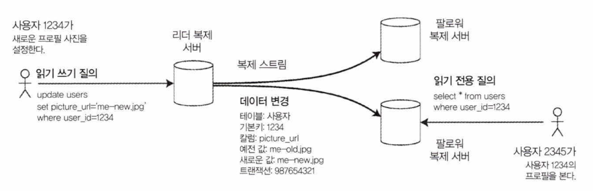
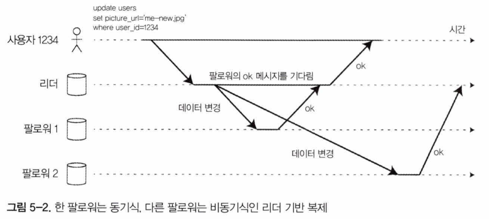
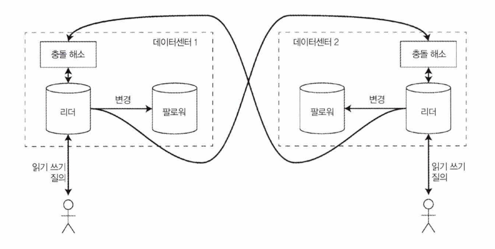
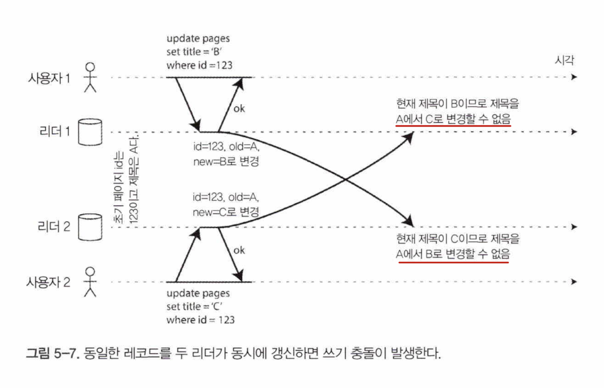
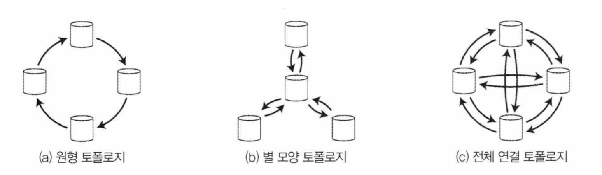
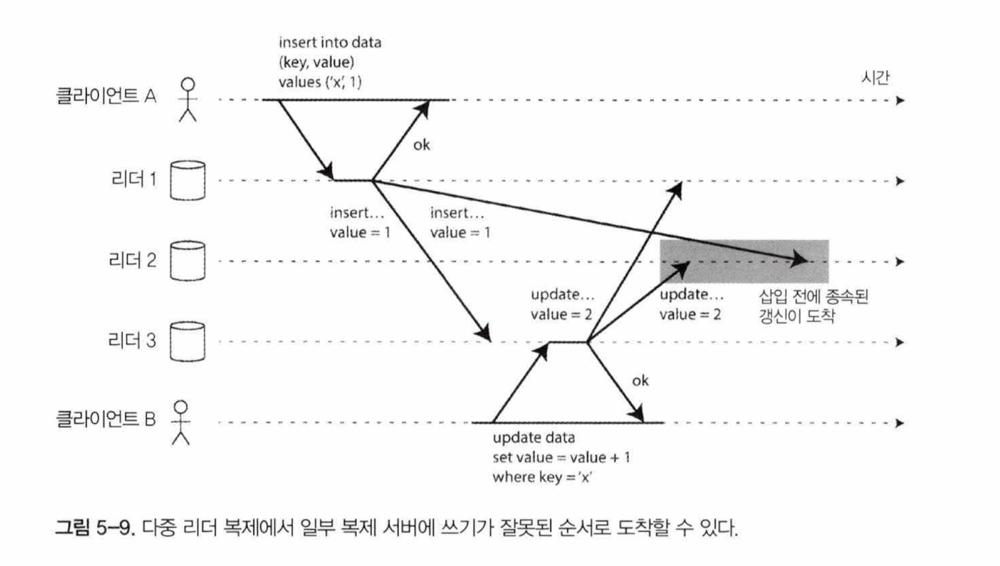
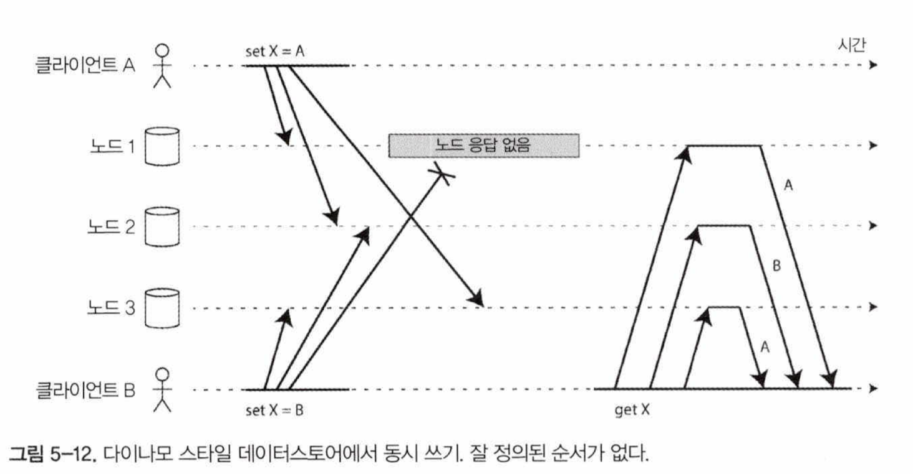

> **복제**: 네트워크로 연결된 여러장비에 동일한 데이터의 복사본을 유지한다는 의미
> 

노드 간 변경을 복제하기 위한 세 가지 인기 있는 알고리즘(단일 리더, 다중 리더, 리더없는 복제)가 있으며 이번 장에서 살펴볼것임.

## 리더와 팔로워

데이터베이스의 복사본을 저장하는 각 노드를 복제 서버라고 함. 그 중 하나를 **리더**(마스터 or 프라이머리), 나머지를 **팔로워**(복제 서버, 슬레이브) 라고 함. 

클라이언트는 리더에 쓰기 요청을 하고 리더는 로컬 저장소에 새로운 데이터를 기록. 리더는 **복제로그**나 **변경 스트림**의 형태로 팔로워에게 변경 내용을 전송, 팔로워는 복사본을 갱신.

읽기는 팔로워에게 질의 하지만 쓰기는 리더에게만 허용됨.

### 동기식 대 비동기식 복제

- 동기식 복제 : 팔로워1의 복제. 팔로워의 ok 메시지를 기다림
- 비동기식 복제 : 팔로워 2의 복제
- 반동기식 복제 : 팔로워 중 하나는 동기식, 나머지는 비동기식
- 체인복제: 레플리케이션 그룹을 만들고 순차적으로 복제
    - A -> A-a
    - A-a -> A-a-1, A-a-2 ...

### 새로운 팔로워 설정

- 복제 서버 수를 늘리거나 장애 노드 대체 위해 새로운 팔로워 설정을 한다.
- 팔로워 설정 방법은
    
    고가용성을 위해 리더에 계속해서 쓸 수 있도록 해야함.
    
    1. 리더 데이터베이스의 스냅샷을 가져옴
    2. 스냅샷을 팔로워 노드에 복사
    3. 팔로워는 스냅샷 이후의 모든 데이터 변경을 리더에 요청(로그 일련번호 or 이진 좌표번호 를 이용해 복제 로그의 위치를 알 수 있음)
    4. 변경 내용을 모두 따라잡으면 이제부터 리더에 발생하는 데이터 변화를 이어 처리

### 노드 중단 처리

리더 기반 복제에서 고가용성 달성방법?

- **팔로워 장애: 따라잡기 복구**
    
    보관된 로그에서 결함 발생 전 처리한 마지막 트랜잭션을 알아내 리더에 연결해 연결이 끊어진 동안 발생한 데이터변경 모두 요청. (팔로워 추가할 때랑 비슷한 방법같음)
    
- **리더 장애: 장애 복구**
    
    팔로워 중 하나를 새로운 리더로 승격 → 클라이언트에선 새로운 리더로 쓰기 전송을위해 재설정 → 팔로워는 새로운 리더로부터 데이터 변경 소비 해야 하고 이 과정을 **장애 복구(failover)** 라 한다.
    
    자동 / 수동 복구 가능. 자동 복구는 아래와 같이 이루어짐(p.159)
    
    1. 리더가 장애인지 판단
    2. 새로운 리더선택
    3. 새로운 리더 사용을 위해 시스템 재설정
    
    하지만 여러 문제가 생길 수 있다.
    
    - 비동기식 복제를 이용하고 있었다면 새로운 리더가 이전 리더의 쓰기를 일부 수신하지 못했을 수 있음. → 변경내용 폐기? 내구성에 문제
    - db 외부 다른 저장소가 db의 내용에 연관되어있다면 변경내용 폐기 시 문제가 발생할 수 있음.
    - 여러 노드가 자신이 리더라고(split brain) 할 수 있음. 두 리더가 쓰기를 받고 충돌 해소를 하지 않으면 데이터가 유실되거나 오염된다.
    - 리더가 죽었다고 판단할 적절한 타임아웃은? 애매함. 불필요한 장애복구가 생길 수 있음.

### 복제 로그 구현

- **구문 기반 복제**
    - (rdb) insert, update, delete 구문을 팔로워에게 전달
    - 복제가 깨질 수도 있어서 리더는 구문을 기록할 때 모든 비결정적 함수 호출을(`ran()`, `now()` 등) 고정값을 반환하도록
    - 하지만 다른 엣지케이스가 있을 수 있음.
- **쓰기 전 로그 배송**
    - WAL : write ahead logging
    - 리더는 디스크에 로그를 기록 + 팔로워에게 네트워크로 로그를 전송
    - 복제 프로토콜이 버전의 불일치를 허용하지 않는다면 업그레이드 할 때 중단시간이 필요
- **로우 기반 복제**
    - 복제 로그를 저장소 엔진 내부와 분리하기 위한 대안. 리더와 팔로워에서 다른 버전의 데이터베이스, 다른 저장소 엔진 실행 가능.
    - 로우 단위로 데이터베이스 테이블에 쓰기를 기술한 레코드열
    - **변경 데이터캡처** 라고 부름
- **트리거 기반 복제**
    - 트리거 & 스토어드 프로시저 사용
    - 다른 복제 방식보다 오버헤드가 있다.
    - 하지만 유연성 때문에 매우 유용

## 복제 지연 문제

리더 기반 복제는 비동기식 복제를 선택 했을 때 **읽기 확장**이 가능하다.(동기식 복제와 비교했을 때 더 안정적인 운영이 가능하다는 뜻인듯함.) 동기식 복제를 선택한다면 단일노드 장애나 네트워크 중단이 일어나는 경우 시스템의 쓰기가 불가능해지고 불안정함.

읽기 확장이 가능하지만,, 팔로워에서 데이터를 읽을 때 이전 데이터를 읽을 수도 있다. (아직 복제가 완료되지 않았을때) 쓰기를 멈추고 기다리면 팔로워가 리더의 내용을 다 따라잡을 수 있지만(최종적 일관성을 가짐) 이런 문제는 데이터 정합성을 중요하게 생각하는 경우 실제 문제가 될 수 있기때문에, 해결방법이 필요하다. 

여기선 1. 자신이 쓴 내용 읽기, 2. 단조 읽기, 3. 일관된 순서로읽기 세 가지 방법을 알려줌.

### 자신이 쓴 내용 읽기

- 사용자가 수정한 내용을 읽을 때는 리더에서 읽는다.
- 마지막 갱신 시간을 찾아서 마지막 갱신 후 1분 동안은 리더에서 모든 읽기를 수행
- 복제 서버에서 읽을땐 클라이언트가 기억하는 타임스탬프와 읽기를 수행하는 노드(팔로워라고 해야하나..) 의 타임스탬프를 비교, 뒤처진다면 다른 노드에 질의 / 기다리기
- 동일한 사용자가 여러 디바이스를 이용한다면?
    - 여러 디바이스에서 사용자의 마지막 갱신 타임스탬프를 기억하는 것은 어렵기 때문에 메타데이터를 중앙집중식으로 관리
    - 복제 서버가 여러 데이터센터에 분산돼 있다면 같은 데이터센터로 라우팅되도록 해야함.

### 단조 읽기

- 각 사용자의 읽기가 항상 동일한복제 서버에서 수행되게끔

### 일관된 순서로 읽기

- 일련의 쓰기가 특정 순서로발생한다면 이 쓰기를 읽는 모든 사용자는 같은 순서로 쓰여진 내용을 보게됨을 보장.
- 인과성을 명시적으로 유지하기 위한 알고리즘이 있다.
- 인과성이 있다면 동일한 파티션에 기록되게끔 하는 방법.

### 복제 지연을 위한 해결책

- 복제 지연이 문제가 되는가? 지연이 몇분이나 몇시간으로 증가한다면 애플리케이션이 어떻게 동작할것인가?
- 문제가 있다… 면 강한 보장을 제공하게끔 시스템을 설계해야함.
- 복제가 비동기식으로 동작하지만 동기식으로 동작하는 척!(앞서 알아본 세가지 방법등 여러가지 방법을 이용하여 문제가 안생기도록 잘 조절)
- 트랜잭션이 보장된다! 고 하면 항상 데이터베이스를 신뢰할 수 있고 이 경우가 더 좋음. → 7장에서 계속

## 다중 리더복제

- 마스터 마스터 복제 혹은 액티브 액티브 복제라고도 함.
- 각 리더는 리더인 동시에 다른 리더의 팔로워 역할도 한다.
- 사용 하려는 데이터베이스가 어떤 충돌 감지 기법, 어떤 충돌 해결 기법을 사용하는 지 문서를 주의 깊게 익고 철저히 테스트 해서 확인 해봐야함.

### 다중 리더 복제의 사용 사례

- 다중 데이터센터를 운영하는 경우 동일한 데이터를 다른 두개의 데이터센터에서 동시에 변경할 수있는데, 이때 발생하는 쓰기 충돌은 반드시 해소해야함.(뒤에서 다룸)
    
    

    - 다중 리더 복제에 대한 안좋은 의견들이 많은것 같음. 책에선 가능하면 피해야 한다고 쓰여있음.
    
- 오프라인 작업을 하는 클라이언트는 리더 처럼 동작하는 로컬 데이터베이스가 있고(쓰기 요청을 받아서 처리) 인터넷이 연결 되면 다중 리더복제를 비동기 방식으로 수행하는 프로세스가 있는데, 아키텍처 관점에서보면 이 설정은 근본적으로 데이터센터 간 다중 리더 복제와 동일
    - 카우치DB는 이런 동작 모드를 위해 설계됨
- 협업 편집은 편집 충돌이 없음을 보장하기 위해 잠금 → 편집 → 반영 의 시퀀스로 편집을 해야하고 이 방식은 리더에서 트랜잭션을 사용하는 단일 리더 복제외 동일
    - 더 빠른 협업을 위해 변경 단위를 매우 작게(단일 키 입력) 하면 여러 사용자가 동시 편집할 수 있지만 충돌 해소가 필요한 경우를 포함해 다중 리더 복제에서 발생하는 모든 문제를 야기

### 쓰기 충돌 다루기

다중 리더 복제에서제일 큰 문제는 쓰기 충돌이 발생하는 것이다. 충돌 해소가 필요함!

- **동기 대 비동기 충돌 감지**
    
    일단 쓰기는 성공 하지만 복제 하면서 비동기로 충돌 감지. 사용자에게 충돌을 해소하게끔 요청하면 너무 늦을 수 있다.
    
    그렇다고 동기식으로 충돌 감지 하려면 단일 리더 복제만 사용해야 할 수도 있다.
    
- 충돌 회피
    
    특정 레코드의 모든 쓰기가 동일한 리더를 거치도록 애플리케이션이 보장한다면 충돌은 발생하지 않음. 자주 권장되는 방법이긴 하지만, 지정된 리더를 변경해야 하는 상황(데이터센터가 고장, 사용자가 다른 지역으로 이동해 현재는 다른 데이터센터가 가깝다면) 에는 충돌 회피가 실패함. 다른 리더에서 동시 기록을 할 수도 있다는 가능성을 대처해야 한다.
    
- **일관된 상태 수렴**
    
    모든 복제 계획은 모든 복제 서버가 최종적으로는 동일하다는 사실을 보장해야함. 이를 위해 충돌 해소를 달성하는 방법으로는 
    
    - 최종 쓰기 승리(last write wins) - 쓰기에 고유 id를 보여하고 가장 높은 id를 가진 쓰기를 고른다. 데이터유실 위험이 있음.
    - 복제 서버에 고유 ID 부여, 높은 id 를 가진 서버의 쓰기를 선택. 데이터 유실 위험
    - 값을 어떻게든 병합. 예를 들어 사전 순으로 정렬 후 연결
    - 충돌을 기록해놓고 사용자가 충돌을 해소하도록 함.
- **사용자 정의 충돌 해소로직**
    
    애플리케이션 마다 충돌 해소하는 적절한 방법이다르기 때문에, 대부분의 다중 리더 복제 도구는 애플리케이션 코드를 사용해 충돌 해소 로직을 작성함.
    
    해당 코드는 쓰기나 읽기 수행 중에 실행 될 수 있다.
    

### 다중 리더 복제 토폴로지

- 복제 토폴로지 : 쓰기를 한 노드에서 다른 노드로 전달하는 통신 경로

- 원형, 별 모양 토폴로지의 문제점 중 하나는 하나의 노드에 장애가발생하면 장애가다른 노드 간 복제 메시지 흐름에 방해를 준다는것. spof 가 될 수 있다. 전체연결 토폴로지의 내결함성이 훨씬 더 좋다.
- 전체 연결 토폴로지는 일부복제 메시지가 다른 메시지를 추월 할 수 있음.
    - 이런 이벤트를 올바르게 정렬하기 위해 **버전 벡터 기법**을 사용 할 수 있다.

## 리더 없는 복제

클라이언트가 여러 복제 서버에 쓰기를 직접 전송 or 코디네이터 노드가 클라이언트를 대신해 이를 수행

### 노드 다운됐을 때 데이터베이스에 쓰기

따로 장애 복구를 할 필요 없음.

장애가 발생한 노드가 온라인 상태가 되고 읽기 요청이 전달 되면 오래된 값을 리턴하게 됨. 이 문제를 해결하기 위해(최신 데이터를 얻을 수 있도록) 클라이언트는 **읽기 요청을 여러 노드에 병렬로 전송** 여러 리턴 값 중 최신 데이터 선택

- **읽기 복구와 안티 엔트로피**
    
    누락된 쓰기를 따라잡는 방법
    
    - 읽기 복구
        - 읽는 시점에 클라이언트가 오래된 값을 보낸 노드에 새로운 값을 다시 기록. 값을 자주읽는 상황에 적합
    - 안티 엔트로피 처리
        - 백그라운드 프로세스에서 복제 서버간 데이터차이를 지속적으로 찾아 누락된 데이터를 하나의 복제서버에서 다른 서버로 복사. 상당한 지연이 있을 수 있음.
    
    다른 메커니즘도 있다.
    
- **읽기와 쓰기를 위한 정족수**
    - n, w, r
        - n: 복제서버 개수
        - w: w개 노드에서 성공 해야 쓰기 확정
        - r: 최소 r개 노드에 읽기 질의를 보내야함
        
        정족수 읽기라고 하고, w + r > n 이면 최신 값을 얻을것으로 기대
        

### 정족 일관성의 한계

- w + r > n 이면 최신 값을 얻을것으로 기대하지만 엣지케이스가 있음. 구현에 따라 다르겠지만 아래 케이스가 있다.
    - 느슨한 정족수를 사용하는 케이스
    - 두개의 쓰기가 동시에 발생. 어떤 쓰기가 먼저 일어났는지 분명하지 않음. 쓰기 충돌을 해소해줘야함.
    - 쓰기와 읽기가 동시에 발생
    - 쓰기의 일부가 실패해 전체에서 성공한 서버가 w개보다 낮고 성공한 서버에서 쓰기를 롤백하지 않으면
    - 등등
    
    견고한 보장은일반적으로 트랜잭션이나 합의가 필요함.
    
- 최신성 모니터링
    - 리더 없는 복제 시스템 에서는 쓰기가 적용된 순서를 고정할 수 없어 모니터링이 조금 더 어렵다.
    - 운용을 위해서 “최종적 일관성”의 “최종적” 을 정량화할 수 있어야한다.

### 느슨한 정족수와 암시된 핸드오프

- 정족수는 내결함성이 없다.
    - 네트워크 중단으로 다수의 데이터베이스 노드와 클라이언트는 쉽게 연결이 끊어질 수 있다. 연결이 끊어지면 클라이언트는 더이상 정족수를 충족할 수 없다.
- 느슨한 정족수
    - 노드 n개 이상인 대규모 클러스터에서 클라이언트는 네트워크 장애 상황에서 일부 데이터베이스 노드(정족수 구성에 들어가지 않는)에 연결되었을때, 일단 쓰기를 받아들이고 값이 보통 저장되는 n개 노드에 속하지는 않지만 연결할 수 있는 노드에 기록
        
        이웃집 문을 두드려 소파에 잠시 머물 수 있는지 묻는 상황
        
        네트워크 장애 상황이 해제되면 다른 노드에 쓰여진 모든 쓰기를 “홈” 노드로 전송 ⇒ **암시된 핸드오프**
        
        이 상황에서 w+r>n 이라고 해도 키의 최신 값을 읽는다고 보장하지 않는다.
        

### 동시 쓰기 감지

다양한 네트워크 지연과 부분적인 장애 때문에 이벤트가 다른 노드에 다른 순서로 도착할 수 있다. 각 노드가 클라이언트로부터 쓰기 요청을 받을 때마다 키의 값을 단순하게 덮어 쓴다면 노드들은 영구적으로 일관성이 깨진다. 

데이터 손실을 피하기 위해 애플리케이션 개발자는 데이터베이스 내부에서 충돌을 어떻게 다루는지 잘 알아야함.

- **최종 쓰기 승리(동시 쓰기 버리기)**
    - 쓰기는 자연적인 순서가 없지만(알 수 없지만) 임의로 순서를 정할 수 있다. 예를 들어 타임스탬프
    - 손실 데이터를 허용하지 않는다면 LWW 가 충돌 해소에 적합하지않다.
    - 키를 한번만 쓰고 이후에는 불변 값으로 사용한다면 LWW 로 데이터베이스를 안전하게 사용 할 수있다.
- **“이전 발생” 관계와 동시성**
    - 작업 B 가 A 이전에 발생
        
        
        
    - 작업 A와 B는 인과성이 없음.
        
        
        
    - 두 작업이 동시성인지 아닌지 알 수 있는 알고리즘이 필요하다. 한 작업이 다른 작업 전에 발생했다면 나중 작업은 이전 작업을 덮어쓸 수 있지만 작업이 동시에 발생하면 충돌을 해소해야함.
- **이전 발생 관계 파악하기**
    - 쓰기가 이전 읽기의 버전 번호를 포함하면 쓰기가 수행되기 이전 상태를알 수 있다.
    - 버전 번호를 포함하지 않은 쓰기는 다른 쓰기와 동시에 수행된 것이 아니므로 아무것도 덮어쓰지 않는다.
- **동시에 쓴 값 병합**
    - 버전 관리 하는 것은 클라이언트가 추가적으로 작업을 수행해야함. 동시에 쓴 값을 합쳐 정리해야한다.
    - 추가 → 합집합을 취하는 방법
    - 삭제 → 삭제했다는 표식을 표시를 해당 버전 번호에 남겨둔다. → 툼스톤
- **버전 벡터**
    - 다중 복제본의 동시 쓰기를 받아들이기 위해 키당 버전 번호 뿐 아니라 복제본당 버전 번호도 사용
    - 모든 복제본의 버전 번호 모음을 버전 벡터 라고함.
