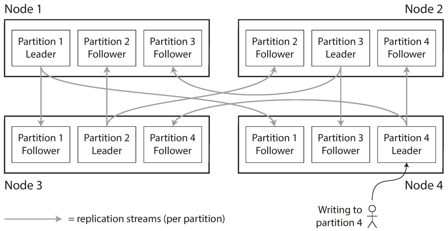
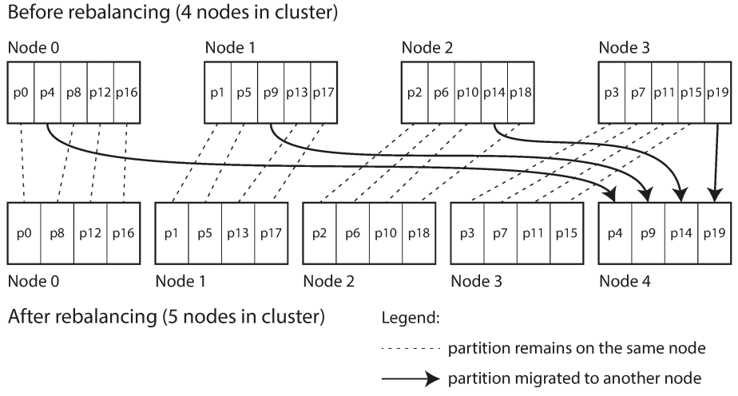

# chapter 6. 파티셔닝
- 요약: 큰 database를 파티션이라는 작은 서브셋으로 나누고 각 파티션은 각기 다른 노드에 할당 (샤딩)

- 파티셔닝 또는 샤딩: 데이터셋이 매우 크거나 질의 처리량이 매우 높다면 복제만으로는 부족하고 데이터를 파티션으로 쪼갤 필요
    - 확장성: 대용량 데이터셋이 여러 디스크에 분산될 수 있고 질의 부하는 여러 프로세서에 분산 (병렬 실행)
    - 이력 데이터의 효율적인 관리: 불필요한 데이터 삭제 작업은 단순히 파티션을 추가하거나 삭제하는 방식으로 간단하고 빠르게 해결
- 파티셔닝과 복제
    - 보통 복제와 파티셔닝을 함께 적용해 각 파티션의 복사본을 여러 노드에 저장
    - 각 레코드는 정확히 한 파티션에 속하더라도 이를 여러 다른 노드에 저장해서 내결합성을 보장
        

## 6.1 키-값 데이터 파티셔닝
- 파티셔닝의 목적은 데이터의 질의와 부하를 고르게 분산
    - skewed(쏠림): 파티셔닝이 고르게 이뤄지지 않아 다른 파티션보다 데이터가 많거나 질의를 많이 받는 파티션이 있는 경우
    - hotspot(핫스팟) : 불균형하게 부하가 높은 파티션 -> 가장 단순 해결은 레코드 저장을 무작위 선택 (단점: 읽을때)

- 키 범위 기준 파티셔닝 : 각 파티션에 연속된 범위의 키를 할당. 각 범위들 사이의 경계를 알 수 있고 어떤 키가 어떤 파티션에 속하는지 쉽게 찾음 (+ 노드도 쉽게)
    - 장점: 각 파티션 내에서는 키를 정렬된 순서로 저장 -> 범위 스캔이 쉬워짐
    - 단점: 특정한 접근 패턴이 핫스팟을 유발
- 키의 해시값 기준 파티셔닝 : 특정 해시 함수에 의해 레코드가 저장될 파티션을 결정
    - 장점: 쏠림과 핫스팟의 위험을 줄여 균일하게 분산
    - 단점: 범위 질의를 효율적으로 실행할 수 있는 키 범위 파티셔닝의 좋은 속성을 잃음
        - 전에는 인접했던 키들이 이제는 모든 파티션에 흩어짐
    - 몽고 DB에서는 해시 기반 샤딩 모드를 활성화 가능. 리악, 카우치베이스, 볼드모트에서는 기본키에 대한 범위 질의가 지원되지 않음. 
    - 카산드라는 두 가지 파티셔닝 전략 사이에서 타협. 첫 번째 칼럼에 고정된 값을 지정하면 키의 다른 칼럼에 대해서는 범위 스캔을 효율적으로 실행

## 6.2 파티셔닝과 보조색인
- 레코드를 기본키를 통해서만 접근한다면 키로부터 파티션을 결정하고 이를 사용해 해당 키를 담당하는 파티션으로 읽기 쓰기 요청을 전달 가능 -> 보조 색인이 복잡하게 만듦
    - 보조 색인 파티셔닝 많이 쓰이는 두개: 문서기반과 용어기반 파티셔닝

- 문서 기준 보조 색인 파티셔닝
    - 지역 색인(Local Index): 각 파티션에 속하는 문서만 담당하며 완전히 독립적으로 동작하는 색인 방법
        - 스캐터/개더(scatter/gather): 모든 파티션으로 질의를 보내서 얻은 결과를 모두 모아야 함
- 용어 기준 보조 색인 파티셔닝 
    - 전역 색인(Global Index): 모든 파티션의 데이터를 담당하는 색인
        - term-partitioned: 찾고자 하는 용어에 따라 색인의 파티션이 결정
        - 용어 자체를 쓸 수도 있고 용어의 해시값을 사용
        - 장점: 읽기가 효율적 (용어를 포함하는 파티션으로만 요청) 
        - 단점: 단일 문서를 쓸 때 해당 색인의 여러 파티션에 영향을 줄 수 있으며 쓰기가 느리고 복잡
    - 현실에서는 전역 보조 색인은 대개 비동기로 갱신

## 6.3 파티션 재균형화(rebalancing)
- 요구사항: 균등 분배, 중단 X, 데이터 이동 최소화 (해시값에 mod n 은 쓰면 안됨)
- 재균형화 전략 
    - 파티션 갯수 고정 (정적 파티셔닝)
        - 리악, 엘라스틱서치, 카우치베이스, 볼드모트 에서 사용됨
        - 전체 데이터셋의 크기 변동이 심하다면 적절한 파티션 개수를 정하기 어려움 -> 충분히 높은값 사용 (적절 크기 선택 어려움)
        
    - 동적 파티셔닝
        - 파티션 갯수는 전체 데이터 용량에 맞춰 조정
        - MongoDB, Hbase (사전 분할 가능)
    - 노드 비례 파티셔닝
        - 카산드라, 케타마에서 사용
        - 파티션 갯수가 노드 대수에 비례 (노드당 할당 파티션 고정)

- 운영 : 자동 재균형화와 수동 재균형화 
    - 완전 자동 재균형: 관리자의 개입이 전혀 없이 시스템이 자동으로 재균형화
    - 완전 수동 재균형화: 관리자가 명시적으로 파티션을 노드에 할당하도록 설정하고 관리자가 재설정할 때만 파티션 할당이 변경
    - 중간지점: 자동으로 파티션 할당을 제안-> 관리자가 확정 (카우치베이스, 리악, 볼트모트)

## 6.4 요청 라우팅
- Service discovery
    - 클라가 아무 노드 접속 -> 노드가 요청 전달
    - routing 계층에서 처리
    - 클라가 타겟 노드를 알고 있게 함
    - 문제: 모든 곳에서 정보 일치 필요 (코디네이션 사용, 예: zookeeper)
    - 사례
        - Hbase, 솔라클라우드, 카프카는 파티션 할당 추적시 주키퍼 사용
        - mongoDB는 mongos 데몬을 라이팅 계층으로 사용
        - 카산드라와 리악은 gossip protocol로 클러스터 상태를 노드에 전파 (외부 코디네이션 안씀)
        - 카우치베이스는 라우팅 정보를 알아내는 moxi (라우팅계층) 설정

- 병렬 질의 실행
    - 대규모 병렬 처리(massively parallel processing, MPP) 지원
    - 전형적인 데이터 웨어하우스 질의는 조인, 필터링, 그룹화, 집계 연산 포함
    - MPP 질의는 클러스터 내의 서로 다른 노드에서 병렬적으로 실행 (병렬 실행 혜택)

- 키워드
    - 지역, 글로벌 색인

- 관련 자료 
    - https://stackshare.io/service-discovery