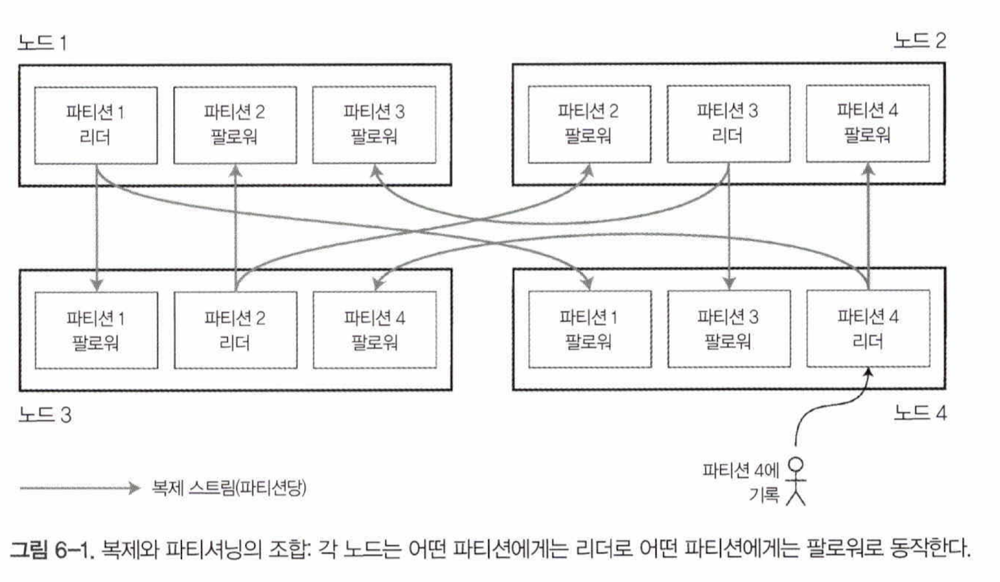

데이터를 파티션으로 쪼개는 작업을 샤딩이라고 함.

파티셔닝의 주 목적은 확장성이다. 트랜잭션, 분석용 작업 부하 완화

## 파티셔닝과 복제

- 보통 복제와 파티셔닝을 함께 적용해 각 파티션의 복사본을 여러 노드에 저장한다.
- 한 노드에 여러 파티션이 속할 수 있다.

## 키-값 데이터 파티셔닝

파티셔닝을 해도 데이터가 고르게 분포되지 않아 특정 파티션이 다른 파티션보다 데이터가 많거나 질의를 많이 받을 수 있다(skewed 됐다고 함). 불균형하게 부하가 높은 파티션을 **핫스팟** 이라고 하는데 이런 현상이 발생한다면 파티셔닝의 효과가 매우 떨어지게됨.

어떤 데이터를 어느 노드에 저장할 지 어떻게 결정할까?

### 키의 범위 기준 파티셔닝

- 백과사전 처럼
    - A~B, C~D, D~F, …, T~Z
- 각 파티션 내에선 키를 정렬된 순서로저장할 수 있다.
- 키 범위기준 파티셔닝은 특정한 접근 패턴이 핫스팟을 유발하는 단점이 있다.
    - 예를 들어 1일치의 데이터를 파티션 하나가 담당한다면 쓰기 연산이 한 파티션에 전달됨
- 이런 현상이 일어나지않도록 키를 잘~ 설계해야함

### 키의 해시값 기준 파티셔닝

- 쏠림과 핫스팟의 위험으로 키의 해시값을 기준으로 파티션을 정하기도 함.
- 언어의 내장 해시함수는 해시값 구하는데 부적절.
- 파티션을 나누는 기준을 해시값의 범위로함.
- 범위 질의를 효율적으로 하기 어려워짐. 이를 해결하기 위해 카산드라는 **복합 기본키** 라는 전략을 사용

### 쏠린 작업부하와 핫스팟 완화

- 수백만 명의 팔로워를 거느린 유명인이 뭔가를 하면 후폭풍이 발생할 수도 있음. 이런 경우에 해시값을 사용하는것은 도움이 안됨
- 각 키의 시작이나 끝에 10진수 2개를 붙인다면? 부하를 다른 파티션으로 이동시킬 수 있음.
- 대신 읽기를 할 때 추가적인 작업이 필요해짐.

## 파티셔닝과 보조 색인

보조색인은 보통 레코드를 유일하게 식별하는 용도가 아니라 특정한값이 발생한 항목을 검색하는 수단.

보조 색인이 있는 데이터베이스를 파티셔닝 하는데 널리 쓰이는 두 가지 방법. 문서 기반 파티셔닝과 용어 기반 파티셔닝

### 문서 기준 보조 색인 파티셔닝

- 문서 id 를 기준으로 데이터베이스를 파티셔닝.
- 각 파티션은 독립적으로 동작하며 자신의 보조 색인을 유지하고 그 파티션에 속하는 문서만 담당.
- 지역색인이라고 한다.
- 값을 읽을때 문제가 되는데, 모든 파티션으로 질의를 보내서 얻은 결과를 모두 모아야한다.

### 용어 기준 보조 색인 파티셔닝

- 이와 반대로 각 파티션이 모든 파티션의 데이터를담당하는 전역색인
    - 특정 용어는 한 파티션에 모두 몰려있다고 해석하면 될듯.
- 읽기가 효율적이지만 쓰기가 느리고 복잡하다.
- 그래서 대개 비동기로 갱신됨.

## 파티션 재균형화

클러스터에서 한 노드가 담당하던 부하를 다른 노드로 옮기는 과정을 재균형화(rebalancing)라고 함.

재균형화 도중 달성해야 할 조건들이 있다.

- 재균형화 후, 부하가클러스터 내에 있는 노드들 사이에 균등하게 분배돼야 함.
- 재균형화 도중에도 데이터베이스는 읽기 쓰기 요청을 받아들여야 함.
- 재균형화가 빨리 실행되고 네트워크와 디스크 i/o 부하를 최소화할 수 있도록 노드들 사이에 데이터가 필요 이상으로 옮겨지면 안됨.

### 재균형화 전략

- **해시값에 모드 n 연산을 수행** → 쓰면 안됨
- **파티션 개수 고정**
    - 파티션을 충분히 크게 나누고, 클러스터에 노드가 추가 되면 새 노드는 기존 노드에서 파티션을 뺏어온다.
    - 파티션 개수는 바뀌지 않고 위치만 변경됨
    - 파티션 개수가 고정되면 운영이 단순해짐. 분할하는게 가능하긴 하지만 지원하지 않는 경우가 많음.
    - 파티션 개수는 적당히 크게
    - 데이터셋 크기가 변한다면 적절한 크기를 정하기 어려울 수도 있다.
- **동적 파티셔닝**
    - 파티션 크기가 설정된 값을 넘어서면 파티션을 두개로 쪼갠다.
    - 임계값 밑으로 떨어지면 합친다.
    - 초기에는 사전 분할로 미리 분할해놓을 수 있음.
    - 키 범위파티셔닝, 해시파티셔닝에도 사용할 수 있음.
- **노드 비례 파티셔닝**
    - 파티션 개수가 노드 대수에 비례
    - 노드당 할당되는 파티션 개수를 고정
    - 노드 대수가 변함 없는 동안은 개별 파티션 크기가 데이터셋 크기에 비례
    - 노드를 늘리면 파티션 크기 작아짐.

### 운영: 자동 재균형화와 수동 재균형화

- 자동으로 재균형화 할 수도 있으나 운영상 예상치 못한 이들이 생길수도 있어 사람이 개입하는게 좋을 수도 있음.

## 요청 라우팅

- 서비스 찾기!
- 방법 예시
    - 아무 노드에나 접속해 데이터가 있는 노드를 응답 받고 그 노드에 다시 질의
    - 중간에 라우팅 계층이 있어 라우팅 계층을 통해 데이터가있는 노드로 질의 전달
    - 클라이언트에서 파티셔닝 방법과 파티션이 어느 노드에 할당됐는지 알고 있는 상태로 바로 질의
- 별도의 코디네이션 서비스를 사용하기도 한다.
    - 주키퍼, 헬릭스, 설정서버+몽고스
    - 가십 프로토콜(카산드라, 리악)
    - 목시(라우팅 계층, 카우치베이스)

### 병렬 질의 실행

- 대규모 병렬 처리(massively parallel processing, MPP) 질의 최적화기가 있고 이는 복잡한 질의를 여러 실행 단계와 파티션으로 분해하며, 이들 중 다수는 데이터베이스 클러스터 내의 서로 다른 노드에서 병렬적으로 실행될 수 있음.
- 자세한 내용은 10장에서~