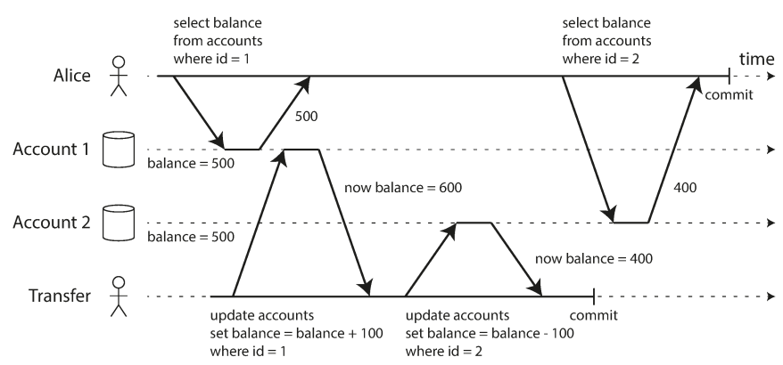
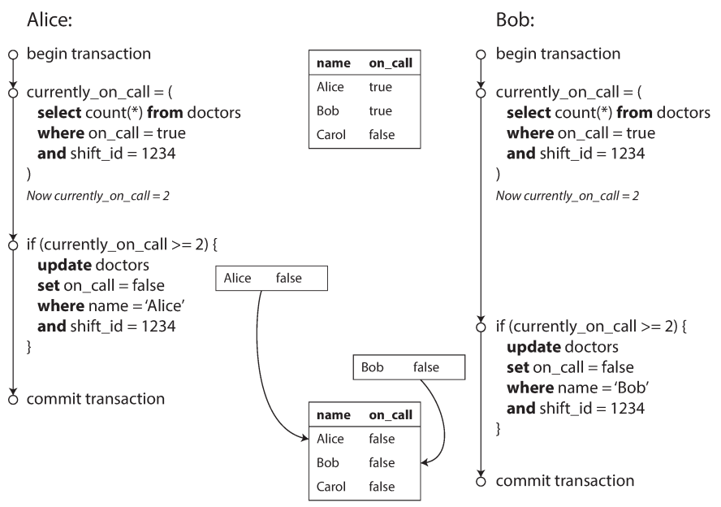
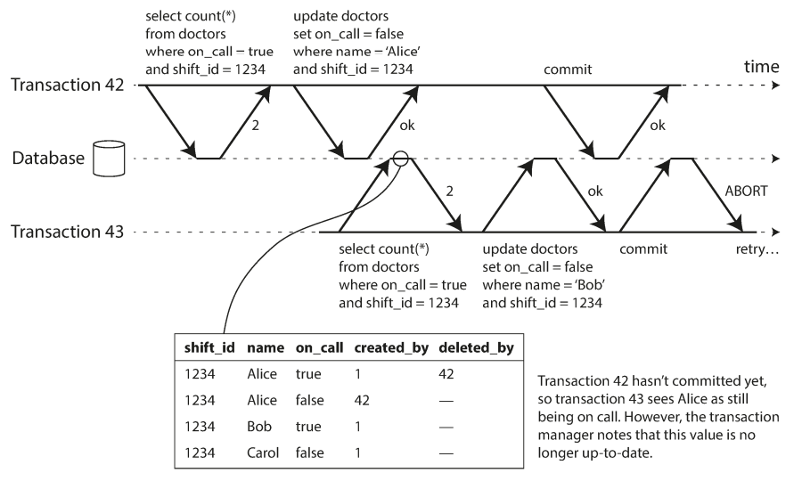
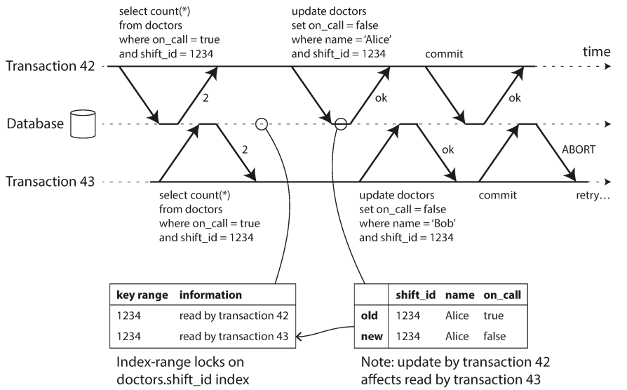

# chapter 7. 트랜잭션
- 요약: 트렌젝션 설명 (전체가 성공하거나 실패)

* 부분적 실패를 걱정할 필요가 없다.

## 7.1 애매 모한 트랜잭션의 개념

### ACID의 의미
* atomicity (원자성): 데이터베이스는 전부 반영되거나 아무것도 반영되지 않는 것을 보장 (commit or abort, 더 작게 쪼갤 수 없음)
* consistency (일관성): 트랜잭션에서 쓰인 데이터가 유효성을 보전함. (일관성은 application 이 유효한 데이터를 넣어야 하므로 application 속성)
* isolation (격리성): 트랜잭션은 다른 트랜잭션을 방해할 수 없다. (직렬성으로 순차적으로 실행했을때 결과와 동일하도록 보장)
* Durability (지속성): 데이터를 안 잃어버리도록 안전한 저장소 제공 (비휘발성에 저장, 쓰기전 로그등 사용, 성공이라고 보고하기 전 쓰기나 복제 완료)

### 단일 객체 연산과 다중 객체 연산
* 한 클라이언트가 한 트랜젝션에서 여러 번 쓰기 할 경우: 한번에 여러 객체 변경
* 단일 객체 쓰기: 객체에 잠금 or 원자적 연산 제공
* 다중 객체 트랜젝션
    * 다중 객체 트랜잭션은 참조가 유효한 상태로 유지되도록 보장 (외래키 등)
    * 조인 기능 없는 DB는 비정규화 장려 (단, 한번에 여러 문서 변경에 대한 트랜잭션은 보장)
    * 색인 갱신도 보장
* error 와 abort: transaction의 핵심 기능은 오류 발생 시 abort되고 안전하게 재실행 가능 (오류 복구는 application 기능)

## 7.2 완화된 격리 수준
* 트랜잭션을 제공해 동시성 문제를 감춤 (직렬성 격리)

### 커밋 후 읽기 (READ COMMITTED)
* 트랜잭션 격리 수준
    * 데이터베이스에서 읽을 때 커밋된 데이터만 보게 된다(더티 읽기가 없음)
    * 데이터베이스에 쓸 때 커밋된 데이터만 덮어쓰게 된다(더티 쓰기가 없음)

* 더티 읽기(dirty read) : 어떤 트랜잭션에서 처리한 작업이 완료되지 않았는데도 다른 트랜잭션에서 볼 수 있는 현상 -> 이걸 방지
* 더티 쓰기(dirty write) : 두 트랜잭션이 동일한 객체를 동시에 갱신하려고 할 때, 먼저 쓴 내용이 아직 커밋되지 않은 트랜잭션에서 쓴 것이고 나중에 실행된 쓰기 작업이 커밋되지 않은 값을 덮는 경우 -> 먼저 쓴 transaction 이 커밋이나 어보트될때까지 두번째 쓰기를 지연

* 커밋 후 읽기 구현 (Implementing read committed)
    * Oracle 11g, PostgreSQL, SQL Server 2012, MemSQL 등에서 기본 설정
    * 더티 쓰기 방지: 트랜잭션이 커밋되거나 어보트될 때까지 잠금 (로우 수준 잠금) 을 보유한다. 이런 잠금은 커밋 후 읽기 모드에서 데이터베이스에 의해 자동으로 실행된다.
    * 더티 읽기 방지: 과거의 커밋된 값/ 현재 쓰고 있는 새로운 값을 모두 기억하게 하여 해당 트랜잭션이 실행 중인 동안 과거의 값을 읽게하여 더티 읽기를 방지 할 수 있다 -> 대부분은 과거값 읽다가 쓰기 트랜젝션 끝난 후 최신값 볼 수 있다. (READ_COMMITTED Isolation)

### 스냅숏 격리와 반복 읽기
* 비반복 읽기(nonrepeatable read)나 읽기 스큐(read skew): 커밋 후 읽기 격리 수준에서도 동시성 버그가 생길 수 있는 현상
    

* 스냅숏 격리 : 각 트랜잭션은 데이터베이스의 일관된 스냅숏으로부터 읽는 구현
    * 즉, 트랜잭션 시작할 때 커밋상태의 모든 데이터를 본다
    * 핵심 원리: 읽는 쪽에서 쓰는 쪽을 결코 차단 안하고 쓰는쪽에서도 읽는 쪽을 차단 안함

* 스냅숏 격리 구현
    * 다중 버전 동시성 제어(multi-version concurrency control, MVCC) : 데이터베이스가 객체의 여러 버전을 함께 유지하는 기법

* 일관된 스냅숏을 보는 가시성 규칙
    * 트랜잭션은 데이터베이스에서 객체를 읽을 때 트랜잭션 ID를 사용해 어떤 것을 볼 수 있고 어떤 것을 볼 수 없는지 결정
    * 트랜잭션 ID가 더 큰(즉 현재 트랜잭션이 시작한 후에 시작한) 트랜잭션이 쓴 데이터는 모두 무시 (그 트랜잭션의 커밋 여부에 관계 없이)

* 색인과 스냅숏 격리 
    * 색인이 객체의 모든 버전을 가리키게 하고 색인 질의가 현재 트랜잭션에서 볼 수 없는 버전을 걸러냄 (추후 안쓰는거 제거)
    * 동일한 객체의 다른 버전들이 같은 페이지(page)에 저장될 수 있다면 색인 갱신을 회피하는 최적화 실행 (postgresql)
    * 쓸 때 복사되는 (append-only/copy-on-write) 변종을 사용. 트리의 페이지가 갱신될 때 덮어쓰는 대신 각 변경된 페이지의 새로운 복사본을 생성
    * 추가 전용 B트리 사용. 쓰기를 실행하는 모든 트랜잭션은 새로운 B 트리 루트를 생성하며 특정 루트는 그것이 생성된 시점에 해당하는 데이터베이스의 일관된 스냅숏

* 반복 읽기와 혼란스러운 이름 
    * 스냅숏 격리는 읽기 전용 트랜잭션에서 유용
    * 여러 다른 이름 (SQL 표준에 스냅숏 격리의 개념이 없음)
        * Oracle: 직렬성(Serializable)
        * PostgreSQL, MySQL: 반복 읽기(Repeatable Read)
        * spring 에 Isolation 속성
            * DEFALUT: DB 에 따른다. (다른 모든 수준은 JDBC 격리 수준에 해당)
            * READ_UNCOMMITTED : 다른 트랜잭션에서 커밋되지 않은 데이터를 읽을 수 있습니다.
            * READ_COMMITTED (기본값) : 다른 트랜잭션에서 커밋된 데이터만 읽을 수 있습니다.
            * REPEATABLE_READ : 같은 트랜잭션 내에서 여러 번 읽은 데이터는 동일합니다.
            * SERIALIZABLE : 트랜잭션은 서로 동시에 실행될 수 없습니다. 

### 갱신 손실 방지
* 갱신 손실 (lost update): 두 트랜잭션이 작업을 동시에 하면 두번째 쓰기 작업이 첫 번째 변경을 포함하지 않으므로 변경 중 하나는 손실
    * 다양한 해결책: 원자적 쓰기 연산, 명시적인 잠금, 갱신 손실 자동 감지, Compare-and-set, 충돌 해소와 복제
    * 원자적 쓰기 연산 : 쓰기 연산에 원사성 (Atomicity) 성질을 부여 
        * exclusive lock 을 획득하여 구현 (갱신이 적용될 때까지 다른 트랜잭션에서 그 객체를 읽지 못함)
        * 모든 원자적 연산을 단일 스레드에서 실행되도록 강제하는 방법
    * 명시적인 잠금: 애플리케이션에서 갱신할 객체를 명시적으로 잠금. 다른 트랜잭션이 동시에 같은 객체를 읽으려고 하면 첫 번째 read-modify-write 주기가 완료될 때까지 기다리도록 강제
    * 갱신 손실 자동 감지: 여러 트랜잭션의 병렬 실행을 허용하고 트랜잭션 관리자가 갱신 손실을 발견하면 트랜잭션을 abort 시키고, 재시도하도록 강제
    * Compare-and-set: 값을 마지막으로 읽은 후로 변경되지 않았을 때만 갱신을 허용
    * 충돌 해소와 복제: 잠금과 compare-and-set 연산은 데이터의 최신 복사본이 하나만 있다고 가정함 -> 복제가 적용된 데이터베이스에서 흔히 쓰는 방법은 쓰기가 동시에 실행될 때 한 값에 대해 여러 개의 충돌된 버전(sibling)을 생성하는 것을 허용하고, 추후에 충돌을 해소하고 이 버전들을 병합 (LWW, 최종쓰기 승리를 많은 DB가 기본으로 사용)

### 쓰기 스큐와 팬텀
* 쓰기 스큐 (wirte skew): 두 트랜잭션이 두 개의 다른 객체를 갱신하는 중 발생하는 경쟁 조건
    * 데이터베이스에서 스냅숏 격리를 사용하므로 둘 다 2를 반환해서 두 트랜잭션 모두 다음 단계로 진행함, 최소 한 명의 의사가 호출 대기해야 한다는 요구사항 위반
    

    * 다른 예제: 회의실 예약, 다중플레이게임, 사용자명 획득, 이중 사용 방지
    * 팬텀(Phantom) : 어떤 트랜잭션에서 실행한 쓰기가 다른 트랜잭션의 검색 질의 결과를 바꾸는 것

* 충돌 구체화 (materializing conflict)
    * 최초의 select 시 잠글 수 있는 객체가 없기 때문이었음 -> 인위적으로 데이터베이스에 잠금 객체를 추가
    * 대부분 구체화 방법 알아내기 어렵고 오류 발생 쉬움 -> 직렬성 격리를 최대한 사용

## 7.3 직렬성
* 격리 수준은 이해하기 어렵고 데이터베이스마다 그 구현에 일관성이 없음 -> 대안은 직렬성 사용
    * 여러 트랜잭션이 병렬로 실행되더라도, 최종 결과는 동시성 없이 한 번에 하나씩 직렬로 실행될 때와 같도록 보장
* 직렬성을 제공하는 3가지 기법
    * 말 그대로 트랜잭션을 순차적으로 실행하기
    * 2단계 잠금 (2PL)
    * 직렬성 스냅숏 격리 같은 낙관적 동시성 제어 기법 (SSI)

### 실제적인 직렬 실행
* 동시성 문제를 피하는 가장 간단한 방법은 동시성을 완전히 제거하는 것
    * 한 번에 트랜잭션 하나씩만 직렬로 단일 스레드에서 실행
    * 단점.. 성능 (모든 데이터가 메모리에 있다면 or 트랜젝션을 다른 형태와 다르게 구조화)

* 트랜잭션을 스토어드 프로시저 안에 캡슐화 하기
    * 트랜잭션 코드 전체를 스토어드 프로시저 형태로 데이터베이스에 미리 제출
    * 트랜잭션에 필요한 데이터는 모두 메모리에 있고, 스토어드 프로시저는 네트워크나 디스크 I/O 없이 매우 빨리 실행된다고 가정 -> 실제로 좋은 성능

* 파티셔닝: 각 트랜잭션이 단일 파티션 내에서만 데이터를 읽고 쓰도록 파티셔닝

### 2단계 잠금 (2PL, two-phase locking)
* 독점적 접근이 필요
    * 트랜잭션 A가 객체 하나를 읽고 트랜잭션 B가 그 객체에 쓰기를 원한다면 B는 진행하기 전에 A가 커밋되거나 어보트될 때까지 기다려야함
    * 트랜잭션 A가 객체에 썼고 트랜잭션 B가 그 객체를 읽기 원한다면 B는 진행하기 전에 A가 커밋되거나 어보트될 때까지 기다려야함

* 단점
    * 가장 큰 약점이 성능 (잠금을 획득하고 해제하는 오버헤드 때문에 느린 것)
    * 더 중요한 원인은 동시성이 줄어들기 때문
    * 교착상태 발생 가능성이 훨씬 높음

* 서술 잠금 (predicate lock): 조건에 부합하는 모든 객체에 잠금을 획득 (미래에 추가될 가능성 있는 팬텀에도 적용)
* 색인 범위 잠금 (index-range locking): 색인 범위에 lock 을 거는 것
    * 색인 범위 잠금은 서술 잠금 보다 정밀하지 않지만(직렬성을 유지하기 위해 반드시 필요한 것보다 더 큰 범위를 잠글 수도 있음) 오버헤드가 낮기 때문에 좋은 타협안
    * 범위 잠금을 잡을 수 있는 적합한 색인이 없다면 테이블 전체에 공유 잠금을 잡는 것으로 대체

### 직렬성 스냅숏 격리 (SSI, Serializable Snapshot Isolation)
* SSI : 직렬성 격리와 좋은 성능은 공존, 스냅숏 격리에 비해 약간의 성능 손해
* 낙관적 동시제어 기법
    * 뭔가 위험한 상황이 발생할 가능성이 있을 때 트랜잭션을 막는 대신 모든 것이 괜찮아질 거라는 희망을 갖고 계속 진행
    * 트랜잭션이 커밋되기를 원할 때 데이터베이스는 나쁜 상황이 발생했는지 확인함 -> 발생했다면 abort 되고 재시도 (따라서, 경쟁이 심하면 abort 비율이 높아지므로 성능 떨어짐)
    * 예비 용량이 충분하고 트랜잭션 사이의 경쟁이 너무 심하지 않으면, 낙관적 동시성 제어 기법이 성능이 좋은 경향
        * 경쟁은 가환 (commutative) 원자적 연산으로 줄임 (예를 들어 증가연산은 순서 상관없음)

* 뒤처진 전제 기반한 결정
    * 예를 들어 의사가 2명이라는 전제 (전제가 달라지면 어보트)
    * 두가지를 고려해야함 : 오래된 MVCC 객체 감지, 과거에 읽기에 영향 미치는 쓰기 감지

* 오래된 MVCC 객체 감지
    * MVCC (오래된 읽기 감지) 를 보고 신규 트랜잭션이 커밋할때까지 기다린 후 상황을 보고 커밋
    

* 과거에 읽기에 영향 미치는 쓰기 감지
    * 트랜잭션이 읽은게 더이상 최신이 아니라고만 알림
    

- 키워드
    - transaction
    - dirty read, dirty write
    - read skew, write skew
    - ACID
    - lost update
    - 2PL
    - SSI

- 관련 자료 
    - spring-transactional-propagation-isolation
        - https://www.baeldung.com/spring-transactional-propagation-isolation
        - https://docs.spring.io/spring-framework/docs/current/javadoc-api/org/springframework/transaction/annotation/Isolation.html#DEFAULT
    