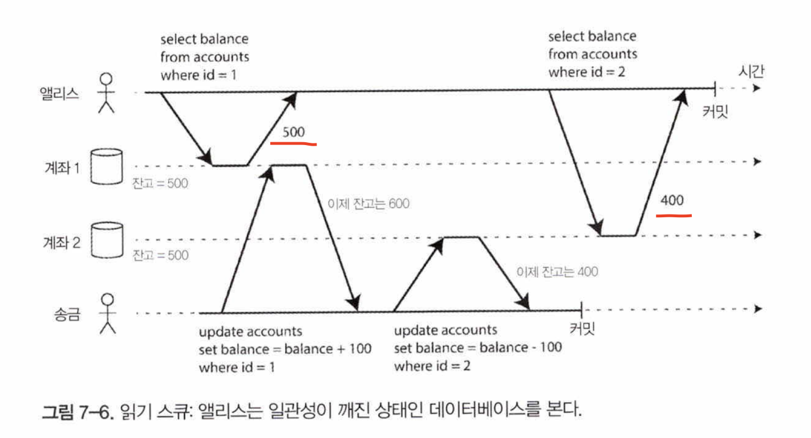
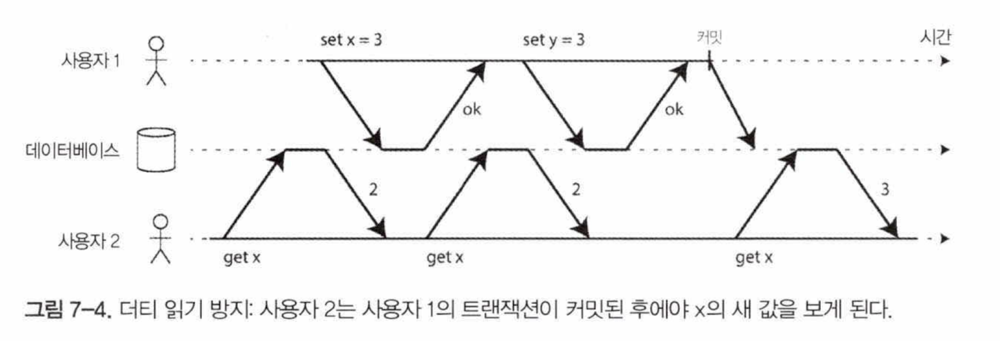
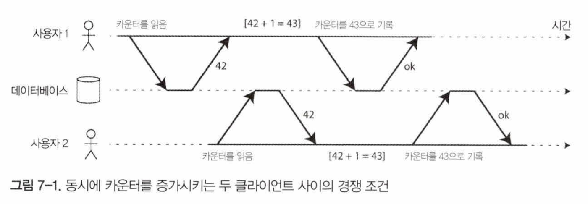
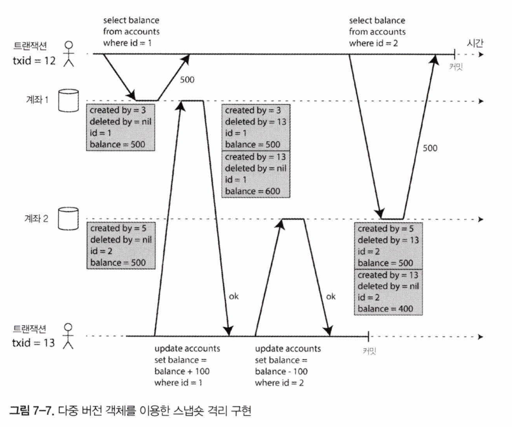
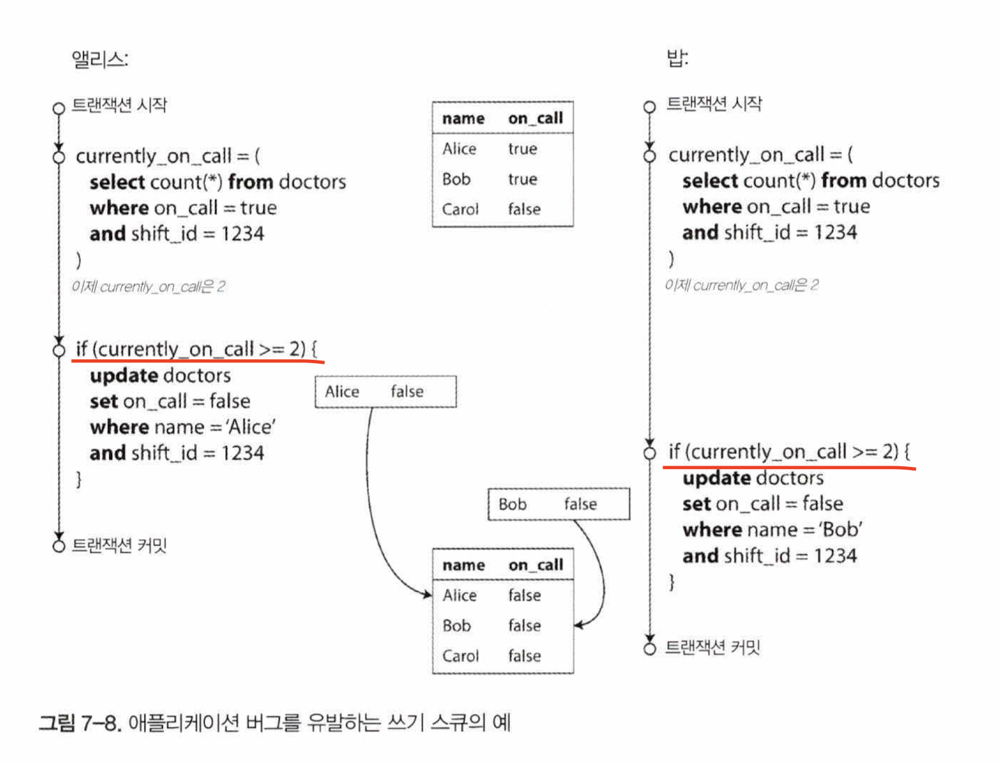
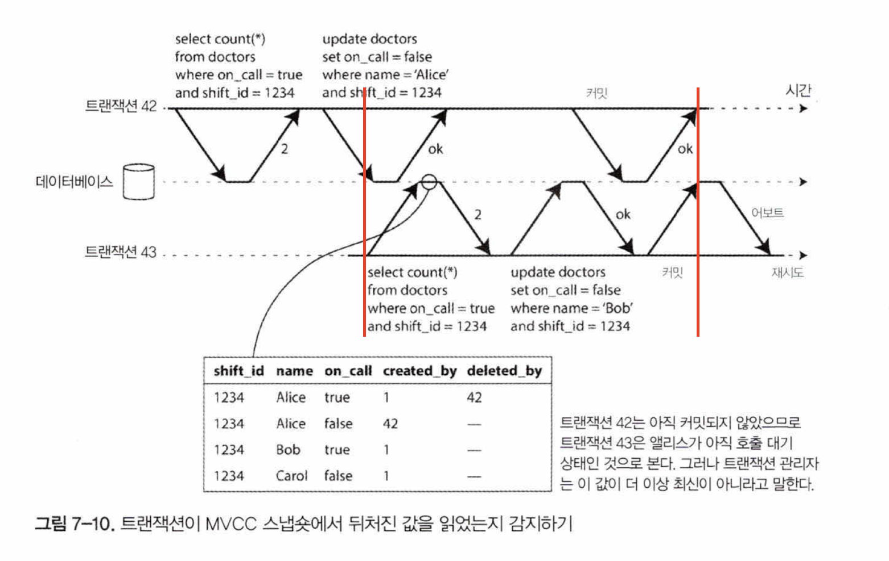

## 애매모호한 트랜잭션의 개념

MySQL, 포스트그레스큐엘, 오라클 등에서 지원되는 트랜잭션은 1975년 첫번째 SQL 데이터베이스인 IBM 시스템 R에서 소개된 스타일을 따름.

2000년대 후반에 NoSQL데이터베이스가 인기를 얻고 발전하면서 트랜잭션을 포기하거나 과거에 인식되던 것보다 훨씬 약한 보장을 의미하는 단어로 트랜잭션의 의미를 재정의.

확장성에 안티테제(과거의 주장에 첨예하게 대립되는 주제)다? 꼭 필요한 요소다? 여러 주장이 있는데, 둘 다 과장된 측면이 있음. 충돌의종류, 각 단계가 어떻게 동작하는지 잘 파악 하고 트레이드오프에 따라 선택!

### ACID의 의미

- ACID : Atomicity(원자성), Consistency(일관성), Isolation(격리성), Durability(지속성)
    - 구현은 데이터베이스 마다 제각각이다.
- BASE: ACID 가 아닌것은 BASE라고 하고, Basically Available(가용성을 제공하고) Soft state(유연한 상태를 가지며) Eventual consistency(최종적 일관성을 지닌다.) 을 의미함.
- **원자성**
    - 더 작은 부분으로 쪼갤 수없다.
    - 동시성과는 관련이 없음(동시성은 Isolation에서 다룸)
    - 쓰기 작업 몇 개를 실행하다 결함이 생기면 실행되었던 쓰기작업이 어보트 됨.
    - 트랜잭션이 어보트 되었다면 그 트랜잭션으로 인해 변경된게 아무것도 없다는 것이 보장됨.
    - atomicity 말고 abortability로 쓰면 이해하기 더 쉬울텐데
- **일관성**
    - 다른 곳에서 여러 의미로 사용됨.
    - ACID 에서는..
        - *항상 진실이어야 하는, 데이터에관한 어떤 선언(불변식(invariant))가 있다.*
    - 일관성의 개념은 애플리케이션에 의존한다.
- **격리성**
    - *동시에 실행 되는 트랜잭션은 서로 격리된다.*
    - 직렬성이라는 개념이 있는데
        - 데이터베이스는 실제로는 여러 트랜잭션이 동시에 실행됐더라도 트랜잭션이 커밋됐을 때의 결과가 트랜잭션이 순차적으로 실행됐을 때의 결과와 동일하도록 보장.
        
        성능 손해를 동반하므로 현실에서는 거의 사용되지 않음.
        
        오라클에 “직렬성” 격리 수준이 있지만 실제로는 직렬성 보다 보장이 약한 스냅숏 격리를 구현한것.
        
    - 뒤에 완화된 격리 수준, 직렬성 에서 자세하게 다룬다.
- **지속성**
    - *트랜잭션이 성공적으로 커밋 됐다면 하드웨어 결함이 발생하거나데이터베이스가 죽더라도 트랜잭션에서 기록한 모든 데이터는 손실되지않는다.*
    - 하지만 완벽한 지속성은 존재하지 않는다.

### 단일 객체 연산과 다중 객체 연산

- ACID 의 A, I 는 한 트랜잭션 내에서 여러번의 쓰기를 하면 데이터베이스가 어떻게 해야 하는지를 서술. 이 정의는 한 번에 여러 객체를 변경할 수있다고 가정한다.
    - 원자성: 전부 반영하거나 아무것도 반영하지 않는 것을 보장함으로써 부분 실패를 걱정할 필요가 없게 도와준다.
    - 격리성: 동시 실행되는 트랜잭션들은 서로를 방해하지 말아야 한다.
- 다중 객체 트랜잭션 → 한 트랜잭션에서 다수의 객체에 접근하여 읽기 쓰기를 하는것? 단순하게 여러 쿼리문이 한 트랜잭션에서 실행되는 것을 다중 객체 트랜잭션이라고 할 수 있을것같다.
    - 관계형 DB : `BEGIN TRANSACTION`, `COMMIT` 사이의 모든 것은같은 트랜잭션에 속하는 것으로 여겨짐
    - 비관계형 DB : 관계형 DB 처럼 연산을 묶는 방법이 없는 경우가 많다. → 어떤 키에 대한 연산은 성공하고 나머지 키에 대한 연산은 실패해서 데이터베이스가 부분적으로 갱신된 상태가 될 수 있다.
- **단일 객체 쓰기**
    - 단일 객체를 변경하는 경우에도 원자성과 격리성에 대해 신경써줘야함.
        - 디비가 디스크에 저장된 기존 값을 덮어 쓰는 도중에 전원이 나가면?
        - 문서를 쓰고 있을 때 다른 클라이언트가 그 문서를 읽으면?
    - 원자성은 장애복구용 로그를 써서 구현 가능
    - 격리성은 각 객체에 잠금을 사용해 구현 가능
    - 디비는 원자적 연산(예를 들어 - 원자적 증가(auto increment 인듯), CAS)을 제공하기도 하고, 이는 갱신 손실을 방지해 유용함.
        - 하지만 일반적으로 쓰이는 의미의 트랜잭션은 아님.
    - 트랜잭션 - 다중 객체에 대한다중 연산을 하나의실행 단위로 묶는 메커니즘
- **다중 객체 트랜잭션의 필요성**
    - 서로참조하는(관계형 데이터모델에서 테이블간 외래키로 참조하는 경우, 그래프형 모델에서 정점과 정점을 잇는 간선) 여러 레코드를 삽입할 때 참조키는 올발라야 하고 최신 정보를 반영해야 한다.
    - 문서데이터베이스의 경우도 비정규화 된 경우 비정규화된 데이터를 갱신하기 위해 한번에 여러 문서를 갱신해야하는데 이럴때 비정규화된 데이터동기화가 깨질 수 있음.
    - 보조 색인이 있는 데이터베이스 에서는 값을 변경할 때마다 색인도 갱신해줘야 하는데, 트랜잭션 관점에서 테이블(?) 과 색인 은 서로 다른 데이터베이스 객체다.
    - 트랜잭션이 없어도 애플리케이션 구현이 가능하지만 원자성이 없으면 오류 처리가 훨씬 더 어려워지고 격리성이 없으면 동시성 문제가 생길 수 있다.
- **오류와 어보트 처리**
    - 트랜잭션의 핵심 기능은 오류가 생기면 어보트 되고 안전하게 재시도할 수 있다는것. 하지만 모든 시스템이 이 철학을 따르지는 않는다.
        - 예를 들어 리더 없는 복제를 사용하는 데이터 스토어. 애플리케이션에 오류 복구의 책임이 있다.
    - 소프트웨어 개발자의 많은 경우는 어보트 된 경우 오류 메시지를 사용자에게 전달 하고 다시 시도하지 않는다.
    - 어보트의 취지를 제대로 살리지 못하는것 같지만(재시도 가능한데) 단순 재시도가 위험한 경우도 있음.
        - 트랜잭션 성공 했지만 네트워크 단절로 성공 응답을 못받은 경우
        - 오류 과부하로 디비가 힘들 때 트랜잭션 재시도 하면 상황이 악화됨.
        - 영구적인 오류(제약조건 위반 등) 는 재시도 해도 소용없음.
        - 트랜잭션 도중 부수효과가 있는 경우(예를 들어 이메일을 보낸다거나) 트랜잭션이 재시도 할 때 부수효과가 반복으로 동작함.

## 완화된 격리 수준

- 트랜잭션 격리
    - 애플리케이션 개발자들에게 동시성 문제를 감추기 위해
- 직렬성 격리
    - 여러 트랜잭션들이 직렬적으로 실행되는 것과 동일한 결과가 나오도록 보장한다는 것 의미
    - 성능 비용이 있어 많은 데이터베이스들은 그 비용을 지불하려고 하지 않는다.
    - 대신 완화된 격리 수준을 사용.

데이터 정합성이 중요하다고 해서 단순히 ACID 데이터베이스를 사용하라! 보다는 동시성 문제의 종류를 잘 이해하고 방지하는 방법을 배울 필요가 있다.

### 커밋 후 읽기

- 가장 기본적인 수준의 트랜잭션 격리
- 다음 두 가지를 보장해준다.
    - 데이터베이스에서 읽을 때 커밋된 데이터만 보게 된다.(더티 읽기가 없음)
    - 데이터베이스에 쓸 때 커밋된 데이터만 덮어쓰게 된다.(더티 쓰기가 없음)
- 다음은 보장하지 못함.
    - 반복 읽기 보장 못함.(비반복 읽기, 읽기 스큐라고 함)
        
        
        
        - 읽기 시점에 따라 잔고 100 이 날라간것 처럼 보일 수 있다.
- **더티 읽기 방지**
    - 더티 읽기: 트랜잭션이 데이터베이스에 데이터를 썼지만 아직 커밋되거나 어보트 되지 않았을 때, 다른 트랜잭션에서 커밋되지 않은 데이터를 보는것
        
        
        
        - 더티 읽기가 방지된 예시
    - 유용한 이유?
        - 부분적으로 갱신된 상태에 있는 데이터베이스를 보는 것은(더티읽기 상황) 사용자에게 혼란스러우며 다른 트랜잭션들이 잘못된 결정을 하게 되는 원인이 될 수 있음.
        - 트랜잭션이 롤백될 때 롤백될 데이터(실제로 데이터베이스에 결코 커밋되지 않을 데이터)를 볼 수 있음. 혼란스러워~
- **더티 쓰기 방지**
    - 더티쓰기: 먼저 쓴 내용이 아직 커밋되지 않은 트랜잭션에서 쓴 것이고 나중에 실행된 쓰기 작업이 커밋되지 않은 값을 덮어써버리는 경우
        - 먼저 쓴 트랜잭션이 커밋되거나 어보트될 떄까지 두 번째 쓰기를 지연시키는 방법으로 달성함.
    - 막지 못하는 경쟁조건이 있음.
        
        
        
        - 이런 경우는 트랜잭션이 커밋된 상태에서일어났기 때문에 더티쓰기가 아니다. “갱신 손실 방지” 에서 카운터 증가를 안전하게 만드는 방법을 다룬다.
- **커밋 후 읽기 구현**
    - 매우 널리 쓰이는 격리 수준
    - 로우 수준 잠금을 사용해 더티 쓰기를 방지
        - 해당 객체에 대한 잠금 획득
        - 트랜잭션이 커밋되거나 어보트될 때까지 잠금 보유
        - 데이터베이스에서 자동으로 실행
    - 더티 읽기 방지는
        - 읽기잠금? 가능하다. 하지만 현실에서 잘 동작하지 않음. 읽기가 많은데 중간에 어떠한… 장해가 생기는 경우 대기시간이 길어질 수 있다.
        - 그림 7-4에서 설명된 방법을 사용해 더티 읽기 방지.
        - 과거에 커밋된 값과 현재 쓰기 잠금이 갖고 있는 트랜잭션에서 쓴 새로운 값 모두 기억.
        - 트랜잭션이 커밋 되면 다른 트랜잭션들이 새로운 값을 읽을 수 있다.

### 스냅숏 격리와 반복 읽기

- 스냅숏 격리와 반복읽기가 보장이 안되면
    - 백업본을 만들 때 비일관성이 영속적이게 된다.(일관성이 깨진 데이터가 백업되게 됨)
    - 분석질의(디비의 큰 부분을 질의 등) 다른 시점에 있는 데이터베이스의 일부를 보게 되면서 불합리한 결과를 반환할 수도 있다.
- 각 트랜잭션은 데이터베이스의 일관된 스냅숏으로부터 읽는다.
- **스냅숏 격리 구현**
    - 읽는 쪽에서 쓰는 쪽을 차단하지 않고 쓰는 쪽에서 읽는 쪽을 결코 않는다.
    - 다중 버전 동시성 제어(multi-version concurrency control, MVCC)
        - 객체마다 커밋된 버전 여러 개를 유지할 수 있어야 한다. 데이터베이스가 객체의 여러 버전을 유지하는 기법을 mvcc라고함.
    - 포스트그레스큐엘에선 MVCC 기반 스냅숏 격리를 아래와 같이 구현함
        
        
        
        - 트랜잭션이 시작하면 계속 증가하는 고유한 트랜잭션 ID를 할당받는다.
        - 트랜잭션이 데이터베이스에 데이터를 쓸 때마다 쓰기를 실행한 트랜잭션의 ID 가 함께 붙는다.
        - 테이블의 각 로우에는 그 로우를 테이블에 삽입한 트랜잭션의 ID를 갖는 created_by 필드가 있다.
        - 각로우 처음에는 비어있는 deleted_by 필드도 있다.
        - 트랜잭션이 로우를 삭제하면 실제로데이터베이스에서 지우지않고 deleted_by 필드를삭제 요청 트랜잭션의 ID로 설정하여 지워졌다고 표시
        - 나중에 아무 트랜잭션도 더 이상 삭제된 데이터에 접근하지 않는 게 확실해지면 데이터베이스의 가비지 컬렉션 프로세스가 지워졌다고 표시된 로우들을 삭제
        - 갱신은 내부에서 삭제와 생성으로 변환됨.
- **일관된 스냅숏을 보는 가시성 규칙**
    - 트랜잭션은 트랜잭션 ID 를 사용해 어떤 것을 볼 수 있고 어떤 것을 볼 수 없는지 결정한다. 동작 방식은 아래와 같다.
        1. 데이터베이스는 각 트랜잭션을 시작할 때 그 시점에 진행 중인(아직 커밋이나 어보트 되지 않은) 모든 트랜잭션의 목록을 만든다. 이 트랜잭션 들이 쓴 데이터는 모두 무시됨
        2. 어보트된 트랜잭션이 쓴데이터는 모두 무시됨.
        3. 트랜잭션 ID가 더 큰 트랜잭션이 쓴 데이터는 그 트랜잭션의 커밋 여부에 관계 없이 모두 무시
        4. 그 밖의 모든 데이터는 애플리케이션의 질의로 볼 수 있다.
- **색인과 스냅숏 격리**
    - 여러 구현 방식에 따라 성능이 달라짐
        - 포스트그레스큐엘 - 동일한 객체의 버전들이 같은 페이지에 저장될 수 있다면 색인 갱신을 회피하는 최적화를 함.
        - 카우치DB, 데이토믹, LMDB - 추가 전용이며 쓸 때 복사되는 B트리. 특정 시점의 root 는 그 시점에 해당하는 데이터베이스의 일관된 스냅숏이 된다.
- **반복 읽기와 혼란스러운 이름**
    - 오라클에서는 반복 읽기를 **직렬성**이라고 함.
    - 포스트그레스큐엘, mysql 에서는 **반복읽기**라고 함.
    - SQL 표준에 스냅숏 격리의 개념이 없고 용어가 모호하고 부정확.

### 갱신 손실 방지

- 커밋 후 읽기, 스냅숏 격리 수준 - 쓰기작업과 읽기 작업이 동시에 실행될 때 읽기 전용 트랜잭션이 무엇을 볼 수 있는지에 대한 보장
- 몇가지 해결 해야 할 문제가 더 있음. 갱신 손실
    - 데이터베이스에서 값을 읽고 변경 후 변경된 값을 다시 쓸 때 발생 가능.
    - 두 트랜잭션이 같은 객체를 변경하려고 할 때 두번째 커밋 된 트랜잭션이 첫번째 트랜잭션이 ㅂ녀경한 내용을 포함하지 않으므로 변경 중 하나는 손실될 수 있다.
- 사례
    - 카운터 증가, 계좌 잔고 갱신
    - 복잡한 값을 지역적으로 변경(Json 문서 내에 있는 리스트에 엘리먼트 추가)
    - 새 값을 덮어쓰면서 갱신하는 게시판에서 두 사용자가 동시에 같은 페이지 편집
- **해결방법 - 원자적 쓰기 연산**
    
    ```sql
    update counters set value = value + 1 where key = 'foo' 
    ```
    
    - read - modify - write 를 구현할 필요가 없음.
    - 모든 경우에 해결책이 될 순 없지만 원자적 연산을 사용할 수 있는 경우엔 이 방법이 보통 최선의 선택이 됨.
    - 원자적 연산은 보통 객체를 읽을 때 그 객체에 독점적인(exclusive) 잠금을 획득해서구현한다. - 커서 안정성
    - *read-modify-write 주기가 순차적으로 실행됨을 강제*
- **해결방법 - 명시적 잠금**
    - 동시에 실행되는 read-modify-write를 안전하게 - 같은 객체에 접근하는 첫번째 실행된 트랜잭션이 끝날 때까지 기다림
    - *read-modify-write 주기가 순차적으로 실행됨을 강제*
    
    ```sql
    BEGIN TRANSACTION;
    
    SELECT * FROM figures
    	WHERE name = 'robot' and game_id = 222
    	FOR UPDATE; -- 이 질의에 의해 반환된 모든 로우에 잠금을 획득해야 함을 가리킴
    
    UPDATE figures SET position = 'c4' WHERE id = 1234;
    
    COMMIT;
    ```
    
- **해결방법 - 갱신 손실 자동 감지**
    - 트랜잭션 관리자가 갱신 손실을 감지 하면 트랜잭션을 어보트 시키고 *read-modify-write* 주기를 재시도 한다.
    - 디비 단에서 스냅숏 격리와 결합해 이 방법을 효율적으로할 수 있다.
- **해결방법 - Compare-and-set**
    - 마지막으로 읽은 후 변경 되지 않았을 때만 갱신 허용함으로써 갱신 손실을 회피. 변경되었다면 갱신은 반영되지 않고 *read-modify-write* 주기를 재시도.
    - 데이터베이스 WHERE 절이 오래된 스냅숏으로 부터 읽는 것을 허용한다면 이 구문은 갱신 손실을 막지 못할수도 있다.
    - 사용하기 전에 안전한지 확인 필요!
- **해결방법 - 충돌 해소와 복제**
    - 복제가 적용된 데이터베이스에서는 갱신 손실을 방지하려면 추가 단계가 필요하다.
    - 잠금과 compare-and-set 은 데이터의 최신 복사본이 하나만 있다고 가정.
    - 하지만 *다중리더* / *리더 없는 복제*를 사용하는 데이터베이스는 일반적으로 여러 쓰기가 동시에 실행되고 비동기식으로 복제되는 것을 허용하므로 데이터의 최신 복산본이 하나만 있으리라고 보장할 수 없다.
    - 이땐 한 값에 대해 여러 개의 충돌된 버전(형제)을 생성하는 것을 허용하고사후에 애플리케이션 코드나 특별한 데이터 구조를 사용해 충돌을 해소하고 이 버전들을 병합.

### 쓰기 스큐와 팬텀

- 앞선 방식을 모두 사용하더라도 데이터가 손실 되는 케이스가 발생할수 있음.
- **쓰기 스큐**
    - 정상적인 상황이었으면 일어나지 말앗어야 하지만 경합상황에서 정책 위반사항이 생기는 경우
        
        
        
        - currently_on_call 이 2 이상이어야 호출대기를 그만 둘 수 있다는 정책이 깨졌다.
    - 자동으로 방지하기 위해 진짜 직렬성 격리가 필요함.
    - 몇몇 데이터베이스에 내장된 트리거나 구체화 뷰를 사용해 방지 가능.
    - 로우를 명시적으로 잠그는 것이 차선책.
- **쓰기 스큐를 유발하는 팬텀**
    - 쓰기 스큐가 유발되는 상황은 특정 패턴이 따른다.
        1. Select 질의가 어떤 검색 조건에 부합하는 로우를 검색함으로써 어떤 요구사항을 만족하는지 확인
        2. 첫번째 질의의 결과에 따라 애플리케이션 코드는 어떻게 진행할지 결정
        3. 애플리케이션이 계속 처리하기로결정했다면 데이터베이스에 쓰고 트랜잭션을 커밋. 이 쓰기의 효과로 2단계를 결정한 조건이 바뀜.
        
        다른 경우도 발생할 수 있긴 함.
        
    - 로우를 잠금으로써 트랜잭션을 안전하게 만들 수 있으나 잠글 수 있는 객체가 없는 경우도 많다.
    - 어떤 트랜잭션에서 실행한 쓰기가 다른 트랜잭션의 검색 질의 결과를 바꾸고 있고, 이런 효과를 **팬텀**이라고 한다.
- **충돌 구체화**
    - 인위적으로 데이터베이스에 잠금 객체를 추가할 수도 있다. - **충돌 구체화**라고 함.
    - 충돌 구체화 방법은 알아내기 어렵고 오류 발생하기 쉬움. 동시성 제어 메커니즘이 애플리케이션 데이터 모델로 새어나오는 것도 별로 보기 안좋음.
    - 대부분 경우직렬성 겨리 수준이 훨씬 더 선호됨.

## 직렬성

- 보통 가장 강력한 격리수준이라고 여겨짐.
- 여러 트랜잭션이 병렬로 실행 되더라도 최조 결과는 동시성 없이 한 번에 하나씩 직렬로 실행될 때와 같도록 보장.
- 구현 방법
    - 말 그대로 트랜잭션을 순차적으로 실행
    - 2단계 잠금
    - 낙관적 동시성 제어(직렬성 스냅숏)

### 실제적인 직렬 실행

- 비교적 최근에 실현 가능하다고 결론내려짐
    - 램 가격이 저렵해져서 활성화된 데이터셋 전체를 메모리에 유지할 수 있을 정도가 됨. 디스크에 읽는것 보다 트랜잭션 처리 속도가 빨라짐.
    - OLTP 트랜잭션은 보통 짧고 실행하는 읽기와 쓰기의 개수가 적다.
    - OLAP 는 비교적 길고 읽기 전용이라 직렬 실행 루프 밖에서 일관된 스냅숏을 사용해 실행.
- 처리량이 CPU 코어 하나의 처리량으로 제한됨.
- **트랜잭션을 스토어드 프로시저 안에 캡슐화하기**
    - 단일 스레드에서 트랜잭션 순차적 처리를 지원하는 시스템들은 상호작용하는 다중구문 트랜잭션을 허용하지 않는다.
        - 상호작용? user의 응답/결정을 기다린다거나 네트워크 통신을 한다거나
    - 트랜잭션 코드 전체를 스토어드프로시저 형태로 데이터베이스에 미리 제출.
- **스토어드 프로시저의 장단점.**
    - 단
        - 범용 프로그래밍 언어만큼 발전하지 못해 낡고 조잡해보이며 라이브러리 생태계가 빈약
        - 디버깅, 테스트, 모니터링 어렵
        - 잘못 작성하면 성능에 성능에 민감한 데이터베이스에 안좋은 영향을 끼침.
    - 장
        - PL/SQL 대신 범용 프로그래밍 언어 지원. redis - lua 스크립트
        - 데이터가 메모리에 있을때 - I/O 대기가 필요 없고 동시성제어로 오버헤드 회피 가능
    - 복제에 사용하려면 결정적 쿼리를 써야함.(random(), now() 는 비결정적. 디비에서 알아서 해주겠지)
- **파티셔닝**
    - 쓰기 트랜잭션이 단일 CPU 코어의 속도로 제한됨.
    - 파티셔닝을 사용하면 모든 파티션에 대해 락을 획득한 다음 실행해야함.
    - 추가적인 코디네이션 오버헤드가 있어 단일 파티션 트랜잭션보다 느림.
- **직렬 실행 요약**
    - 몇가지 제약사항 안에서 트랜잭션 직렬 실행은 실용적인 방법
        - 모든 트랜잭션은 작고 빨라야함.
        - 활성화 데이터셋이 메모리에 적재된 경우
        - 쓰기 처리량이 단일 CPU에서 처리할 수 있을 정도로 낮아야함.

### 2단계 잠금(2PL)

- 잠금이 트랜잭션간 직렬성을 보장해줌.
- 갱신손실과 쓰기 스큐를 포함한 모든 경쟁조건을 막아줌. 2PL은 직렬성을 제공함(진짜?? 259페이지에선 서술잠금과 함께 써야 직렬성 보장해준다는것 같은데?)
- **2단계 잠금 구현**
    - 공유 모드 락:
        - 객체 읽을 때 s-lock. 동시에 여러 트랜잭션이 s-lock 을 획득하는것이 가능하다. x-lock 이 걸려있으면 풀릴때 까지 기다려야 한다.
        - 객체를 읽다가 쓸 때 s-lock 에서 x-lock 으로 업그레이드해야함. x-lock 직접 획득할때랑 동일하기 동작.
    - 독점 모드 락:
        - 객체에 쓸 때 x-lock. x-lock 이 걸려있는 객체에 추가로 x-lock을 획득 할 수 없다.
    - 트랜잭션이 종료될 때까지 락을 가지고 있어야함.1단계 - 락 획득, 2단계 - 락 해제
    - 교착상태가 생길 수 있고, 데이터베이스는 교착상태를 감지해 그 중 하나를 어보트 시키고, 앱에서재시도 해야한다.
- **2단계 잠금의 성능**
    - 락 걸고 해제 하는 오버헤드에 의한 성능 하락
    - 동시성이 줄어들어 성능 하락
    - 교착상태도 다른 방식 보다 많이 발생
- **서술 잠금**
    - 공유/독점 잠금과 비슷하게 동작하지만 특정 객체에 속하지 않고 아래와 같은 어떤 검색 조건에 부합하는 모든 객체에 속한다.
    
    ```sql
    SELECT * FROM bookings
    WHERE room_id = 123 AND
    end_time > '2018-01-01 12:00' AND
    start_time < '2018-01-01 13:00';
    ```
    
    - 공유 모드 서술 잠금, 독점 모드 서술 잠금이 있는것 같고
    - 범위로 잠그기가 가능. 미래에 추가될 수 있는 객체(팬텀) 에도적용 가능함.
    - 2단계 잠금 + 서술잠금이면 모든 형태의 쓰기 스큐와 다른 경쟁조건을 막을 수 있어서 격리 수준이 직렬성 격리가 된다.
- **색인 범위 잠금**
    - 서술잠금은 잘 동작하지 않는다. 그래서 2PL을 지원하는 대부분의 데이터베이스는 색인 범위 잠금, 다음 키 잠금(next-key locking) 을 구현한다. 서술잠금의 간략한 근사라고 보면 됨.
    - 쓰기 팬텀, 쓰기 스큐로부터 보호해줌.
    - 색인 범위 잠금은 서술 잠금보다 정밀하진 않지만 오버헤드가 훨씬 낮음.
    - 범위 잠금을 잡을 수없으면 데이터베이스는 테이블 전체에 공유 잠금을 잡는다. 성능엔 좋지 않지만 안전한 대비책.

### 직렬성 스냅숏 격리(SSI)

- 직렬성 처리와 성능 두 부분에서 좋은 성능을 가지는 유망한 알고리즘.
    - 완전한 직렬성 제공하지만 스냅숏 격리에 비해 약간의 성능 손해
- 단일 노드 데이터베이스와 분산 데이터베이스 모두에섯 ㅏ용.
- 성능 증명 중
- **비관적 동시성 제어 대 낙관적 동시성 제어**
    - 2단계 잠금은 비관적 동시성 제어 메커니즘. 직렬 실행은 극단적으로 비관적
    - SSI는 낙관적 동시성 제어
        - 일단 진행. 트랜잭션이 커밋 되기 전에 격리가 위반됐는 지 확인 후 트랜잭션 어보트 후 재시도
    - 경쟁이 심하다면 낙관적 동시성 제어는 오히려 부하를 많이 줄 수 있음(재시도 때문에)
    - 예비 용량이 충분하고 트랜잭션 사이의 경쟁이 너무심하지 않으면 성능이 좋은 경향이 있다.
    - SSI는 스냅숏 격리 위에 쓰기 작업 사이의 직렬성 충돌을 감지하고 어보트 시킬 트랜잭션을 결정하는 알고리즘을 추가한다.
- **뒤처진 전제에 기반한 결정**
    - 앞서 쓰기 스큐 예시에서 쓰기스큐가 일어나는 케이스는 트랜잭션이 실행되는 어떠한 “전제” 가 바뀔때 발생함.(currently_on_call ≥ 2)
    - 직렬성 격리 제공을 위해 데이터베이스는 트랜잭션이 뒤처진 전제를 기반으로 동작하는 상황을 감지하고그런 상황에서는 트랜잭션을 어보트시켜야 한다.
    - 방법은
        - 오래된 MVCC 객체 버전 읽었는지 감지
        - 과거의 읽기에 영향을 미치는 쓰기 감지
- **오래된 MVCC 읽기 감지하기**
    - 트랜잭션이 커밋하려고 할 때 데이터베이스는 무시된 쓰기 중 커밋된게 있는 지 확인해야 하고, 커밋되었다면 지금 트랜잭션은 어보트 되어야함.
    
    
    
    - 트랜잭션 43이 doctors 테이블을 읽을 때 사용한 스냅숏은 트랜잭션 42가 반영되지 않은 스냅숏
    - 트랜잭션 43이 커밋 하려고 할 때 이미 트랜잭션 42가 커밋 했고, 43이 사용한 스냅숏은 오래된 스냅숏이 됨.
    - 커밋할때 검사해서 불필요한 어보트를 줄인다.
- **과거의 읽기에 영향을 미치는 쓰기 감지하기**
    - 트랜잭션이 데이터베이스에 쓸 때 영향 받는 데이터를 최근에 읽은 트랜잭션이 있는지 색인에서 확인.
    - 나중에 커밋되는 트랜잭션이 충돌되는 쓰기가 있는지 확인 후 어보트 여부 결정한다.
    - 앞선 방식과 보완적인 관계인지(SSI를 위해 같이 사용해야 하는 방법인지), 같은 목적을 위한 다른 방식인지.. 잘 모르겠음 내생각엔 같은 목적을 위한 다른 방식으로 보임