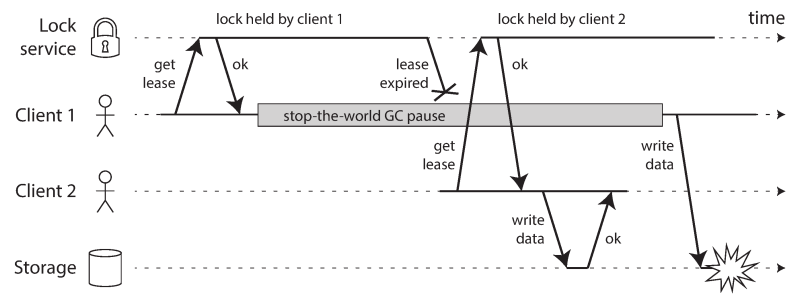
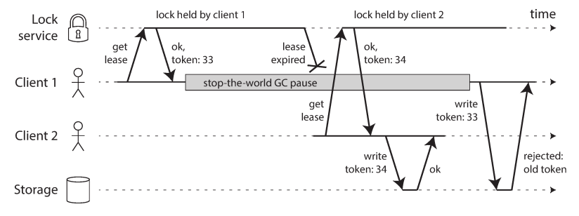

# chapter 8. 분산 시스템의 골칫거리
- 요약: 분산 시스템에서 발생하는 문제를 자세히 살펴봄

- 잘못될 가능성이 있다면 잘못된다.
    - 모든 게 잘못되도 제 역할을 해내는 시스템 구축 -> 분산 시스템에서 제공하는 알고리즘 몇가지 예 (9장) 
    - 네트워크 + 시계 및 타이밍

## 8.1 결함과 부분 장애
- 단일 컴퓨터 환경: 결정적 (항상 같은 결과)
- 분산 컴퓨터 환경: 비결정적, 부분장애, 성공여부 알지도 못할 수도

### 클라우드 컴퓨팅과 슈퍼컴퓨팅
- 슈퍼컴퓨터: 지속성 있는 저장소에 체크포인트로 저장 -> 장애가 발생하면 마지막 체크포인트로부터 계산을 재시작 한다. 단일 노드 컴퓨터에 가깝다 
    - 부분 장애를 전체 장애로 확대하는 방법으로 처리
- 분산시스템 동작하려면? 부분 장애 가능성을 받아들이고 sw에 내결함성 메커니즘 넣어야 함
- 결함 처리는 소프트웨어 설계의 일부여야 하며 결함이 발생하면 소프트웨어가 어떻게 동작할지 알아야 함

## 8.2 신뢰성 없는 네트워크
- 분산시스템은 비공유 시스템이다. (네트워크로 연결된 다수의 장비) -> 비동기
    - 메시지 도착 보장되지 않는 원인들
        - 요청이 손실, 요청이 큐에서 대기하다 나중에 전송, 원격 노드에 장애 발생, 원격 노드가 일시적으로 응답을 멈췄지만 나중에 다시 응답 시작, 응답이 네트워크상에서 유실, 응답이 지연되다가 나중에 전송
        - 이런 문제를 다루는 흔한 방법: 타임아웃

### 현실의 네트워크 결함
- 네트워크 결함이 드물더라도 결함이 일어날 수 있다는 사실은 인지하고 소프트웨어가 이를 처리할 수 있도록 설계 
    - 반드시 네트워크 결함을 견뎌내도록(tolerating) 처리할 필요는 없음
    - 복구할 수 있도록 보장 (카오스 몽키)

### 결함 감지
- 결함 있는 노드를 자동으로 감지
    - 로드 밸런서는 죽은 노드로 요청을 그만 보내기
    - 리더 장애 시 팔로워 중 리더 자동 승격

### 타임아웃과 기약 없는 지연
- 타임아웃은 얼마나? 답은 없음
    - 길면 노드가 죽었다고 선언될 때까지 기다리는 시간이 길어짐
    - 짧으면 결함을 빨리 발견하지만 응답이 일시적으로 느려졌어도 죽었다고 선언 (문제 악화)
- 네트워크 혼잡과 큐 대기
    - 여러 노드가 동시에 같은 목적지로 패킷을 보내려고 하면 네트워크 스위치는 패킷을 큐에 넣고 한번에 하나씩 네트워크 링크로 넘김
    - 패킷이 목적지 장비에 도착해도, cpu가 바쁘면 OS가 큐에 넣어둠
    - 가상환경에서는 다른 가상장비가 cpu 사용해 멈출때가 흔함
    - TCP는 흐름 제어를 수행하며 혼잡회피나 배압을 조절하여 과부하고 되지 않도록 송신을 제한하기도 함
        - TCP는 타임아웃 안에 확인 응답을 받지 않으면 패킷이 손실됐다고 간주하고 재전송
        - UDP는 흐름 제어를 하지 않고 손실된 패킷을 재전송하지 않으므로 네트워크 지연이 크게 변하게 하는 원인 중 일부를 제거

### 동기 네트워크 대 비동기 네트워크
- 동기 네트워크 대 비동기 네트워크
    - 전화 네트워크 (circuit): 동기식
- 그냥 네트워크 지연을 예측 가능하게 만들 수는 없을까?
    - 왜 데이터센터 네트워크와 인터넷은 패킷을 교환을 사용할까? 순간적으로 몰리는 트래픽에 최적화됐기 때문 (bursty traffic)
    - TCP는 가용한 네트워크 용량에 맞춰 데이터 전송률을 동적으로 조절

## 8.3 신뢰성 없는 시계
- 시계와 시간은 중요 (아래의 이유로 시계에 의존)
    - 지속 시간
        - 이 요청이 타임아웃됐나?, 이 서비스의 99분위 응답 시간은 어떻게 되나?, 이 서비스는 지난 5분 동안 평균 초당 몇 개의 질의를 처리했나?, 사용자가 우리 사이트에서 시간을 얼마나 보냈나?
    - 시점
        - 이 기사가 언제 게시됐나?, 며칠 몇 시에 미리 알림 이메일을 보내야 하나?, 이 캐시 항목은 언제 만료되나?, 로그 파일에 남은 이 오류 메시지의 타임스탬프는 무엇인가?
    - HW, 네트워크 시간

### 단조 시계 대 일 기준 시계
- 일 기준 시계
    - NTP (Network Time Protocal) 로 동기화 -> 신뢰성이 높지 않음
    - 윤초 문제
    - 매우 거친 해상도 (예: 윈도는 10ms로 흐름)
- 단조 시계
    - 시간은 앞으로 흐른다. (반대로 일 기준 시간은 거꾸로 뛸 수 있음)
    - 두 값의 차이 (한번 확인 후 어떤 일 후 다시 시계 확인): 흘러간 시간만 체크, 절대적인 값은 의미 없음
    - 해상도가 좋음

### 시계 동기화와 정확도
- 하드웨어 시계와 NTP는 변덕스러울 수 있음
    - 장비 온도, 컴퓨터 시계와 NTP의 차이가 크면 동기화가 거부되거나 로컬 시계가 리셋, 방화벽, NTP 동기화는 잘해야 네트워크 지연만큼만 좋을 수 있음, NTP 서버 자체 문제, 윤초

### 동기화된 시계에 의존하기
- 문제점: 시계가 잘못된다는 것을 눈치채지 못함 -> 모든 장비의 시계 차이를 모니터링
- 이벤트 순서화용 타임스탬프
    - LWW로 충돌을 해소할 때, 잘못된 타임스탬프는 데이터를 손실 시킬 수 있음 (최근 시간의 의미가 애매)
    - Logical clock은 증가하는 카운터를 기반으로 하며 이벤트 순서화의 안전한 대안. 즉, 상대적인 순서만 측정
- 시계에는 신뢰 구간이 있다.
    - 시계를 어떤 시점으로 생각 못함 -> range와 신뢰구간이 나을 수 있음
    - spanner에 있는 google TrueTime API : 예외적으로 신뢰 구간 보여줌
- 전역 스냅숏용 동기화된 시계
    - 여러 DC에 있는 여러 장비에 분산되어 있는 DB라면 전역 단조 증가 트랜잭션 ID를 생성하기 어렵

### 프로세스 중단
- 프로그램 실행 중 예상치 못한 중단이 있었다면, 중단 이후로 권한이 없지만 프로세스가 뭔가 안전하지 않은 일을 한 상태일지 모른다.(lease 예시)
    - stop-the-world
    - 가상 장비 suspend & resume: 모든 프로세스 실행을 멈추고 메모리 내용을 디스크로 저장
    - 노트북 덮개 닫기
    - context switching (steal time) : OS 나 다른 가상장비로 인해
    - I/O 연산
    - Swap to disk (thrashing): OS가 디스크로 메모리 스왑
    - SIGSTOP : 유닉스 프로세스 멈춤
- 선점 (preempt) 으로 해결? (선점된 스레드는 이를 알아채지 못함)
    - 단일 장비에서는 뮤텍스, 세마포어 등
    - 분산 시스템에서는 멈출 수 있다고 가정
- 가비지 컬렉션의 영향을 제한하기 : GC 중단을 노드가 잠시동안 계획적으로 중단되는 것으로 간주

## 8.4 지식, 진실, 그리고 거짓말
- 신뢰성 있는 소프트웨어를 만드는 방법에 도움을 주는 개념
### 진실은 다수결로 결정된다
- 정족수, 즉 노드 사이의 투표에 의존 -> 9장 합의 알고리즘
- 리더와 잠금 시스템
    - 시스템이 하나만 필요할때: 오직 한 노드만 데이터베이스 파티션의 리더(스플릿 브레인 피하기), 잠금획득, 오직 하나의 사용자명
    - 버그 발생 (실제 Hbase문제, redis 이용한 lock 획득)
        
    - 펜싱 토큰으로 해결 (주키퍼를 사용)
        
        - 서버에서 토큰 결함 체크

### 비잔틴 결함
- 분산 시스템 문제는 노드가 “거짓말”(임의의 결함이 있거나 오염된 응답을 보냄) 하면 어려워짐
    - 항공우주 산업 환경에서 cpu, memory에 저장된 데이터가 방사선에 오염
    - 여러 조직이 참여하는 시스템에서 어떤 참여자들을 속이거나 사취
- 약한 형태의 거짓말
    - 네트워크 -> checksum
    - 사용자 입력: sanity-checking
    - NTP 서버 여러개 사용

### 시스템 모델과 현실
- 시스템 모델: 시스템에서 발생할 것으로 예상되는 결함의 종류를 어떻게든 정형화
    - 타이밍 가정
        - 동기식 모델 : 모든 것(네트워크 지연, 프로세스 중단, 시계 오차)에 제한이 있다고 가정
        - 부분 동기식 모델 : 대부분의 시간에는 동기식 시스템처럼 동작하지만 때때로 한계치를 초과한다는 모델
        - 비동기식 모델 : 타이밍에 대한 어떤 가정도 할 수 없으며, 심지어는 시계가 없을 수도 있다 -> 매우 제한적으로 사용
    - 노드 장애
        - crash-stop 결함: 죽으면 중단, 죽는 것일 뿐이라 가정
        - crash-recovery 결함: 죽을 순 있지만 언젠다 다시 응답한다고 가정
        - 비잔틴 (임의적인) 결함: 무슨일이든 할 수 있다.
- 알고리즘의 정확성
    - correct(정확)의 의미를 정의하기 위해 속성(property)를 시술, 항상 만족하는지 확인
    - 펜싱 토큰의 경우: 유일성, 단조 일련번호, 가용성
    - 단, 모든 노드가 죽거나 모든 네트워크 지연이 나면 알고리즘 무소용
- 안전성(safety)과 활동성(liveness)
    - 안전성 : 나쁜 일은 일어나지 않는다. 속성이 깨진 특정 시점을 가리킬 수 있고, 위반을 취소할 수 없다.
        - 항상 만족되기를 요구
        - 예: 유일성, 단조 일련번호
    - 활동성 : 좋은 일은 eventually 일어난다. 어떤 시점을 정하지 못할 수 있지만 항상 미래에 그 속성을 만족시킬 수 있다는 희망
        - 경고하는게 허용
        - 예: 가용성, 최종적 일관성 (결국에는..)
- 시스템 모델을 현실 세계에 대응시키기
    - 관리 가능한 결함의 집합을 뽑기 -> 체계적 해결 (알고리즘 정리 및 속성 성립 증명)
    - 알고리즘이 증명되었어도 '구현'이 올바르게 되었다는 뜻은 아니다. (버그나 추가 다른 문제)

## 추가 사항
- 키워드
    - timeout
    - time
    - leap second (윤초)

- 관련 자료 
    - 노드 간의 응답 시간의 변화를 지속적으로 분석하여 노드의 실패 가능성을 확률적으로 계산
        - https://doc.akka.io/docs/akka/current/typed/failure-detector.html
    - redis lock 사용 유의: https://martin.kleppmann.com/2016/02/08/how-to-do-distributed-locking.html
    - 비잔틴 결함 방지 (코인의 작업증명 이용)
        - https://medium.com/loom-network-korean/%EB%B8%94%EB%A1%9D%EC%B2%B4%EC%9D%B8%EC%9D%98-%EA%B8%B0%EB%B3%B8-%EC%9B%90%EB%A6%AC-%EC%9D%B4%ED%95%B4-%EC%A0%9C-1%EB%B6%80-%EB%B9%84%EC%9E%94%ED%8B%B4-%EA%B2%B0%ED%95%A8-%EB%B0%A9%EC%A7%80-89ad2b7d1b65
    - 윤초 관련
        - https://my.oops.org/archive/201612
        - leap smear (윤초를 추가하는 대신 시간을 천천히 조정): https://googleblog.blogspot.com/2011/09/time-technology-and-leaping-seconds.html
        - https://d2.naver.com/helloworld/645609
    - 장애 사례 (센터간의 연결이 끊김. 양측의 연결은 43초만에 복구)
        - https://muchtrans.com/translations/github-oct-21-post-incident-analysis.ko.html
            