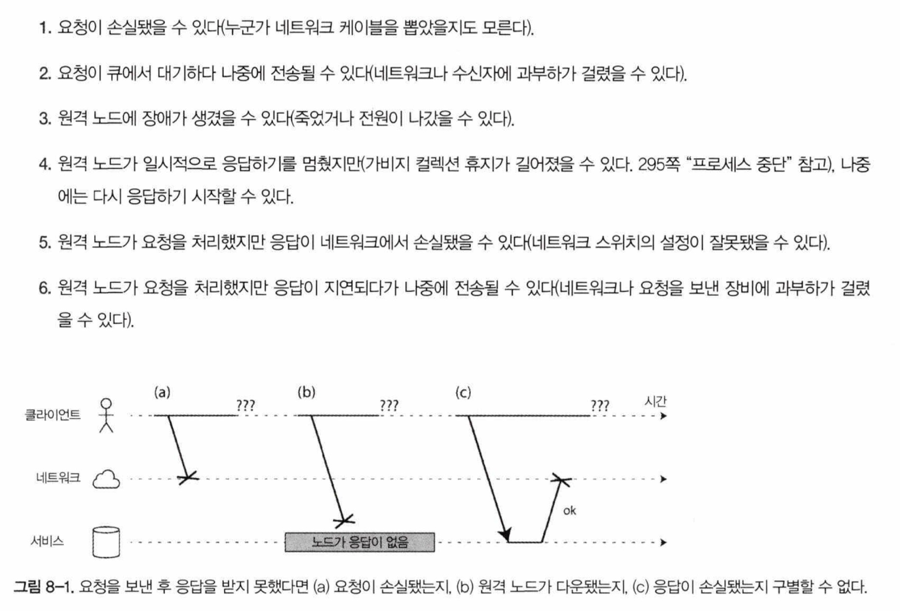
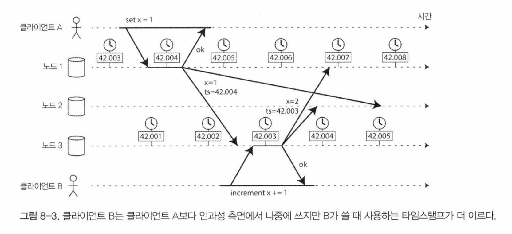
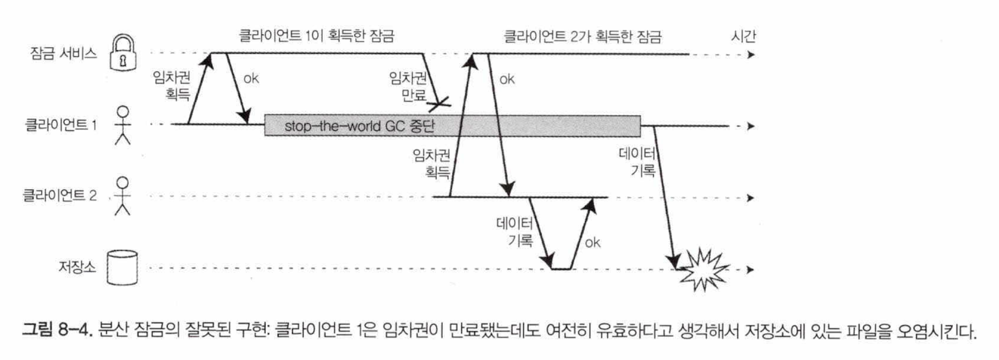

# 8. 분산 시스템의 골칫거리
지난 몇 개 장에 걸쳐 되풀이됐던 주제는 시스템이 잘못된 것을 어떻게 처리 하느냐 였다.

- 5장. 복제 > 리더와 팔로워> 노드 중단 처리
- 5장. 복제 > 복제 지연 문제
- 7장. 트랜잭션 > 완화된 격리 수준

하지만 현실에선 위에선 다루지 못하는 잘못될 수 있는 것들이 더 있고(일단 가능성이 있다면 일어난다고 봐야함)

우리는 어떤 것이든 잘못될 가능성이 있다면 잘못된다 가정 하고 모든게 잘못되더라도 제 역할을 해내는 시스템 을 구축해야함.

## 결함과 부분 장애

단일 컴퓨터에서 실행되는 소프트웨어는 결정적이다.(하드웨어가 올바르게 동작하면 같은 결과를 낸다.) 

이것은 우리가 컴퓨터를 설계할 때 의도적으로 선택한 것으로, 내부 결함에 의해 잘못된 결과를 반환하기 보다는 완전히 동작하지않기를 원한다.

하지만 분산시스템에는 **부분 장애**(어떤 부분은 잘 동작하지만 다른 부분은 잘 동작하지 않음)가 발생 하는데, 부분 장애는 비결정적이고, 이게 분산시스템을 다르기 어려운 이유이다.

### 클라우드 컴퓨팅과 슈퍼컴퓨팅

대규모 컴퓨팅 시스템을 구축 하는 방법

- 한극단은 고성능 컴퓨팅이 있고(고성능 컴퓨팅, 슈퍼컴퓨터는 단일 노드 컴퓨터에 가깝다)
- 다른 극단에는 클라우드 컴퓨팅이 있다.

이 책에서 주로 다루는 인터넷 서비스는 슈퍼컴퓨터와 매우 다르다. 시스템의 여러 노드 중 어떤 부분에서 결함이 생길것이고, 소프트웨어는 그 결함을 처리해야 한다. 결함 처리는 소프트웨어 설계의 일부여야 하며, 결함 발생 시 소프트웨어가 어떻게 동작할지 알아야 한다.

> 신뢰성 없는 구성요소를 사용해 신뢰성 있는 시스템 구축
    **오류 수정 코드 -** 잘못 전달된 수 있는 데이터를 정확히 전송할 수 있게 해준다.
    **IP -** TCP는 ip 위에서 신뢰성 높은 전송 계층을 제공한다.
****좀 더 신뢰성 있는 상위수준 시스템으로 까다로운 저수준 결함 중 일부를 처리해줄 수 있음.
> 

## 신뢰성 없는 네트워크

책에서 다루는 분산시스템은 네트워크로 다수의 장비를 연결한 비공유 시스템이고 인터넷 서비스를 구축하는 주된 방법이 됐다. 상대적으로 저렴하고 데이터센터를 여러 군데에 중복배치 하여 신뢰성을 높일 수 있음.

인터넷과 데이터센터 내부는 대부분 비동기 패킷 네트워크로 통신 하고, 비동기 패킷 네트워크는 메시지의 도착을 보장하지 않는다. 예를 들어 아래와 같은 일이 일어날 수 있다.

이런 문제를 알아차리기 위해 흔히 타임아웃을 사용한다. 하지만 타임아웃을 사용한다 해도 원격 노드가 응답을 받았는지 아닌지는 여전히 알 수 없다.

### 현실의 네트워크 결함

- 네트워크는 신뢰성이 없다. 데이터센터 처럼 제어된 환경에서도 네트워크 문제는 놀랄만큼 흔하다. 인적오류가 큰 비중을 차지함.
- 네트워크 결함이 일어날 수 있다는 사실을 받아들이고 SW 가 이를 처리 할 수 있어야 함.
    - 클러스터가 교착 상태에 빠져 영구 장애가 발생하거나 모든 데이터를 지워버리거나 제멋대로동작하는 등 이상 동작을 보일 수 있음.
- 반드시 네트워크 결함을 견뎌낼(tolerating) 필요는 없고, 소프트웨어가 네트워크 문제에 어떻게 반응 하는지 알고 시스템이 그로부터 복구할 수 있도록 보장해야한다.

### 결함 감지

결함이 있는 노드를 자동으로 감지할 수 있어야 하는데 네트워크에 관한 불확실성 때문에 노드가 동작 중인지 아닌지 구별하기 어렵다.

### 타임아웃과 기약 없는 지연

- 타임아웃 만으로 결함을 감지할 수 있다면 타임아웃은 얼마나 길어야 할까?
    - 타임아웃이 길면 노드가 죽었다고 선언될 때까지 기다리는 시간이 길어진다.
    - 타임아웃이 짧으면 일시적으로 느려졌어도 죽었다고 잘못 선언할 위험이 높아짐.
- 성급하게 노드가 죽었다고 잘못된 판단하면
    - 같은 동작을 두번 실행하게 될지도(retry때문) 모른다.
    - (retry 때문에)  다른 노드와 네트워크에 추가적인 부하를 준다. 시스템에 이미 부하가 있는 상황이라면 부하가 더욱 심해져 문제가 악화될 수 있다.
- 만약 최대 지연시간이 보장된다면 timeout 시간을 산출 할 수 있으나 현실적이지 않다.
- **네트워크혼잡과 큐 대기**
    - 컴퓨터 네트워크에서 패킷 지연의 변동성(타임아웃 기준을 정하기가 어려운 이유)은 큐 대기 때문인 경우가 많다.
        - 여러 다른 노드가 동시에 같은 목적지로 패킷을 보낼때
        - 패킷이 목적지에 도착 했지만 모든 CPU 코어가 바쁜 상태일때
        - 가상 환경에서 실행되는 운영체제
        - TCP 에서 흐름 제어를 하는 경우
        - TCP 자체 계산한 타임아웃에 의한 재시도
        - 공개 클라우드 / 멀티 테넌트 데이터센터 - 여러 소비자가 자원을 공유함.
        - MapReduce 같은 일괄 처리작업 부하 → 네트워크 링크 포화
        
        여러 가지 이유로 패킷이 지연된다.
        
    - 실험적으로 타임아웃을 선택해야함(장기간에 걸친 분석)
    - 파이 증가 장애 감지기(Phi Accrual failure detector)가 있음.(Akka, 카산드라 에서 사용)

### 동기 네트워크 대 비동기 네트워크

- 고정 회선 전화 네트워크(동기식)와 비교해보자.
    - 전화 네트워크에서 통화 할 때는 회선이 만들어짐. 고정되고 보장된 양의 대역폭이 할당 되고 통화가 끝날때까지 유지된다.
    - 네트워크 종단 지연 시간의 최대치가고정돼 있다.**(제한 있는 지연)**
- **네트워크 지연을 예측 가능하게 만들 수 없을까?**
    - 전화네트워크 회선과 다르게 TCP 연결의 패킷은 가용한 네트워크 대역폭을 기회주의적으로 사용.
    - 이는 순간적으로 몰리는 트래픽에 대응하기 위한 특성임
    - 서비스 품질(Quality of Service, QoS, 패킷에 우선순위를 매기고 스케줄링) 과 진입제어(admission control, 저농 측에서 전송률 제한)을 잘 쓰면 회선 교환을 흉내 내거나 통계적으로 제한 있는 지연을 제공하는 것이 가능.
        - 그러나 멀티 테넌트 데이터센터와 공개 클라우드에서 사용할 수 없고 인터넷을 통해 통신할 때도 사용할 수 없다.
    - 현재 배포된 기술로는 네트워크의지연과 신뢰성에 대해 어떤 보장도 할 수 없다. 결국 지연에 대한 올바른 값은 없으며 실험을 통해 결정해야 함.

## 신뢰성 없는 시계

- 시계와 시간을 사용해 우리는 지속 시간을 측정 하거나 시점을 기술한다.
- 분산 시스템에서는 네트워크의 지연변동성 때문에 시간은 다루기 까다롭다.
    - 한 장비에서 다른 장비로 메시지가 전달되는데 얼마나 나중에 전달될지 어려운점이 여러 장비에서발생한 일의 순서를 알아내기 어렵게 만든다.
- 그리고 네트워크에 있는 각 장비는 자신만의 시간 개념이 있는데 이는 장비별로 시간이 다르며 시간을 동기화 하기 위해 NTP를 사용한다.

### 단조 시계 대 일 기준 시계

현대 컴퓨터는 단조시계, 일 기준 시계 두 가지 종류의 시계를 가지고 있다.

- **일 기준 시계**
    - 직관적으로 시계에 기대하는 일을 함.(벽시계 시간)
    - NTP로 동기화됨.
    - 윤초를 종종 무시하고 NTP서버보다 너무 앞서면 강제로 리셋되어 과거로 돌아가는것 처럼 보인다.
- **단조 시계**
    - 타임아웃이나 서비스응답 시간 같은 지속 시간을 재는 데 적합하다.
    - 시간이 항상 앞으로 흐른다.
    - ‘두 시점의 차이값’ 이 의미가 있지 시계의 절대적인 값은 의미가없다.(컴퓨터마다, cpu마다 달라질 수 있음)
    - 시계의 속도를 +-0.05%까지 조절 할 수 있지만 시계를 앞이나 뒤로 가게 할 수는 없다.

### 시계 동기화와 정확도

- 일 기준 시계는 NTP 서버나 다른 외부시간 출처에 맞게 서정돼야 유용하다.
- 하지만 이 방법은 기대만큼 신뢰성 있거나 정확하지 않다.
    - 컴퓨터의 수정 시계는 드리프트 현상(더 빠르거나느리게 실행됨)이 생긴다. 재동기화 주기가 길면 길수록 오차는 커진다.
    - 컴퓨터 시계가 NTP 서버와 너무 많이 차이나면 동기화가 거부되거나 로컬 시계가 강제로 리셋될 수도 있다.
    - 노드와 NTP 서버 사이가 방화벽으로 막히면 잘못된 설정이 얼마 동안 알려지지 않을 수도 있다.
    - NTP 동기화는 잘해야 네트워크 지연만큼만 좋을 수 있다. 최소 35ms. 네트워크 지연이 급증하면 1초가 넘을수도
    - NTP 서버가이상해져 몇시간 정도 차이가날 수도 있다. 이럴땐 클라에서 여러 NTP 서버의 응답값을 보고 처리
    - 윤초를 고려하지 않고 설계된 시스템은 시간에 관한 가정이 엉망이 돼 버림.
    - CPU 코어가 가상 장비 사이에서 공유될 때 각 VM은 다른 VM 이 실행되는 동안 수십 밀리초동안 멈춘다. 애플리케이션 관점에선 이 중단은 시계가 갑자기앞으로 뛰는 문제로 나타남.
    - 완전히 제어할 수 없는 장치(모바일이나 임베디드 장치)의 하드웨어 시계는 믿을 수 없다. 고의로 시간을 잘못되게 설정 할 수도 있기때문
- 자원, 노력, 전문 기술을 투입해 정확도를 높일 수 있음. GPS 수신기, 정밀 시간 프로토콜과 세심한 배포 및 모니터링을 통해 달성 가능.

### 동기화된 시계에 의존하기

- 동기화된 시계가 필요한 소프트웨어를 사용한다면 필수적으로 모든 장비 사이의 시계 차이를 조심스럽게 모니터링 해야 한다.
- 모니터링을 하면서 시계가 너무 차이나면 죽은 것으로 선언되고 클러스터에서 제거되어야함. 너무 큰 피해를 입기 전에 고장난 시계를 알아채도록 보장 가능하다.
- **이벤트순서화용 타임스탬프**
    - 시계에 의존하고 싶지만 아래와 같은 상황에선 나중에 발생한 이벤트가 손실되는 경우가 생기기도 한다.(최종 쓰기 승리 - last write wins 의 상황)
        
        
        
        노드 2 에서 두 이벤트를 받을 때 x = 1 이 더 최근값인 것으로 잘못 결정해서 x = 2로 쓴값을 버리게 된다. B 의 증가 연산은 손실딤.
        
    - 위의 예시에서 본 것 처럼 ‘최근’ 값을 사용하여 충돌 해소를 하는 것은 부정확할 수도 있다. - 로컬 일 시계 기준 & ntp 동기화 된 시계를 쓰더라도 정확한 순서가 보장 안될 수 있음.
    - NTP 동기화를 정확하게 한다고 해도(할 수 없다는것을 앞서 살펴봄) 장비에 존재하는 드리프트 같은 요인에 의해 시간이 달라질 수 있음.
    - 논리적 시계와 물리적 시계 → 위의 경우에는 논리적 시계를 사용하는 것이 문제 해결할 수 있는 한 가지 방법이다.
        - 논리적 시계 : 진동하는 수정 대신 증가하는 카운터 기반. 이벤트의 상대적인 순서만 측정한다.
        - 물리적 시계 : 일 기준 시계와 단조 시계. 실제 경과 시간을 측정
- **시계 읽기는 신뢰 구간이 있다.**
    - 시계 읽기는 어떤 ‘시점’ 을 읽는다기 보단 어떤 신뢰 구간에 속하는 지 시간의 범위로 읽는게 낫다.(여러 부정확성 때문에)
    - GPS 수신기나 컴퓨터에 직접 부착된 원자 시계가 있으면 제조사에서 제공하는 예상 오류 범위를 사용해 불확실성 경계를 알아낼 수 있다.
    - 하지만 대부분의 시스템은 이 불확실성을 노출하지 않음.
    - spanner(?) 에 있는 구글 트루타임(TrueTime) 은 가능한 타임스탬프 범위 중 가장 이른 것과 가장 늦은 것을 가리키는 두개의 값을 받는다.
- **전역 스냅숏용 동기화된 시계**
    - 데이터베이스가 여러 데이터센터에 걸쳐 여러 장비에 분산돼 있을 땐 (모든 파티션에 걸쳐서) 전역 단조 증가 transaction id를 생성하기 어렵다.
        - 트위터 스노우플레이크같은 분산 일련번호 생성기도 있지만 인과성 측면에서 일관성을 지니는 순서를 보장하지 못한다. → 336페이지 순서화 보장 참고
    - 작고 빠른 트랜잭션이 많으면 분산 시스템에서트랜잭션 ID 생성은 방어할 수 없는 병목이 된다.
    - 스패너의 경우 전역 스냅숏용 동기화된 시계를 이렇게 제공함.
        - 신뢰 구간 A(A-earliest, A-latest), B(B-earliest, B-latest) 가 있을 때 두 구간이 겹치지 않으면 A와 B의 실행 순서를 확신할 수 있다.
        - 트랜잭션 타임스탬프가 인과성을 반영하는 것을 보장하기위해 스패너는 읽기 쓰기 트랜잭션을 커밋하기 전에 의도적으로 신뢰 구간의 길이만큼 기다린다.
        - 대기시간을 짧게 유지하기 위해 불확실성을 가능한 작게 유지해야함.(7ms 이내로 동기화되게 함)

### 프로세스 중단

- 우리가 사용하는 프로그램은 실행 중에 예상치 못한 중단이 있을 수 있다. 예를 들면
    - JVM의 경우 가비지 컬렉션을 하며 stop-the-world 에 의해 수분 까지 프로세스가 멈출 수 있다.
    - 가상 환경에서 가상 장비는 서스펜드(모든 프로세스 실행을 멈추고 메모리 내용을 디스크에 저장) 됐다가 재개될 수 있다. 이 중단은 프로세스 실행 중 언제라도 발생 가능하고 임의의 시간동안 지속될 수 있다.
    - 노트북 같은 최종 사용자 기기에서도 실행이 제멋대로 서스펜드 됐다가 재개될 수 있다.(노트북 덮개를 닫는다던가..)
    - 운영체제가 다른 스레드로 컨텍스트 스위치 하거나 하이퍼바이저가 다른 가상 장비로 스위치 되면 현재 실행중인 스레드는 코드의임의 지점에서 멈출 수 있다.
    - 애플리케이션이 동기식으로 디스크에 접근하면 스레드가 느린 디스크 I/O 연산이 완료되기를 기다리느라 중단될수 있다. 네트워크 파일시스템이거나 네트워크 블록장치라면 네트워크 지연의 변동성에도 스레드가 멈추는 시간은 네트워크 지연에도 종속적이다.
    - 디스크로 스왑 할 때 단순한 메모리 접근만으로 페이지를 디스크에서메모리로 로딩 하는 페이지 폴트 발생 가능. 이 느린 I/O 연산 동안 스레드는 멈춘다.
    - 유닉스 프로세스에서 SIGSTOP 신호
- 이렇게 선점이 발생한 스레드는 얼마간의 시간 이후 재개되지만 선점된 스레드는 이를 알아채지 못한다.
- **응답 시간 보장**
    - 열심히 노력(?) 하면 중단의 원인을 제거할 수 있다.
    - 명시된 시간 안에 응답하지 못하면 심각한 손상을 유지할 수 있는 환경에서 실행 되는 소프트웨어들이 있다.
        - 항공기, 로켓, 로봇, 자동차, …
    - 실시간을 보장해야함. 소프트웨어 스택의 모든 수준에서 지원이 필요하다. RTOS(realtime operating system)이 필요하다. 제한된 프로그래밍 언어, 라이브러리, 도구를 사용해야 한다.
        - (임베디드 시스템에서) 실시간이 보장된다? 시스템이 명시된 타이밍 보장을 모든 상황에서 만족하도록 신중하고 설계되고 테스트 됐다는 뜻
    - 대부분의 서버측 데이터 처리 시스템에게 실시간 보장은 전혀 경제적이지도, 적절하지도 않다.
- **가비지 컬렉션의 영향을 제한하기**
    - 언제 가비지 컬렉션을 할지 메모리 공간 추적을 통해 예측 할 수 있으니 gc 가 일어날 때 잠시 요청을 중단 하고 다른 곳으로 요청을 돌린다.
    - 수명이 짧은 객체만 gc를 하고 전체 gc가 필요할 때쯤 프로세스 재시작
    - 지연 시간에 민감한 그융 거래 시스템 중에 이 방법을 쓰는 것도 있다.

## 지식, 진실, 그리고 거짓말

분산 시스템에서 네트워크에 있는 노드는 어떤 것도 확실히 알지 못한다. 네트워크에 장애가 있는지, 노드에 이상이 있는지? 단지 네트워크를 통해 받은(또는 받지 않은) 메시지 기반으로 추측만 할 수 있음.

이럴때 우리는 

- 분산시스템에서 동작에 관해 정한 가정을 명시하고, 이런 가정을 만족시키는 방식으로실제 시스템을 설계할 수 있고
- 어떤 시스템 모델 내에서 알고리즘이 올바르게 동작하는지 증명 할 수 있다.

기반 시스템 모델이 매우적은 보장만 제공 하더라도 신뢰성 있는 동작을 달성할 수 있다는 뜻.

분산 시스템의 몇 가지 예와 특정 가정 하에서 특정 보장을 제공하는 알고리즘을 살펴보자.

### 진실은다수결로 결정된다

- 내가 나에대해 판단 하는 것은 정확하지 않다.
- 분산 시스템에서 특정 노드가 죽었는지 여부를 판단하는 방법중 하나는 **정족수**(노드 사이의투표) 에 의존한다.
- 노드의 과반수 이상을 정족수로 삼는게 흔하다.
- 시스템이 오직 하나의뭔가가 필요할 때가 있는데, 그럴 경우엔 추가적인 처리가 필요하다
- **리더 와 잠금**
    - 저장 서비스에 있는 어떤 파일을 한 번에 클라이언트 하나씩만 접근하도록 보장하고 싶은 경우를 살펴보자
        - 잠금 서비스로 부터 임차권을 얻어 이 기능을 구현하는 경우에도 잘못된 일이 발생할 수 있다.
            
            
            
            - 클라이언트 1이 임차권을 얻었지만 중간에 stop-the-word gc 중단이 일어난다.
            - 클라이언트 1의 stop-the-world 동안 임차권이 만료되고
            - 클라이언트 2가 새로 임차권을 얻어 데이터를 기록한다.
            - 클라이언트 1의 stop-the-world가 끝나고 아까 얻은 임차권(만료됐지만)이 있으니 데이터를 기록하는데
            - 이런 경우충돌이 생길 수 있다.(데이터 오염 발생)
        - 다수결로 새로운 리더를 뽑는다고 해도 이전의 리더는 자신이 더이상 리더가 아니라는 것을 알지 못할 수 있다.
        - 이런 상황에서도 정상적으로 동작하게 하기위해 신중하게 소프트웨어를 설계해야 한다.
- **펜싱 토큰**
    - 펜싱(fencing): 자신이 “선택된 자” 라고 잘못 믿고 있는 노드가나머지 시스템을 방해 할 수 없도록 보장하는기법
        - 서버가 잠금이나 임차권을 승인할 때마다 펜싱 토큰 반환. (잠금이 승인될 때마다 증가하는 숫자 라고 생각하면 됨)
        - 클라이언트가 쓰기 요청을 저장소 서비스로보낼 때마다자신의 현재 펜싱 토큰을 포함하도록 요구
        - 예를 들어 주키퍼의 트랜잭션ID인 zxId나 노드 버전 cversion 을 펜싱토큰으로 사용 할 수 있다.
            - 단조증가하는 속성을 가진것을 펜싱 토큰으로 사용할 수 있음
    - 서버측에서 토큰을 확인 하는 방식이 믿을 수 없는(예상 대로 동작한다는 것이 보장되지 않는) 클라이언트로 부터 보호할 수 있는 좋은 방법이다.
    - 그러나 클라이언트가 가짜 펜싱 토큰을 보낸다면 시스템의 보장이 무너질 수 잇다.(노드가 거짓말을 하는 경우)

### 비잔틴 결함

- 모든 노드가 정직하다고 가정 할 수 없다. 거짓말을 하는 노드가 섞여있을 수 있음.
- 신뢰할 수 없는환경에서합의에 도달하는 문제를 비잔틴 장군 문제라고 한다.
    - **비잔틴 내결함성:** 일부 노드가 오작동하고 프로토콜을 준수하지 않거나 악의적인 공격자가 네트워크를 방해하더라도 시스템이 계속 올바르게 동작한다면 이 시스템은 **비잔틴 내결함성**을 지닌다.
        - 시스템이 비잔틴 내결함성을 지니도록 만드는 프로토콜은 매우복잡하고 내결함성을 지닌 임베디드 시스템은 하드웨어 수준의지원에 의존한다.
        - 서버측 데이터 시스템에서 비잔틴 내결함성 솔루션을 배치하는 것은 비용이 커서 실용적이지 않다.
        - 중앙 권한이없는 피어투피어 네트워크에 적절하다.
- **약한 형태의 거짓말**
    - 하드웨어 문제, 소프트웨어 버그, 잘못된 설정 때문에 유효하지 않은 메시지 같은 ‘약한 형태의 거짓말’ 로부터 보호해 주는 메커니즘을 소프트웨어에 추가하는게 가치가 있을 수도 있다.
    - 비잔틴 내결함성을 가진다고 할 수는 없지만 더 나은 신뢰성으로 향하는 간단하고 실용적인 발걸음이다.
        - 애플리케이션 레벨에서 체크섬을 써서 네트워크 패킷 오염 여부를 판별
        - 사용자의 입력을 신중하게 살균(입력값의 범위 체크 등)
        - 여러 대의 NTP로 부터 응답을 받아 시계 동기화

### 시스템 모델과 현실

- 분산 시스템 문제를 해결하기 위해 많은 알고리즘이 설계되고 있는데, 알고리즘은 그들이 실행되는 하드웨어와 소프트웨어 설정의 세부사항에 너무 심하게 의존하지 않는 방식으로 작성해야 한다.
- 알고리즘이 가정하는 것을 기술한 추상화를 시스템 모델이라고 함.
- 타이밍 가정에 대한 시스템 모델은
    - 동기식 모델
    - 부분 동기식 모델
    - 비동기식 모델
- 노드 장애를 고려한 노드용 시스템 모델은
    - 죽으면 중단하는 결함
    - 죽으면 복구하는 결함
    - 비잔틴 결함
    
    일반적으로 죽으면 복구하는 결함을 지닌 부분 동기식 모델이 가장 유용한 모델이다.
    
- **알고리즘의 정확성**
    - 알고리즘이 정확하다는게 어떤 의미인지 정의하기 위해 알고리즘의 속성(property)을 기술할 수 있다.
        - 예를 들어정렬 알고리즘은 임의의 두 인덱스를 뽑았을 때 왼쪽 인덱스의 값이 오른쪽 인덱스의 값보다 작다 라고 기술 할 수 있다.
    - 분산시스템이 정확하다 라고 정의하고 싶으면 속성을 써보자.
        - 펜싱토큰을 예로 들면
            - 유일성 - 펜싱 토큰 요청이 같은 값을 반환하지 않는다.
            - 단조 일련번호 - 요청 x가 토큰 tx를 요청, 요청 y가 토큰 ty 를 반환했고 y가 시작하기전에 x가 완료됐다면 tx<ty를 만족
            - 가용성 - 펜싱 토큰을 요청하고 죽지 않은 노드는 결국에는 응답을 받는다.
    - 알고리즘이 해당 시스템에서 ‘정확하다’ 라고 하기 위해선 시스템 모델에서 발생 하리라고 가정한 모든 상황에서 그 속성들을 항상 만족시키켜야 함.
    - 하지만 모든 노드가 죽거나 모든 네트워크 지연이 갑자기 무한히 길어진다면 어떤 알고리즘이라도 아무것도 할 수 없다.
- **안전성과 활동성**
    - 활동성
        - 정의에 “결국에는” 이라는 단어를 포함함.(예를 들어 최종적 일관성)
        - (흔히 비공식적으로) 좋은 일은 결국 일어난다.
    - 안정성
        - (흔히 비공식적으로) 나쁜 일은 일어나지 않는다.
- 시스템 모델을 현실 세계에 대응시키기
    - 시스템 모델은 현실세계를 단순화 하고 추상화한 모델.
    - 현실의 복잡한 시스템에서의 문제를 이해하고 체계적으로 해결하려고 노력할 수 있게 하는데 엄청난 도움이 된다.
    - 알고리즘이 올바르다고 증명 됐다고 하더라도 그 구현은 올바르게 동작 안할 수도 있지만 일단 알고리즘의증명은 좋은 첫걸음.
    - 이론적 분석과 경험적 실험이 똑같이 중요하다.
