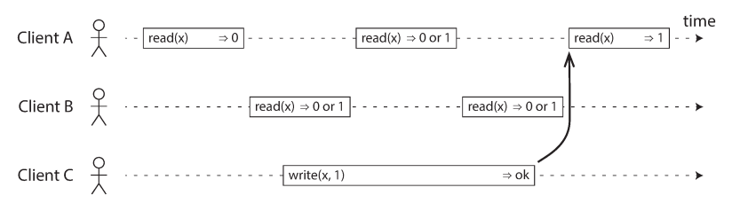
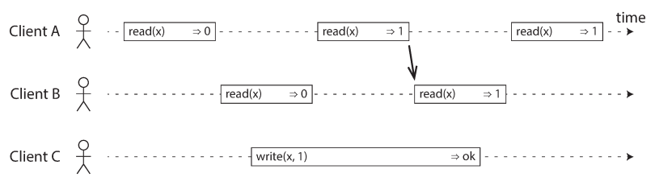
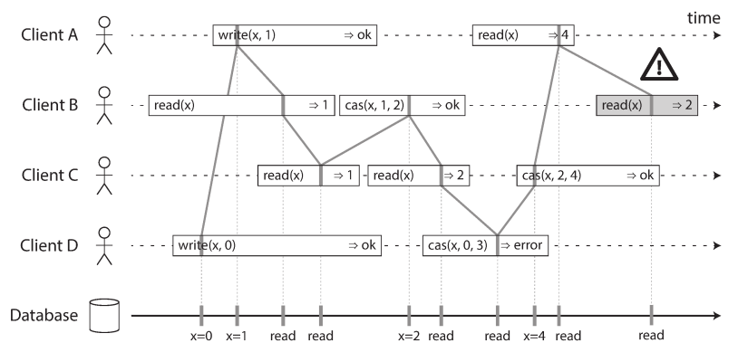
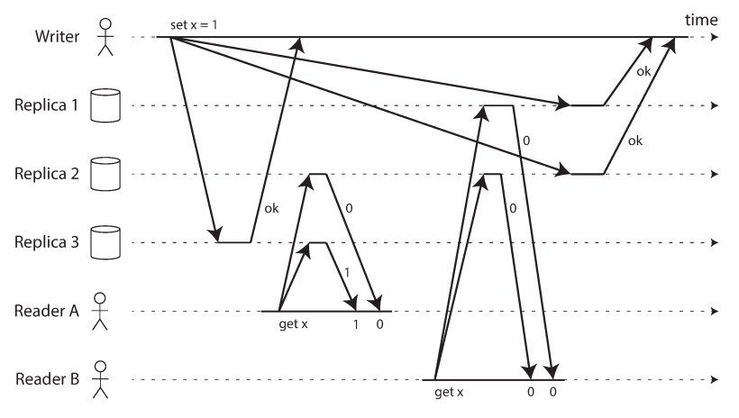
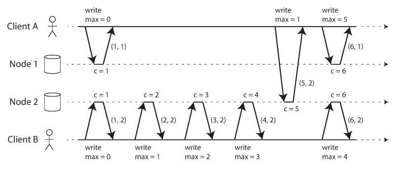
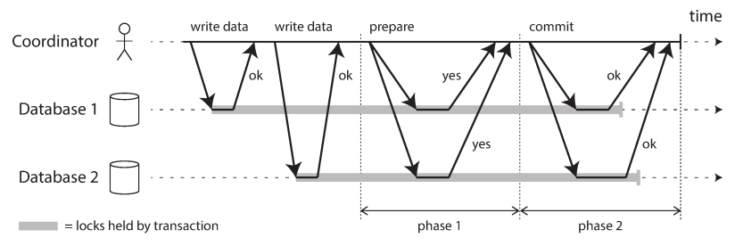
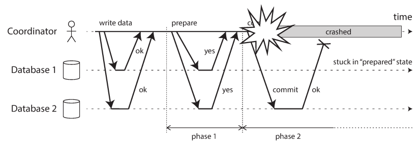

# chapter 9. 일관성과 합의
- 요약: 분산 시스템에서 일관성 (consistency)를 달성하고 합의 (consensus)에 도달하는 것이 무엇인지

- 유용한 보장을 해주는 범용 추상화
    - 트랜잭션 추상화 -> application의 걱정 없앰
    - 분산 시스템에 가장 중요한 추상화: 합의
## 일관성 보장
- 복제 데이터 베이스는 대부분 최소한 최종적 일관성을 제공 (최종적일관성, 근데 언제..?)
- 더 강한 일관성 모델 (trade off: 성능이 나쁘거나 내결함성 약함)
    - 트렌잭션 격리수준은 경쟁 조건 회피, 분산 일관성은 지연과 결함이 있어도 복제본의 상태를 코디네이트

## 9.1 선형성 (linearizability)
- 공통적으로 사용되는 가장 강한 일관성 모델 중 하나 단 하나의 DB 복제본만 있다고 가정
    - 원자적으로 보이게
    - 최신성: 최신성 보장 (recency guarantee)

### 시스템에 선형성을 부여하는 것은 무엇인가?
- 데이터 복사본이 하나뿐인 것처럼 보이게

- 읽기 요청이 쓰기 요청과 동시에 실행되면 과거의 값을 반환할 수도 있고 새로운 값을 반환할 수도 있음
    
- 읽기가 새로운 값을 반환한 적이 있은 후에는 모든 후속 읽기는 새로운 값 반환 (바뀌는 '어떤' 시점이 있다.)
    
- compareAndSet 연산 추가, B 의 경우 선형 반환 오류
    - 

- 선형성 vs 직렬성
    - 직렬성: 트랜잭션 격리 속성 -> 순서대로 실행하는 걸 보장
    - 선형성: 읽기와 쓰기에 대한 최신성 보장. 트랜잭션으로 안묶여서 충동구체화 같은 부가적 수단 안쓰면 쓰기 스큐 문제 막지 못함

### 선형성에 기대기
- 단일 리더 복제에서는 리더가 하나만 존재해야 함
    - 잠금 획득을 시도하고, 성공한 노드가 리더
    - 코디네이션 서비스 사용
        - zookeeper, apache curator (Java 라이브러리), Oracle real application cluster 등 이용
- 제약 조건과 유일성 보장
    - RDB 의 유일성 보장 (compareAndSet과 비슷)
- 채널간 타이밍 의존성
    - 시스템의 통신 채널에 의한 경쟁 조건 발생 가능 -> 선형성으로 회피 (예: "자신이 쓴 내용 읽기")

### 선형성 시스템 구현하기
- 간단히는 복사본을 정말로 하나만 사용
- 복제 방법 (5장내용)
    - 단일 리더 복제(선형적일 수 있음)
        - 팔로워의 읽기는 선형적 될 가능성 있음
    - 합의 알고리즘(선형적)
        - 스플릿 브레인과 복제본 뒤처지는 문제 막을 수단 포함
    - 다중 리더 복제(비선형적)
    - 리더 없는 복제(아마도 비선형적)

- 선형성과 정족수
    - 다이나모 모델에서 엄격한 정족수를 사용한 읽기 쓰기는 선형적으로 보이지만 경쟁 조건이 생길 수 있음 (비선형적인 실행)
        - n(복제 서버) = 3, w(쓰기 노드) = 3, r(읽기 노드) = 2 → 정족수 조건 만족 (w + r > n) 이지만 선형성 실패
        - 
    

### 선형성의 비용
- 데이터 센터마다 리더 없다면? network 끊기면 아무것도 기대 못함. (선형성과 가용성 사이에서 선택)
- CAP 정리
    - Consistency(일관성), Availability(가용성), Partition tolerance(분단 내성)
    - 선형성 데이터베이스라면 이러한 선형성과 가용성의 트레이드오프 문제가 있음
    - 네트워크 문제는 언제나 발생 -> 이때, 일관성과 가용성중 하나를 선택하는 의미
- 선형성과 네트워크 지연
    - 다중코어cpu 와 램조차 선형적이지 않음 (성능을 선택한 trade off)

## 9.2 순서화 보장
- 순서화만 된다면 모든 연산이 원자적으로 효과가 나타는 것처럼 보임
    - 5장의 단일 리더 복제: 팔로워 쓰기 순서를 결정하는게 리더의 목적 (동시에 쓰는 연산때문에 충돌)
    - 7장의 트랜잭션의 직렬성: 어떤 일련 순서에 따라 실행됨을 보장
    - 8장의 분산 시스템의 타임스탬프, 시계 사용: 두 쓰기에서 어떤게 나중인지 결정

### 순서화와 인과성
- 순서가 인과성을 보존하는데 도움
- 인과적으로 일관적(causally consistent): 시스템이 인과성에 의해 부과된 순서를 지킴
    - 예: 스냅샷 격리는 인과적 일관성을 제공
- 인과적 순서가 전체 순서는 아니다
    - 집합은 항상 순서 고려 못함 -> 비교 불가 vs 부분적 순서 정해짐
        - 선형성: 전체 순서 정함
        - 인과성: 부분 순서를 정의함
- 선형성은 인과적 일관성보다 강하다
    - 선형성은 인과성을 내포
    - 성능, 가용성에 해가 됨 (네트워크 지연 등)
- 인과적 의존성 담기
    - 비선형에서 인과적 일관성 담기
        - 먼저 실행됬는지 알아야 함
    - version vector: 단일 키뿐 아니라 전체 DB 인과적 의존성 추적
    - 데이터베이스는 애플리케이션이 어떤 데이터 버전을 읽었는지 확인 (스냅숏 격리)

### 일련번호 순서화
- 일련번호나 타임스탬프로 이벤스 순서 정함
- 비인과적 일련번호 생성기 (인과성에 일관적이지 않음)
    - 노드 별 일련번호 (두개라면 짝수/홀수 등)
    - 해상도 높은 타임스탬프
    - 일련번호 블록 미리 할당
    
- 램포트 타임스탬프 (lamport timestamp)
    - 인과성에 일관적인 일련번호를 생성하는 간단한 방법
    - (카운터, 노드ID) 쌍
        - 두 타임스탬프에서 카운터가 큰 것이, 그리고 노드 ID가 큰 값이 타임 스탬프가 큼
        - 
- 타임스탬프 순서화로는 충분하지 않다
    - 예: 동일 사용자명 저장 시, 추후에 한쪽 실패를 확인 가능하지만 당장 저장할때는 체크 못함
        - 즉, 모든 연산을 모은 후에야 드러남 -> 다음 '전체 순서 브로드캐시드' 체크

### 전체 순서 브로드캐스트
- 단일 리더 복제: 리더의 단일 cpu 에서 모든 연산을 차례로 배열하여 전체 순서 정함
    - 'total order broadcast' or 'atomic broadcast'
    - 노드 사이에 메시지를 교환하는 프로토콜로 기술
    - 비공식적으로 두 가지 안전성 속성을 항상 만족 (네트워크가 끊긴 순간에는 메시지가 전달되지 못하지만 결국 복구, 재시도)
        - 신뢰성 있는 전달: 어떤 메시지도 손실되지 않는다. 메시지가 하나의 노드에 전달되면 모든 노드에 전달
        - 전체 순서가 정해진 전달: 메시지는 모든 노드에 같은 순서로 전달 (소급으로 끼워넣는게 허용 안됨 -> 타임스탬프 순서화 보다 강함)
- 전체 순서 브로드캐스트 사용하기 
    - zookeeper 나 etcd 같은 합의 서비스는 전체 순서 브로드캐스트를 실제로 구현
    - 상태 기계 복제(state machine replication) : 메시지를 받은 순서대로 처리하면 모든 노드가 서로 일관성 있는 상태를 유지
        - 데이터베이스 복제, (11장 체크)
    - 직렬성 트랜잭션: 모든 노드가 메시지를 동일한 순서로 처리하면 데이터베이스의 파티션과 복제본은 일관된 상태를 유지
    - 로그를 만드는 방법중 하나 (복제로그, 트랜잭션 로그나 쓰기전 로그)
    - 펜싱 토큰을 제공하는 잠금 서비스를 구현하는 데에도 유용
- 전체 순서 브로드캐스트 사용해 선형성 저장소 구현하기 
    - 선형성 시스템에서도 연산의 전체 순서 있음. 전체 순서 브로드캐스트와 밀접한 관계
    - 비동기 vs 최신성 
        - 보장 전체 순서 브로드캐스트는 비동기식 (언제 받을지 보장 못함)
        - 선형성은 최신성 보장 (읽기가 최근 쓰여진값 보는게 보장)
    - 전체 순서 브로드캐스트 구현을 기반으로 선형성 저장소를 만들 수 있다.
        - 메시지를 로그에 추가하여 점유를 원하는 사용자명을 가리킨다.
        - 로그를 읽고, 추가한 메시지가 되돌아오기를 기다린다.
        - 원하는 사용자명을 점유하려는 메시지가 있는지 확인한다.
            - 원하는 사용자 명에 대한 첫 번째 메시지가 자신의 것이면 점유에 성공 (다른 사용자의 것이라면 연산 취소)

- 선형성 저장소를 사용해 전체 순서 브로드캐스트 구현하기
    - 쉬운건 원자적 increment-and-get 연산을 사용
        - 메시지에 선형성 정수로 iag 연산을 수행하고 얻은 값을 일련번호로 포함
        - 그 후 메시지를 모든 노드에 전송
        - 수신자들은 일련번호 순서대로 메시지를 전달 
            - 선형성 레지스터에서는 "4 다음 6을 받았으면 5 를 기다려야 함" (램포트에선 X)
    - 이론은 쉽지만 네트워크등 문제 생기면 어려움
        - 선형성 iag(또는 cas) 레지스터와 전체 순서 브로드캐스트는 합의와 동등
        - 즉, 이 문제 중 하나를 해결할 수 있으면 다른 문제도 해결할 수 있다는 것 

## 9.3 분산 트랜잭션과 합의
- 비공식적 합의의 목적: 여러 노드들이 무언가에 동의하게 만드는 것
    - 노드 동의 중요 사항
        - 리더 선출: 스플릿 브레인 현상을 방지
    - 원자적 커밋
        - 여러 노드나 파티션에 걸친 트랜잭션이 노드 별로 성공, 실패의 결과가 다를 수 있음
        - 모두 롤백하거나 성공에 대한 합의 문제

### 원자적 커밋과 2단계 커밋 (2PC)
- 트랜잭션 원자성의 목적: 여러 쓰기를 실행하는 도중 뭔가 잘못된 경우에 간단한 시멘틱 제공
- 단일 노드에서 분산 원자적 커밋으로
    - 단일노드
        - 디스크에 있는 트랜잭션 로그에 커밋 레코드가 추가되어야 커밋
    - 여러 노드
        - 모든 노드가 확신할때 커밋
        - 커밋후 읽기 격리의 기반 형성
        - 커밋 후 취소하는 방법은 불가 (또 다른 트랜잭션에서 커밋된 데이터에 의존성 때문)
            - 보상 트랜잭션(compensating transaction) : 커밋된 트랜잭션의 효과를 나중에 다른 트랜이 취소
- 2단계 커밋 소개 (2PC)
    - 2pc가 내부적으로 사용되는 XA 트랜잭션이나 SOAP 서비스용을 통해 application 에서도 사용 가능
    - 하나의 커밋요청 대신 커밋/어보트 과정은 두 단계로 나뉨
        
        - 순서
            - 애플리케이션이 여러 노드에 데이터를 기록한다.
            - 애플리케이션이 커밋할 준비가 되면 코디네이터가 1단계를 시작한다. 각 노드에 준비 요청을 보낸다.
            - 모든 참여자가 커밋 준비가 완료되면 2단계에서 커밋 요청을 한다.
            - 커밋 준비가 되지 않은 참여자가 있다면 2단계에서 어보트 요청을 한다.
        - 코디네이터: 트랜잭션 관리자  
            - 애플리케이션 프로세스 내에서 라이브러리 형태로 구현되거나 분리된 프로세스 또는 서비스로 제공
        - 참여자: 트랜잭션을 커밋하는 각 데이터베이스 노드
    - 자세히
        - 애플리케이션이 커밋할 준비가 되면 coordinator가 1단계를 시작한다.
        
        - 애플리케이션은 분산 트랜잭션을 시작하기 원할 때 coordinator에게 트랜잭션 ID를 요청한다.
        - 애플리케이션은 각 참여자에서 단일 노드 트랜잭션을 시작하고 단일 노드 트랜잭션에 전역적으로 유일한 트랜잭션 ID를 붙인다.
        - 각 노드에 준비 요청을 보내서 커밋할 수 있는지 "준비 요청"을 물어본다.

        - 참가자는 트랜잭션을 커밋할 수 있는지 확인한다.
            - 모두 네라고 응답했으면 coordinator는 커밋할지 안 할지 최종적 결정을 한다. 추후 죽는 경우에 어떻게 결정했는지 알 수 있도록 그 결정을 디스크에 있는 트랜잭션 로그에 기록해야 한다. -> 커밋 포인트
            - 아니요라고 한 노드라도 응답하면 2단계에서 모든 노드에 어보트를 보낸다.
        - 커밋 포인트가 남으면 요청이 실패하거나 타임아웃이 될 때 성공할 때까지 영원히 재시도해야 한다.
- 코디네이터 장애
    - coordinator가 준비 요청을 보내고 나서 "네"에 투표한 다음 장애가 났다면, 참여자는 기다리기만 해야 한다.
    - 이 상태에 있는 참여자의 트랜잭션을 in doubt 혹은 uncertain이라고 한다.
    - 2PC가 완료할 수 있는 유일한 방법은 코디네이터가 복구되기를 기다리는 것
    

### 현실의 분산 트랜잭션
- 분산 트랜잭션
    - 분산 시스템에서 원자적 커밋을 달성하여 안전성 보장 vs 성능이슈
    - 분산 트랜잭션은 종류 크게 2가지
        - 데이터베이스 내부 분산 트랜잭션 : 분산 DB에서 DB 노드 간 트랜잭션 지원
            - Heterogeneous 방법보다 쉽고, 흔히 매우 잘 동작
        - Heterogeneous 트랜잭션 : 서로 다른 벤더의 DB일 수도, 메시지 브로커처럼 비데이터베이스 시스템일 수도 있다.
- 정확히 한 번 메시지 처리
    - 메시지 확인과 데이터베이스 쓰기를 단일 트랜잭션에서 원자적으로 커밋함으로써 구현
    -  메시지와 그 처리 과정의 side effect를 원자적으로 커밋함으로써 effectively exactly once 처리되도록 보장할 수 있음
- XA Transaction(eXtended Architecture)
    - heterogeneus 기술에 걸친 2단계 커밋을 구현하는 표준.
    - XA는 네트워크 프로토콜이 아니라, 트랜잭션 코디네이터와 연결되는 인터페이스를 제공하는 API일 뿐이다.
    - 모든 통신이 클라이언트 library 를 거쳐야 하므로 DB는 코디네이터에 직접 연결 못함
- 의심스러운 상태에 있는 동안 잠금을 유지하는 문제
    - 문제는 잠금: 데이터베이스 트랜잭션은 보통 더티 쓰기를 막기 위해 그들이 변경한 로우에 로우 수준의 독점적인 잠금을 획득 (직렬성 격리를 원하면 읽은 로우에 공유 잠금도 획득까지도)
        - 트랜잭션이 커밋하거나 어보트할 때까지 잠금 해제 못함
        - 2단계 커밋을 사용할 때 트랜잭션은 의심스러운 상태에 있는 동안 내내 잠금을 잡고 있어야 한다.
        - 이 경우, 코디네이터 장애면? 장애 시간 내내 다 멈춤 (코디네이터 복구 or 수동해제 필요)
- 코디네이터 장애에서 복구하기
    - 이론상으로는 코디네이터가 죽은 후 재시작하면 상태를 깨끗하게 복구
    - 현실에서는 고아(orphaned) 의심스러운 트랜잭션, 즉 코디네이터가 어떤 이유 때문인지 그 결과를 결정할 수 없는 트랜잭션이 생길 가능성
    - 이런 트랜잭션은 자동으로 해소될 수 없어서 잠금을 유지하고 다른 트랜잭션을 차단하면서 데이터베이스에 영원히 남음
    - 여기서 빠져나가는 유일한 방법은 관리자가 수동으로 트랜잭션을 커밋하거나 롤백할지 결정하는 것
    - 여러 XA 구현에는 참여자가 코디네이터로부터 확정적 결정을 얻지 않고 의심스러운 트랜잭션을 어보트하거나 커밋할지를 일방적으로 결정할 수 있도록 하는 경험적 결정(heuristic decision)이라고 부르는 비상 탈출구 (원자성 깨질 가능성) 가 있음
 
- 분산 트랜잭션의 제약
    - 코디네이터가 복제되지 않은 경우 SPOF가 될 수 있음
    - 코디네이터의 로그가 지속적인 시스템 상태의 중대한 부분이 된다. -> 더 이상 application이 상태를 갖게됨
    - XA는 광범위한 데이터 시스템과 호환돼야 하므로 최소 공통 분모에 해당하는 기능만 제공. 여러 시스템에 걸친 교착상태를 감지할 수 없음. 스냅숏 격리와 함께 동작 안함
    - 결과적으로 시스템의 어떤 부분이라도 고장 나면 트랜잭션도 실패한다. 따라서 분산 트랜잭션은 장애를 증폭시키는 경향이 있다

### 내결함성을 지닌 합의
- 합의 알고리즘 속성
    - 균일한 동의 : 어떤 두 노드도 다르게 결정하지 않는다.
    - 무결성 : 어떤 노드도 두 번 결정하지 않는다.
    - 유효성 : 한 노드가 값 v를 결정한다면 v는 어떤 노드에서 제안된 것이다.
    - 종료 : 죽지 않은 노드는 결국 어떤 값을 결정한다.
- 합의 알고리즘의 가정
    - 죽은 노드는 돌아오지 않는다
    - 과반수의 노드는 존재
    - 비잔틴 결함은 없다고 가정한다
- 합의 알고리즘과 전체 순서 브로드캐스트 
    - 순차열 (sequence)에 대해 결정해서 전체 순서 브로드캐시트 알고리즘을 만듦
        - 균일한 동의 : 모든 노드는 같은 메시지를 같은 순서로 전달한다.
        - 무결성 : 메시지는 중복되지 않는다.
        - 유효성 : 메시지는 조작되거나, 오염되지 않는다.
        - 종료 : 메시지는 반드시 전달되며, 손실되지 않는다.
- 단일 리더 복제와 합의
    - 단일 리더 복제는 모든 쓰기를 리더에서 처리하고 쓰기를 같은 순서로 모든 팔로워에게 적용
    - 여기서 합의 알고리즘으로 리더를 선출하면? 리더를 선출하기 위해 리더가 필요
        - 합의를 해결하기 위해 합의가 필요하다는 난제
- 에포크 번호 붙이기와 정족수 
    - 에포크 번호: 특정 시점을 구별하기 위해 번호를 매김 (각 에포크 내에서는 리더가 유일하다고 보장)
        - 더 약한 보장, 포크 번호는 전체 순서가 있고 단조 증가
    - 두가지 투표
        - 리더를 선출
        - 리더의 제안에 투표 (모든 결정 마다 제안한 값에 대해 다른 노드에게 찬반 요청)
            - 제안에 대한 투표가 성공하면 그 제안에 투표한 노드 중 최소 하나는 가장 최근의 리더 선출에도 참여
    - 2단계 커밋과 내결함성 합의 알고리즘의 차이
        - 2PC 는 모두 네 vs 합의는 과반수
        - 합의는 복구과정을 통해 안정성이 항상 만족
- 합의의 제약
    - 동기식이 강제 -> 성능
    - 타임아웃에 의존적
    - 네트워크 문제에 민감 (엄격한 과반수 동작 -> 선형성의 비용)

### 멤버십과 코디네이션 서비스
- ‘분산 키-값 저장소’나 ‘코디네이션 설정 서비스’: 주키퍼나 etcd 
    - 선형성 원자적 연산: 네트워크가 끊기더라도 그 연산이 원자적이고 선형적일 것을 보장
        - 분산 잠금을 보통 클라이언트에 장애가 난 경우 결국에는 해제되도록 만료 시간이 있는 임차권(lease)으로 구현
    - 연산의 전체 순서화: 펜싱 토큰은 잠금을 획득할 때마다 단조 증가하는 어떤 숫자, 트랜잭션 ID(zxid)와 버전 번호(cversion)
    - 장애 감지: 주기적으로 하트비트(heartbeat)를 교환해서 다른 쪽이 여전히 살아 있는지 확인, 주키퍼에선 단명 노드(ephemeral node)
    - 변경 알림: 변경이 있는지 감시 (폴링 안해도 됨)
- 작업을 노드에 할당하기
    - 주키퍼는 실제 늘어나는 클라이언트 (서비스 등) 대신 고정된 수의 노드에서 실행되고 이 노드들 사이에서 과반수 투표를 수행
- 서비스 찾기 (service discovery)
    - zookeeper, etcd, consul
    - 선형성을 보장하지 않아도 되는 읽기 요청을 서비스
- 멤버십 서비스 
    - 클러스터에서 어떤 노드가 현재 살아있는 멤버인지 결정

## 추가
- 키워드
    - 일관성
    - 선형성 (linearizability)
    - 순서화
    - 합의
    - 뷰스탬프복제, 팍소스, 라프트 (raft)
    - zookeeper, etcd, consul

- 관련 자료 