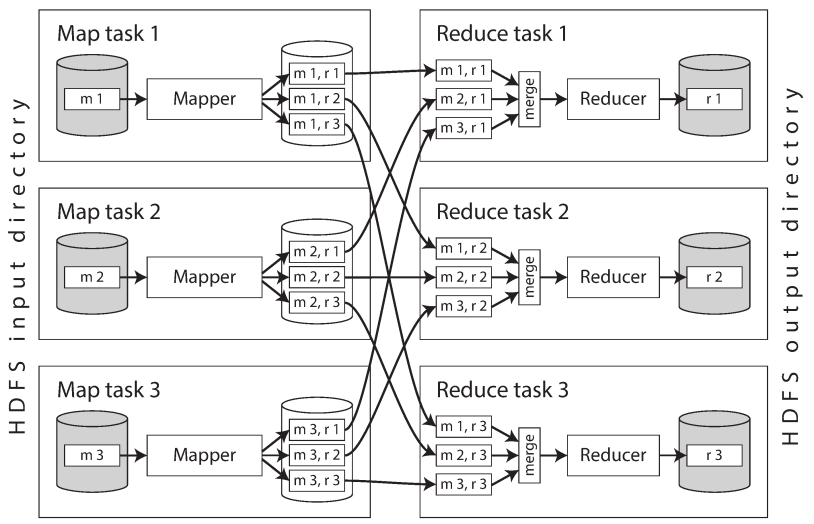
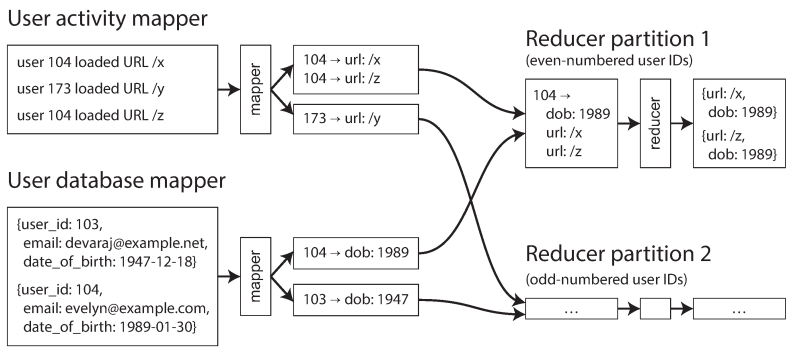

# chapter 10. 일괄 처리
- 요약: 맵리듀스와 같은 일괄 처리 방식 데이터플로 시스템을 살펴보고 좋은 도구가 어떤건지, 그리고 대규모 데이터 시스템을 구축하기 위한 원리가 무엇인지

- 1,2 부에서 다룬 내용: 요청(request), 응답(response), 질의(query), 결과 (result)
    - 온라인 시스템은 응답시간 단축에 노력을 기울임 (사용자가 기다림)
    - 서비스(온라인 시스템)
    - 일괄 처리 시스템(오프라인 시스템) : 처리량이 대표적인 지표
    - 스트림 처리 시스템(준실시간 시스템): 일괄처리보다 지연시간 낮음

## 10.1 유닉스 도구로 일괄 처리 하기
- 단순 로그 분석
    - 실제로 많은 데이터 분석이 수 분 내에 awk, sed, grep, sort, uniq, xargs 등의 조합으로 결과를 얻을 수 있고 놀라울 정도로 잘 수행
- 정렬 대 인메모리 집계
    - 루비 스크립트 등을 이용하면, 데이터를 "메모리"에 유지 (메모리보다 크면 파일 따로 생성 등 작업)
    - 유닉스 연쇄 명령은 자동으로 메모리 -> 파일 처리
- 유닉스 철학
    - 유닉스 철학
        - 각 프로그램이 한 가지 일만 하도록 작성하라.
        - 모든 프로그램의 출력은 아직 알려지지 않은 다른 프로그램의 입력으로 쓰일 수 있다고 생각하라.
        - 소프트웨어를 빠르게 써볼 수 있게 설계하고 구축하라.
        - 프로그래밍 작업을 줄이려면 미숙한 도움보단 도구를 사용하라.
    - 유닉스 파이프 : 다른 방법으로 데이터 처리가 필요할 때 정원 호스와 같이 여러 다른 프로그램을 연결하는 방법이 필요하다. 이것은 I/O 방식이기도 하다.
- 동일 인터페이스
    - 특정 프로그램이 다른 어떤 프로그램과도 연결 가능하려면 프로그램 모두가 같은 입출력 인터페이스를 사용
    - 유닉스에서의 인터페이스는 파일(파일 디스크립터)
- 로직과 연결의 분리
    - 유닉스 도구는 표준 입력과 표준 출력을 사용
        - 파이프는 한 프로세스의 stdout을 다른 프로세스의 stdin과 연결한다. 중간 데이터를 디스크에 쓰지 않고 작은 인메모리 버퍼를 사용해 프로세스 간 데이터를 전송한다.
    - 느슨한 결합(loose coupling)/지연 바인딩(late binding)/제어 반전(inversion of control) : 쉘 사용자는 유닉스 접근법으로 원하는 대로 입력과 출력을 연결할 수 있다. 프로그램은 입력이 어디서부터 들어오는지 출력이 어디로 나가는지 신경 쓰거나 알 필요조차 없다.
- 투명성과 실험
    - 입력 파일은 일반적으로 불변
    - 파이프라인을 중단하고 출력을 파이프를 통해 less로 보내 원하는 형태의 출력이 나오는지 확인 가능
    - 특정 파이프라인의 출력을 파일에 쓰고 그 파일을 다음 단계의 입력으로 사용 가능
    - 단점은 단일장비 -> 하둡

## 10.2 맵리듀스와 분산 파일 시스템
- 맵리듀스
    - 유닉스 도구와 비슷한 면이 있지만 수천 대의 장비로 분산해서 실행
    - NameNode라는 중앙 서버는 특정 파일 블록이 어떤 장비에 저장됐는지 추적

### 10.2.1 맵리듀스 작업 실행하기
- 작업 순서
    - 1: 입력 파일을 읽는다. 레코드로 쪼갠다.
    - 2: 각 입력 레코드마다 매퍼 함수를 호출해 키와 값을 추출한다.(Map)
    - 3: 키를 기준으로 키-값 쌍을 모두 정렬한다.
    - 4: 정렬된 키-값 쌍 전체를 대상으로 리듀스 함수를 호출한다. (Reduce)
        - 2, 4단계는 사용자가 직접 작성해야 한다.
        - Mapper : 모든 입력 레코드마다 한 번씩만 호출하며, 레코드로부터 키와 값을 추출하는 작업. 각 레코드는 독립 처리 된다.
        - Reducer : 매퍼가 생산한 키-값 쌍을 받아 같은 키를 가진 레코드를 모으고 해당 값의 집합을 반복해 리듀서 함수를 호출.
- 맵리듀스의 분산 실행
    - 맵리듀스가 병렬로 수행하는 코드를 직접 작성하지 않고도 여러 장비에서 동시에 처리가 가능 (유닉스 명령어와 차이)
    - 데이터 가까이서 연산하기 : 각 매퍼 입력 파일의 복제본이 있는 장비에 RAM, CPU가 충분하면 해당 작업을 수행. 네트워크 부하 감소, 지역성 증가의 이점.
    - 
    - 리듀서 측 연산도 파티셔닝되며, 리듀서 태스크 수는 사용자가 설정한다.
    - 같은 키면 같은 리듀서에서 처리됨을 보장. 특정 키-값 쌍이 어느 리듀스 태스크에서 수행될지 결정하기 위해 키의 해시값을 사용
        - 셔플: 리듀서를 기준으로 파티셔닝하고 정렬한 뒤 매퍼로부터 데이터 파티션을 복사하는 과정
- 맵리듀스 워크플로
    - 맵리듀스 작업 하나로 해결할 수 있는 문제의 범위는 제한적
        - 작업을 연결해 workflow로 구성: 맵리듀스 작업 하나의 출력을 다른 맵리듀스 작업의 입력으로 사용 
    - 스케줄러 : Oozie, Azkaban, Luigi, Airflow, Pinball
    - 하둡용 고수준 도구 : Pig, Hive, Cascading, Crunch, FlumeJava
### 10.2.2 리듀스 사이드 조인과 그룹화
- 맵리듀스에 파일 집합이 입력으로 주어졌다면, Full table scan (전체 테이블 스캔)
- 색인(index)이 필요하지만 맵리듀스에는 없음
- 사용자 활동 이벤트 분석 예제
    - 일괄 처리에서 처리량을 높이기 위해서는 가능한 한 장비 내에서 연산을 수행 (원본 말고 사본 활용)
- 정렬 병합 조인 (sort-merge join)
    - 맵리듀스 프레임워크에서 키로 매퍼의 출력을 파티셔닝해 키-값 쌍으로 정렬한다면 같은 사용자의 활동 이벤트와 사용자 레코드는 리듀서의 입력으로 서로 인접해서 들어간다.
    - 보조 정렬 : 리듀서가 항상 사용자 DB를 먼저 보고 활동 이벤트를 시간 순으로 보게 하는 식으로 맵리듀스에서 작업 레코드를 재배열하기도 한다.
        - 리듀서는 특정 사용자 ID의 모든 레코드를 한 번에 처리하므로 한 번에 사용자 한 명의 레코드만 메모리에 유지하면 되고 네트워크로 아무 요청도 보낼 필요가 없다.
        - 
        - sort-merge join: 원하는 타겟 데이터를 메모리에 두고 네트워크로 요청 안하게 몰아두기
- 같은 곳으로 연관된 데이터 가져오기
    - 병합 정렬 조인 중 매퍼와 정렬 프로세스는 특정 사용자 ID로 조인 연산을 할 때 필요한 모든 데이터를 한 곳으로 모은다. (사용자 ID 별로 리듀서를 한 번만 호출)
    - 맵리듀스는 모든 네트워크 통신을 직접 관리하기 떄문에 특정 장비가 죽어도 고민할 필요가 없다. (실패한 태스크 확실히 재시도)
- 그룹화
    - 맵리듀스로 그룹화 연산을 구현하는 가장 간단한 방법은 매퍼가 키-값 쌍을 생성할 떄 그룹화할 대상을 키로 하는 것이다.
    - 세션화: 사용자 세션별 활동 이벤트 수집 분석 (세션별 그룹화)
- 쏠림 다루기
    - 키 하나에 너무 많은 데이터가 연관된다면 "같은 키를 가지는 모든 레코드를 같은 장소로 모으는" 패턴은 제대로 작동하지 않음
        - linchpin object or hot key : 불균형한 활성 데이터 레코드
    - 핫스팟 완화
        - Pig : skewed join(핫키 판단을 위해 샘플링하고, 조인 수행 시 임의로 선택한 리듀서로 보냄. 핫 키를 여러 리듀서에 퍼뜨려서 처리하게 하는 방법)
        - Hive : 테이블 메타데이터에 핫 키를 명시적으로 지정하고 관련 레코드를 따로 저장한다. 해당 테이블에서 조인할 때 핫 키를 가지는 레코드는 map-side join을 사용해 처리

### 10.2.3 맵사이드 조인, map-side join
- reduce-side join : 조인 로직을 리듀서에서 수행. 입력 데이터에 대한 가정이 필요 없고 (장점), 리듀서 입력을 병합해야 함 (비용이 크기 때문에 단점).
- map-side-join : 입력 데이터에 대한 특정 가정이 필요. 조인을 더 빠르게 수행
- 브로드캐스트 해시 조인
    - 맵사이드 조인: "각 매퍼 메모리에 적재 가능한 정도로" 작은 데이터셋과 매우 큰 데이터셋을 조인하는 경우에 가장 간단하게 적용 가능
    - 작은 입력을 큰 입력의 모든 파티션에 "브로드캐스트" (+ 해시 테이블을 사용)
- 파티션 해시 조인(partitioned hash join/bucketed map join)
    - 조인의 입력을 파티셔닝한다면 조인을 각 파티션에 독립적으로 적용 가능 (조인 입력을 모두 같은 키와 해시 함수로 파티셔닝)
- 맵 사이드 병합 조인
    - 입력 데이터셋이 같은 방식으로 파티션이됐을 뿐 아니라 같은 키를 기준으로 정렬 -> 선행 맵리듀스 작업이 이미 입력을 파티셔닝함
- 맵 사이드 조인을 사용하는 맵리듀스 워크플로
    - 리듀스 사이드 조인은 조인 키로 파티셔닝하고 정렬해서 출력한다.
    - 맵 사이드 조인은 큰 입력과 동일한 방법으로 파티셔닝하고 정렬한다.
### 10.2.4 일괄 처리 워크플로의 출력
- 검색 색인 구축
    - 정해진 문서 집합을 대상으로 전문 검색이 필요하다면 일괄 처리가 색인을 구축하는 데 매우 효율적이다.
    - 매퍼는 필요에 따라 문서 집합을 파티셔닝하고 각 리듀서가 해당 파티션에 대한 색인을 구축한다.
- 일괄 처리의 출력으로 키-값을 저장
    - 배치 프로세스의 출력을 웹 어플리케이션이 질의하는 데이터베이스로 보내는 방법
    - 데이터베이스 클라이언트 라이브러리를 사용해 일괄 처리 작업이 한번에 레코드 하나씩 데이터베이스 서버로 직접 요청을 보내는 방법
    - 모든 레코드마다 네트워크 요청을 하는 작업은 상당히 느리다.
    - 데이터베이스가 과부하 상태에 빠지기 쉽고 질의 성능도 나빠진다.
    - 작업 내부에서 외부 시스템에 기록한다면 외부에 드러나는 부수 효과를 만들어낸다.
    - 일괄 처리 작업 내부에 완전히 새로운 데이터베이스를 구축해 분산 파일 시스템의 작업 출력 디렉터리에 저장하는 방법
- 일괄 처리 출력에 관한 철학
    - 입력을 불변으로 처리하고 외부 데이터베이스에 기록하는 등의 부수 효과를 피하기 때문에 일괄 처리 작업은 좋은 성능을 내면서도 유지보수가 훨씬 간단하다.
    - 코드에 버그가 있어 출력이 잘못되거나 오염됐다면 코드를 이전 버전으로 돌리고 작업을 재수행해 간단하게 출력을 고칠 수 있다.
    - 쉽게 되돌릴 수 있는 속성의 결과로 실수를 하면 손상을 되돌릴 수 없는 환경에서보다 기능 개발을 빠르게 진행할 수 있다.
    - 맵이나 리듀스 태스크가 실패하면 맵리듀스 프레임워크가 해당 태스크를 자동으로 다시 스테줄링하고 동일한 입력을 사용해 재실행한다.
    - 다양한 작업에서 입력으로 동일한 파일 집합을 사용하곤 한다.
    - 입출력 디렉터리를 설정하는 등의 연결 작업과 로직을 분리한다. 관심사를 따로 처리할 수 있고 코드 재사용도 가능하다.
### 10.2.5 하둡과 분산 데이터베이스의 비교
- MPP (massively parallel processing) 대규모 병렬 처리: 장비 클러스터에서 분석 SQL 질의를 병렬로 수행하는 것에 초점
- 저장소의 다양성
    - 하둡은 데이터가 어떤 형태라도 상관없이 HDFS로 덤프 가능
    - 현실에서는 이상적인 데이터 모델을 만들려고 하기보다 데이터를 빨리 사용 가능하게 만드는 것이 더 가치 있음
        - 초밥 원리 : 하나의 이상적인 데이터 모델은 존재하지 않을지 몰라도 데이터에는 여러 목적에 적합한 다양한 관점이 존재 ("원시 데이터가 더 좋다")
- 처리 모델의 다양성
    - SQL 질의로 모든 종류의 처리를 표현하지는 못함
    - 맵리듀스를 이용하면 엔지니어는 자신이 작성한 코드를 대용량 데이터셋 상에서 쉽게 실행 가능
        - 하둡 위에서 다른 다양한 처리 모델이 개발됨
    - 다양한 처리 모델은 모두 단일 공유 클러스터 장비에서 실행되고 분산 파일 시스템상에 존재하는 동일한 파일들에 접근 가능
- 빈번하게 발생하는 결함을 줄이는 설계
    - MPP 데이터베이스
        - 질의 실행 중에 한 장비만 죽어도 MPP 데이터베이스 대부분은 전체 질의가 중단됨
        - 디스크에서 데이터를 읽는 비용을 피하기 위해 조인 같은 방식을 사용해 가능하면 메모리에 많은 데이터를 유지하는 것을 선호
    - 맵리듀스 (대용량에 더 적합)
        - 맵 또는 리듀스 태스크의 실패를 견딜 수 있다.
        - 많은 데이터 처리 + 오랜 시간 수행 -> 최소한 하나는 실패 가능 -> 데이터를 되도록 디스크에 기록
        - 프로세스를 임의로 종료할 수 있으면 연산 클러스터에서 자원 활용도를 높일 수 있기 때문에 태스크 종료가 될 수 있음

## 10.3 맵리듀스를 넘어
### 10.3.1 중간 상태 구체화
- 로직과 연산 분리: 분산 파일 시스템 내 잘 알려진 위치에 데이터를 올리면 작업 간 연결이 느슨해 어떤 작업이 입력을 생성하고 출력을 생산하는지 알 필요가 없다.
- 대게 한 작업의 출력은 같은 팀 내에서 유지보수하는 다른 특정 작업의 입력으로만 사용
- 중간 상태(intermediate state): 분산 파일 시스템 상에 있는 파일들은 단순히 한 작업에서 다른 작업으로 데이터를 옮기는 수단
- 구체화(materialization): 중간 상태를 파일로 기록하는 과정
    - 파이프는 중간 상태를 완전히 구체화하는 대신 작은 인메모리 버퍼만을 사용해 점진적으로 출력을 입력으로 스트리밍한다.
- 데이터플로 엔진
    - 스파크, 테즈, 플링크 : 분산 일괄 처리 연산을 수행하는 엔진, 데이터플로 엔진
    - 전체 워크플로를 독립된 하위 작업으로 나누지 않고 작업 하나로서 다룸
    - 특징
        - 단일 스레드에서 사용자 정의 함수를 반복 호출해 한번에 레코드 한 개씩 처리
        - 입력을 파티셔닝해 병렬화
        - 한 함수의 출력을 다른 함수의 입력으로 사용하기 위해 네트워크를 통해 복사
        - 지역성 최적화 가능
        - HDFS 기록하지 않고 메모리로 중간 상태 기록
        - 연산자들이 입력 준비되면 즉시 실행을 시작
- 내결함성
    - 분산 파일 시스템에 중간 상태를 모두 구체화할 때 생기는 이점은 내구성. 맵리듀스는 중간 상태를 모두 구체화하기 때문에 쉽게 내결함성을 확보함
    - 스파크, 플링크, 테즈 : 장비가 죽어서 장비에 있던 중간 상태까지 잃게 되면 아직 유효한 데이터러부터 계산을 다시 해서 복구한다.
        - spark - RDD , flink - checkpoint
    - 아래로 전파되는 결함을 피하려면 연산자를 결정적으로 만들어야 좋음
- 구체화에 대한 논의
    - 맵리듀스는 각 명령의 출력을 임시 파일에 기록하는 것과 유사한 반면 데이터플로 엔진은 유닉스 파이프와 매우 비슷
    - 데이터플로 엔진을 사용할때 HDFS상에 구체화된 데이터셋은 보통 작업의 입력과 최종 출력
### 10.3.2 그래프와 반복 처리
- 정점을 조인하면서 특정조건에 도달할 때까지 반복 (일부만 변경되도 동일 수행하기에 비효율적)
- 프리글 처리 모델
    - 맵리듀스와 프리글 모델의 차이점은 정점은 반복에서 사용한 메모리 상태를 기억
    - 정점은 새로 들어오는 메시지만 처리
- 내결함성
    - 네트워크 상의 문제로 메시지가 사라지거나 중복되거나 지연되더라도 다음 반복에서 메시지는 목적지 정점에서 정확히 한 번만 처리
    - 반복이 끝나는 시점에 모든 정점의 상태를 주기적으로 체크포인트로 저장함으로써 보장된다. 전체 상태를 지속성 있는 저장소에 기록한다.
- 병렬 실행
    - 그래프 알고리즘은 장비 간 통신 오버헤드가 많이 발생함
    - 이런 이유로 그래프가 단일 컴퓨터 메모리에 넣을 수 있는 크기라면 단일 장비 알고리즘이 분산 일괄 처리보다 훨씬 성능이 좋을 가능성이 높음
### 10.3.3 고수준 API 와 언어
- 선언형 질의 언어로 전환
    - 선언형일 경우 질의 최적화기가 최적의 수행방법 결정
    - 어떤 조인 알고리즘을 선택하느냐에 따라 일괄 처리 작업의 성능이 크게 달라짐
    - 선언적인 방법으로 조인을 저장하면 가능

## 추가
- 키워드
    - 파티셔닝, 내결함성
    - 정렬 병합 조인, 브로드캐스트 해시 조인, 파티션 해시 조인

- 참고자료