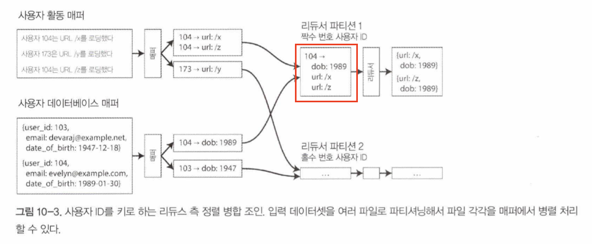

- 시스템을 세 가지로 나누면
    - 서비스(온라인 시스템) - was 같은것을 말하는듯
    - 일괄 처리 시스템(오프라인 시스템) - 매우 큰 입력 데이터를 받아 데이터를 처리하는 작업을 수행하고 데이터 생산. 성능 지표로 처리량이 대표적
    - 스트림 처리 시스템(준실시간 시스템) - 온/오프라인 처리 사이 어딘가.

## 유닉스 도구로 일괄 처리하기

### 단순 로그 분석

- 예시 - 웹 사이트에서 가장 인기가 높은 페이지 5개를 뽑는다면
    - 연쇄 명령 - 유닉스 연쇄 파이프
        
        ```bash
        cat /var/log/nginx/access.log |
        	awk '{print $7}   |
        	sort              |
        	uniq -c           |
        	sort -r -n        |
        	head -n 5         |
        ```
        
    - 맞춤형 프로그램 - 루비
        
        ```ruby
        counts = Hash.new(0)
        
        File.open('var/log/nginx/access.log') do |file|
        	file.each do|line|
        		url = line.split[6]
        		counts[url] += 1
        	end
        end
        
        top5 = counts.map(|url, count| [count, url] }.sort.reverse[0...5]
        top5.each(|count, url| puts "#{count} #{url}"}
        ```
        
    - 어떤게 좋은 방법인가? 취향차이라고 볼 수 있나? 확실한건 대용량 파일을 분석해 보면 차이가 드러난다는것.
- **정렬 대 인메모리 집계**
    - 유지 해야 할 데이터가 적다? ⇒ 데이터를 메모리에 유지해도 충분함 ⇒ 루비
    - 유지 해야 할 데이터가 많다? ⇒ 유닉스 연쇄 파이프가 유리함.(GNU Coreutils 의 sort 유틸리티는 메모리보다 큰 데이터셋을 자동으로 디스크로 보내고 자동으로 여러 cpu 코어에서 병렬 정렬)

### 유닉스 철학

bash 같은 유닉스 셸을 사용하면 작은 프로그램들을 가지고 놀랄 만큼 강력한 데이터처리 작업을 쉽게 구성할 수 있다. ‘결합성’ 이라고 표현 하는데 유닉스에 이런 결합성을 부여하는 것은 아래와 같다.

- **동일 인터페이스**
    - 프로그램 모두가 같은 입출력 인터페이스를 사용한다.
        - 유닉스에선 파일이 입출력 인터페이스이다.
        - 데이터베이스와 비교됨
- **로직과 연결의 분리**
    - 프로그램은 입력이 어디서 들어오는지, 출력이 어디로 나가는지 신경 쓰거나 알 필요 없다.
        - loose coupling, late binding, inversion of control 이라고 함.
    - 제약사항이 있긴 함.
        - 여러개의 입력, 여러개의 출력이 까다로움
        - 출력을 파이프를 이용해 네트워크에 연결을 못함.
            - 방법은 있지만 입출력 연결의 유연하이 없어짐
- **투명성과 실험**
    - 진행상황을 파악하기 쉽다

유닉스의 철학은 아래와 같다.

1. 각 프로그램이 한 가지 일만 하도록 작성하라. 기능 추가 보다는 새로운 프로그램 작성.
2. 모든 프로그램의 출력은 아직 알려지지 않은 다른 프로그램의 입력으로 쓰일 수 있다고 생각하라. 필요한 정보만 출력.
3. 소프트웨어를 빠르게 써볼 수 있게 설계하고 구축하라.
4. 프로그래밍 작업을 줄이려면 미숙한 도움보단 도구를 사용하라.

다 좋은데 단일 장비에서만 실행됨 ⇒ 하둡 같은 도구가 필요하다

### 맵리듀스와 분산 파일 시스템

- 맵리듀스는 수천 대의 장비로 분산 실행이 가능하다
- 하둡 맵리듀스 작업은 분산 파일 시스템(HDFS) 상의 파일을 입력과 출력으로 사용한다.
- HDFS 는 비공유 원칙을 기반으로 하기 때문에 특별한 하드웨어가 필요없고, 일반적인 데이터센터 네트워크에 연결된 컴퓨터면 충분하다.
- NameNode 라고 부르는 중앙 서버에서 특정 파일 블록이 어떤 장비에 저장 됐는지 추적한다.
    - 모든 노드에 데몬이 떠있음.
- 네트워크 상에서 특별한 하드웨어 장치 없이 파일의 접근과 복제가 일어남.
    - 여러 장비에 동일한 데이터 복사
    - 삭제 코딩 방식 - 전체 복제 보다 적은 저장소 부담
- 확장성 뛰어나고 저렴

### 맵리듀스 작업 실행하기

- 맵리듀스의 데이터 처리 패턴
    1. 입력 파일을 읽어서 레코드로 쪼갠다.
    2. 각 입력 레코드마다 매퍼 함수를 호출해와 키, 값을 추출한다. ⇒ 맵
    3. 키를 기준으로 키-값 쌍을 모두 정렬한다.
    4. 정렬된 키-값 쌍 전체를 대상으로 리듀스 함수를 호출한다. ⇒ 리듀스
- 매퍼
    - 모든 입력 레코드 마다 한 번씩만 호출된다. 입력 레코드로부터 키와 값을 추출하는 작업이다.
- 리듀서
    - 매퍼가 생산한 키-값 쌍을 받아 같은 키를 가진 레코드를 모으고, 해당 값의 집합을 반복해 리듀서 함수를 호출한다. 출력 레코드를 생산한다.
- **맵리듀스의 분산실행**
    - 병렬로 수행하는 코드를 직접 작성하지 않아도 여러 장비에서 동시 처리가 가능함. 맵리듀스 프레임워크가 장비간에 데이터가 이동하는 복잡한 부분을 처리.
    - 맵리듀스 작업의 병렬 실행은 파티셔닝을 기반으로 한다.
        - 맵 태스크 - 입력 파일의 블록수에 의해 결정, 리듀스 태스크 : 사용자가 설정
        
        
        
        - 그림에 안 나타나 있지만 입력 파일은 복제본이 존재하고, 복제본이 있는 장비의 cpu, ram 에 여유가 충분하다면 그 장비에서 작업이 수행됨(스케줄러에 의해). ⇒ 네트워크 부하 감소 및 지역성 증가
            - 맵 태스크와 리듀스 태스크가 동일한 장비에서 일어난다는 말인가?
        - 작업 수행하기 전에 데이터가 존재하는 장비로 코드(예를 들어 jar 파일)가 복사된다.
        - 코드 복사 후 장비에서 매퍼태스크가 시작되고, 입력파일에서 한번에 레코드 하나씩 읽어 매퍼 콜백함수로 전달.
        - 키-값 쌍은 반드시 정렬돼야 하고, 단계를 거쳐 정렬을 한다.
            - 맵태스크의 오른쪽 부분, 리듀서 태스크의 왼쪽 부분을 말하는듯.
            - 빨간 네모 박스 부분을 셔플이라고 하는듯.
        - 병합 이후 리듀서의 입력으로 들어갈 때는 서로 인접하게 된다.
- **맵리듀스 워크플로**
    - 맵리듀스 작업을 연결해 워크플로로 구성하는 방식은 꽤 일반적.
    - 하나의 맵리듀스 작업이 결과물을 HDFS에 쓰면 그 다음 작업이 HDFS의 특정 디렉터리를 입력으로 사용
    - 중간중간 파일을 쓰는 방식. 장단점은 419쪽 중간 상태 구체화 에서

### 리듀스 사이드 조인과 그룹화

- **정렬 병합 조인**
    - 예시
        
        
        
        - 한 매퍼는 활동 이벤트를 훑어 사용자 ID를 키로, 활동 이벤트를 값으로 추출하고, 다른 매퍼는 사용자 데이터베이스를 훑어 사용자 ID를 키로 사용자 생일을 값으로 추출.
        
        
        
        - 같은 사용자의 활동 이벤트와 사용자 레코드(그림 상의 dob) 는 같은 파티션으로들어간다.
        - 붉은 박스 안에 사용자 정보(dob), 활동 정보(url) 순으로 배치되게 하는 것을 보조정렬이라고 함.
    - 매퍼 출력이 키로 정렬된 후에 리듀서가 조인의 양 측의 정렬된 레코드 목록을 병합하기 때문에 정렬 병합 조인이라고 함.
- **같은 곳으로 연관된 데이터 가져오기**
    - 조인 연산에 필요한 데이터를 한곳에 모으는 것, 필요한 데이터를 정렬하는것(위에서 본 보조정렬)을 통해 리듀서는 단일 스레드로 동작하는 간단한 코드 조각이 될 수 있으며, 처리량은 높게 유지하면서도 메모리 부담을 줄일 수 있다.
- **그룹화**
    - ‘키’ 가 같은 모든 레코드를 같은 리듀서로 모은다는 점에서 조인 에서의 방식과 비슷함.
    - 특정 사용자가 취한 일련의 활동을 찾기 위해 사용자 세션별 활동 이벤트를 수집 분석할 때 일반적으로 그룹화를 사용함. 세션화 라고 한다.
- **쏠림 다루기**
    - 불균형한 활성 데이터베이스 레코드를 핫키라고 하고
    - 이로 인해 한개의 리듀서에 많은 레코드(?)가 몰리는 것을 핫스팟이라고 한다.
    - 쏠림 완화 방법? - 쏠린 조인(skewed join)
        - 샘플링을 통해  핫키를 결정
        - 핫키를 가진 레코드는 임의의 리듀서로 보냄.
        - 크런치 에서 제공하는 공유 조인 기법도 비슷한 방법. 단, 핫키를 명시적으로 지정해줘야함.
    - 쏠림 완화 방법? - 하이브, 맵사이드 조인

### 맵 사이드 조인

- 데이터에 대한 특정 가정이 가능하다면 맵사이드 조인으로 불리는 기법을 사용해 조인을 더 빠르게 수행할 수 있다.
- **브로드캐스트 해시 조인**
    - 작은 데이터셋과 매우 큰 데이터셋을 조인하는 경우에 가장 간단하게 적용해볼 수 있다.
        - 작은 데이터셋은 전체를 각 매퍼메모리에 적재 가능할 정도로 충분히 작아야 한다.
    - 10-2 에서 보면 사용자 데이터베이스(작은 데이터셋)의 내용을 사용자 활동 이벤트(큰 데이터셋) 에 브로드캐스트 한다고 볼 수 있다.
- **파티션 해시 조인**
    - 맵 사이드 조인의 입력을 파티셔닝 하면 해시 조인 접근법을 각 파티션에 독립적으로 적용 할 수 있다.
    - 하이브에서는 버킷 맵 조인 이라함.
- **맵 사이드 병합 조인(이해를 잘 못함)**
    - 입력 데이터셋이 같은 방식으로 파티셔닝 됐고 같은 키를 기준으로 정렬 됐다면  변형된 맵 사이드 조인을 적용할 수 있다.
    - 이전 맵리듀스 작업에서 리듀스 사이드 정렬 병합 조인을 실행한 것과 같지만, 맵사이드 병합 조인이 유리할 때도 있다.
        - 파티셔닝 및 정렬된 데이터셋이 바로 이 조인 외에 다른 용도로 필요한 경우
- **맵 사이드 조인을 사용하는 맵리듀스 워크플로**
    - 워크플로에서 맵 사이드 조인을 사용할지 리듀스 조인을 사용할지에 따라 출력 구조가 달라진다.
        - 리듀스 사이드 조인:  조인 키로 파티셔닝하고 정렬해서 출력한다.
        - 맵 사이드 조인:  큰 입력과 동일한 방법으로 파티셔닝하고 정렬한다.
    - 맵 사이드 조인을 수행하기 위해서 크기, 정렬, 입력 데이터의 파티셔닝 같은 제약사항이 따른다. 조인 전략을 최적화할 때는 분산 파일 시스템 내 저장된 데이터셋의 물리적 레이아웃 파악이 중요하다.
        - 파티션 수가 몇개인지, 데이터가 어떤 키를 기준으로 파티셔닝 되고 정렬됐는지..
        - 하둡에선 H카탈로그나 하이브 메타스토어 사용하기도 함.

### 일괄 처리 워크플로의 출력

일괄처리를 하는 목적이 무엇일까? 일괄처리는 트랜잭션 처리(OLTP) 도 아니고 분석(OLAP) 에 모두 적합하지 않다.

- **검색 색인 구축**
    - 정해진 문서 집합을 대상으로 전문검색이 필요한 경우 일괄처리가 색인을 구축하는데 매우 효율적
        - 매퍼는 문서집합 파티셔닝
        - 리듀서가  해당 파티션에 대한 색인 구축
        - 색인 파일은 분산 파일 시스템에 저장
    - 워크플로 재실행 하여 색인을 주기적으로 갱신
    - 증분 색인을 구축하는 것도 가능(3장에서)
- **일괄 처리의 출력으로 키-값을 저장**
    - 분류기 같은 머신러닝 시스템 구축 혹은 추천시스템 구축
    - 서비스에서 질의를 할 수 있어야 함 ⇒ 결과물을 디비에 벌크로 적재(데이터베이스 파일을 생성할 수도 있음)
- **일괄처리 출력에 관한 철학**
    - 입력을 불변으로 처리하고 외부 데이터베이스에 기록하는 등의 부수 효과를 피하기때문에 일괄 처리 작업은 좋은 성능을 내면서도 유지보수가 훨씬 간단하다. ⇒ 유닉스의 철학과 동일
    - 여기에 더해 하둡에선 구조화된 파일 형식을 사용하여 효율적인 스키마 기반 부호화를 제공하고 시간이 지남에 따라 스키마를 발전시킬 수 있다.

### 하둡과 분산 데이터베이스의 비교

- **저장소의 다양성**
    - 분산파일시스템에서의 파일은 어떤 데이터모델과 인코딩을 사용해서도 기록할 수 있는 연속된 바이트일뿐.
        - 하둡은 어떤 데이터라도 형태에 상관 없이 HDFS로 덤프 가능
    - 일단 원시 데이터를 수집하고 설계는 나중에 고민(데이터레이크). 데이터의 해석은 소비자가 해결해야 할 문제.
    - 따라서 하둡은 ETL 프로세스를 구현하는데 종종 사용되기도 함.
- **처리 모델의 다양성**
    - 맵리듀스를 이용하여 자신이 작성한 코드를 대용량 데이터셋 상에서 쉽게 실행 가능.
    - HDFS + 맵리듀스 위에 SQL 실행 엔진 구축 가능(HIVE)
    - SQL 질의로 표현하기 힘든 다양한 일괄 처리도 작성할 수 가능
    - 다른 다양한 처리 모델이 개발되었음
- **빈번히 발생하는 결함을 줄이는 설계**
    - 맵리듀스는 맵 또는 리듀스 태스크의 실패를 견딜 수 있다. 개별 태스크 수준에서 작업을 수행하기 때문에 전체 작업으로 보면 영향을 받지 않는다.
    - 하지만 현실에서 장애는 크게 빈번하진 않다.
    - 장애 보단 우선순위가 높은 프로세스를 위한 공간을 마련해 주기 위해 태스크가 종료될 위험이 5% 정도로 높고, 이를 위해 태스크의 예상치 못한 종료에도 견딜 수 있도록 설계 됐다고 보면 됨.
    - 하지만 쿠버네티스같은 경우는 우선순위 선점 방식을 지원하지 않았고, 이것만 봤을 땐 맵리듀스를 이러한 방식으로 설계한 점을 이해하긴 어려움.

## 맵리듀스를 넘어

일괄처리 방법의 대안을 알아봅시다

### 중간 상태 구체화

- 분산 파일 시스템에서 각 태스크의 산출물인 파일들은 단순히 한 작업에서 다른 작업으로 데이터를 옮기는 수단(중간 상태) 이다.
- 중간 상태를 파일로 기록하는 과정을 구체화라고 함.
- 반대로 유닉스의 파이프는 인메모리 버퍼만을 사용하고, 출력을 입력으로 스트리밍 함.
- 중간 상태를 완전히 구체화하는 맵리듀스는 유닉스 파이프에 비해 여러 단점이 존재함
    - 맵리듀스 작업은 입력을 생성하는 모든 선행 작업이 완료됐을 때만 시작 가능. 선행 작업 태스크가 모두 종료될 때까지 기다리고 워크플로 전체 수행 시간이 느려짐.
    - 매퍼는 종종 중복되기도 한다.
    - 중간 상태를 저장하는 것은 파일들이 여러 장비에 복제됐다는 의미이며, 중간 상태는 임시파일이므로.. 과잉조치이다.
- **데이터플로 엔진**
    - 위의 문제를 해결해주는 스파크와 같은 엔진이 개발되었는데, 이 엔진들의 공통점은 전체 워크플로를 독립된 하위 작업으로 나누지 않고 작업 하나로 다룬다는 점이다.
    - 이 엔진들은 여러 처리 단계를 통해 데이터 흐름을 명시적으로 모델링하기 때문에 이 시스템을 데이터플로 엔진이라고 부른다.
    - 맵리듀스와 달리 이 함수들은 맵과 리듀스를 번갈아 수행하는 규칙을 엄격히 지킬 필요가 없음. 더 유연한 방법으로 함수들을 조합하는데, 이런 함수들을 연산자라고 부르고, 연산자의 출력과 다른 연산자의 입력을 연결하는 여러 선택지를 제공한다.
    - 맵리듀스 모델과 비교했을 때 장점
        - 정렬과 같은 값비싼 작업은 실제로 필요할 때만 수행한다.
        - 필요없는 맵 태스크는 없다.
        - 워크플로에 모든 조인과 데이터 의존 관계를 명시적으로 선언하기 때문에 스케줄러가 지역성 최적화를 해줄 수 있다.
        - 연산자 간 중간 상태는 메모리나 로컬 디스크에 기록해서 HDFS 에 중간상태를 기록할 때보다 I/O가 훨씬 적게 든다.
        - 연산자들은 입력이 준비되는 즉시 실행을 시작할 수 있다.
        - 새로운 연산자를 실행할 때 이미 존재하는 JVM을 활용할 수 있어 시작 부담이 적다.
    - 맵리듀스 워크플로와 동일한 연산을 데이터플로 엔진을 사용해 구현할 수 있다. 수행속도도 일반적으로 훨씬 빠름.(최적화로 인해)
- **내결함성**
    - 맵리듀스는 중간 상태를 모두구체화하기 때문에 쉽게 내결함성을 확보한다.
    - 스파크, 플링크, 테즈는 HDFS 에 중간 상태를 쓰지 않기 때문에 내결함성 확보를 위해 다른 접근법을 사용한다.
        - 유효한 데이터로부터 계산을 다시 해서 복구
    - 데이터 재연산시 해당 연산이 결정적인지 파악하는 것이 중요. 연산자를 결정적으로 만드는 것이 중요
- **구체에 대한 논의**
    - 데이터 플로 엔진은 유닉스 파이프와 매우비슷.(연산자의 출력을 다른 연산자로점진적으로 전달하고입력을처리하기전에입력이 완료될 때까지 기다리지 않는다.)
        - 정렬 연산자 같이 전체 입력을 소비해야 하는 경우가 있기도 하지만 워크플로의 여러 다른 부분은 파이프라인 방식으로실행이 가능함.
    - 데이터플로 엔진을 사용할 때 HDFS 상에 구체화된 데이터셋은 보통 작업의 입력과 최종 출력이다.
        - 모든 중간 상태를 파일 시스템에 기록하느 ㄴ수고를 덜어줌.

### 그래프와 반복 처리

- 추천엔진, 랭킹 시스템 분야 등 에서 그래프 처리의 필요성이 떠오르고 있음.
- 맵리듀스로도 처리 할 수는 있지만 상당히 비효율 적인 작업 들에 사용
- **프리글 처리 모델**
    - 일괄 처리 그래프를 최적화 하는 방법으로 벌크 동기식 병렬(bulk synchronous parallel, BSP)가 있는데, 프리글 모델로 불림.
    - 맵리듀스와의 차이점은 정점 반복에서 사용한 메모리 상태를 기억하고 있다는 점. 정점은 새로 드어온 메시지만 처리하면 됨.
- **내결함성**
    - 프리글 프레임워크차원에서 완벽히 결함을 복구함.
        - 끝나는 시점에 모든 정점의 상태를 주기적으로 체크포인트로 저장함으로서 보장됨.
- **병렬 실행**
    - 프리글 프레임워크가 임의의 방법으로 그래프를 파티셔닝 할 수 있다.
    - 그래프가단일 컴퓨터 메모리에 넣을 수 있는 크기라면 단일장비 알고리즘이 분산일괄처리보다 성능이 훨씬 좋을 가능성이 높다.

### 고수준 API와 언어

고수준 인터페이스는 코드를 적게 작성해도 되는 명백한 이점뿐만 아니라대화식 사용도 지원함. 또한 사용자가 시스템을 생산성 높게 사용할 수 있을 뿐 아니라 장비 수준에서도 작업을 더욱 효율적으로 수행할 수 있다.

- **선언형 질의 언어로 전환**
    - 프레임워크가 조인 입력의 속성을 분석해 자동으로 앞서 기술한 조인 알고리즘 중에 어떤 방법이 적절한지 자동으로 결정 가능.
    - MPP 데이터베이스와 비교할 만한 성능을 낸다.
- **다양한 분야를지원하기 위한 전문화**
    - 표준화된 처리 패턴은 재사용 가능한 공통 빌딩 블록을 구현하는 방법이 가치가 있음.