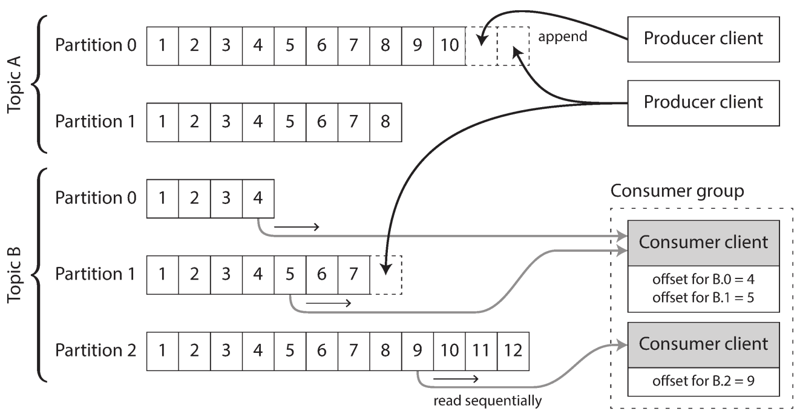
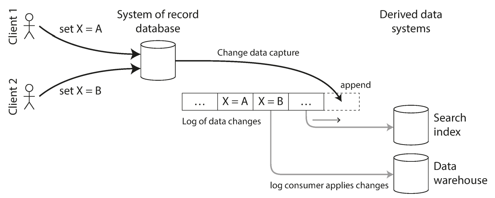
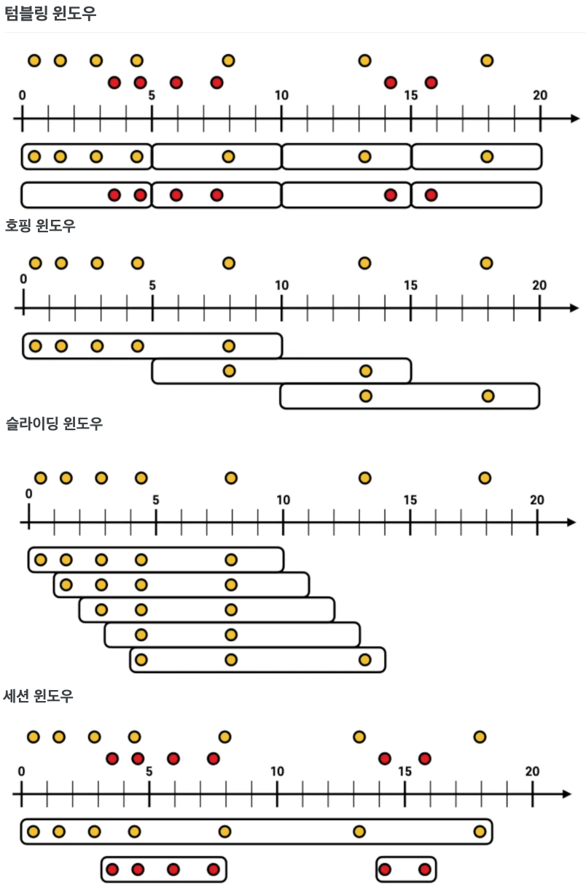

# chapter 11. 스트림 처리
- 요약: 10장과 동일한 아이디어를 데이터 스트렘에 적용해보기. 낮은 지연으로 일괄처리와 동일한 작업 수행
    - 10장은 입력을 유한한 처리로 한정한 가정 (초기에 출력 시작 못함)
    - 이벤트가 발생할 때마다 처리

## 이벤트 스트림 전송
- 폴링 방식은 비용이 큼 -> 새 이벤트를 소비자에게 알리는 편이 낫다 (RDB 의 트리거)
### 메시징 시스템
- 메시지 시스템 구분
    - 생산 속도가 소비보다 빠를때? 버리거나 큐에 메시지 버퍼링, 배압(backpressure, 흐름제어 flow control)
    - 노드가 죽거나 일시적으로 오프라인되면? 손실? 디스크에 기록하거나 복제본 생성
- 전달 방식
    - 직접 전달: (udp, http, rpc) 항상 생산자/소비자가 온라인이라 가정
    - 메시지 브로커 (메시지 큐): 생산자 -(브로커)-> 소비자
- 복수 소비자
    - 로드 밸런싱: 각 메시지는 소비자 중 하나로 전달
    - 팬 아웃: 모든 소비자에게 전달
- 확인 응답과 재전송
    - 소비자 / 생산자 장애로 재전송 -> 메시지 순서에 영향

### 파티셔닝된 로그
- 파티셔닝된 로그
    - 읽기 전용이라 입력에 손상 없음
    - 로그기반 메시지 브로커 (log-based message broker): DB 지속성과 메시징 시스템의 짧은 지연 조합
- 로그를 사용한 메시지 저장소 
    - tail -f 처럼 동작
    - 파티셔닝을 통해 각 파트션과 독립적으로 읽고 쓰기 (offset)
    
- 메시지 방식 비교
    - JSM/AMQP 방식: 메시지 처리 비용 비싸고 메시지 단위로 병렬화 처리화하고 순서가 중요하지 않을 경우 적합
    - 로그기반 방식: 처리량 많고 메시지 처리 속도 빠르고 메시지 순서 중요시 적합
- 그 외
    - 소비자 오프셋: 단일 리더 DB 복제의 log sequence number와 유사
        - 로그 기반 메시지 브로커의 유일한 부수효과
    - 디스크 용량도 고려 필요
    - lag: 소비자가 생산자 못 따라감

## 데이터베이스와 스트림
- 시스템 동기화와 유지
    - 데이터는 목적에 맞게 최적화된 형태로 각각 저장
    - 데이터 주기적 덤프가 느리면 dual write 방법도 있다. -> 실패로 인해, 불일치 가능성
- 변경 데이터 켑처 (change data capture, CDC)
    - DB 에 기록하는 모든 데이터 변화를 관찰해 다른 시스템으로 데이터를 복제할 수 있는 형태로 추출
        
    - 파생 데이터 시스템: 로그 소비자 (저장된 데이터의 또 다른 뷰이기 때문)
    - CDC 구현에 DB 트리거를 사용하기도 함 (고장 쉽고, 오버헤드 큼) -> 복제 로그를 파싱 (스키마 변경 문제가 있지만 트리거보다 견고)
    - 비동기로 동작 -> 복제 지연의 모든 문제가 발생함
    - 초기 스냅숏: 모든 변경을 다 가지는 건 너무 크고 작업도 오래 걸림 -> 로그를 적당히 잘라야 함 -> 로그 컴팩션 (최신값 유지)

### 이벤트 소싱
- 이벤트 소싱: DDD 에서 개발한 기법, 
    - application 상태변화를 모두 변경 이벤트 로그로 저장 (단, CDC와는 추상화 레벨이 다르다.)
    - 이벤트 소싱은 변경/삭제는 없고 "추가"만 존재 (CDC 는 로그 컴팩션을 통해 이전 로그 지우지만 이벤트 소싱은 전체 이벤트 필요)
        - 단, 현재 상태의 스냅샷을 저장하는 매커니즘이 있음 (성능 최적화)
    - 명령과 이벤트
        - 사용자 요청은 "명령" 으로, 실패가 가능함
        - 이벤트는 불편의 로그
- 상태와 스트림 그리고 불변성, 불변 이벤트의 장점
    - 원장(ledger) 에 추가만 하는 방식, 실수가 발생해도 지우거나 고치지 않음. -> 실수 보완 거래내역 추가
        - 현재 상태보다 많은 정보를 담음
    - 동일 이벤트로 여러 뷰 만들기 가능 (목적, 요구사항에 따라 뷰 생성, 읽기 최적화 -> CQRS)
    - 동시성 제어: 단점이 비동기 -> 관심 대상으로 파티셔닝
- 불변성 한계: 개인정보 등 지우기 불가
## 스트림 처리
- 사용 방식
    - DB, cache, 검색등에 기록 후 사용, 이벤트 직접 전달, 신규 스트림 생성
### 스트림 처리의 사용
- 복잡한 이벤트 처리: 이벤트 패턴에 매칭하는 질의 찾기
- 스트림 분석: 대량의 이벤트를 집계하여 통계 지표 뽑기 (윈도우: 집계시간 간격)
### 시간에 관한 추론
- 이벤트 시간과 처리 시간의 의미는 다름
    - 낙오자 (straggler) 이벤트 처리: 무시 vs 수정값 발행
- 어떤 시계? 이벤트 발생 시간 vs 이벤트를 서버로 보낸 시간 vs 서버에서 이벤트 받은 시간
- 윈도우 유형
    - 텀블링 윈도우, 홉핑 윈도우, 슬라이딩 윈도우, 세션 윈도우
        
### 스트림 조인
- 스트림 스트림 윈도우 조인: 두 개의 데이터 스트림을 특정 시간 윈도우 내에서 조인하는 방식
- 스트림 테이블 조인 (스트림 강화):  실시간 데이터 스트림과 정적 테이블을 조인하는 방식
- 테이블-테이블 조인 (Table-Table Join): 구체화 뷰 유지
### 내결함성
- 정확히 한번만 -> 결과론적으로 한번만 처리
    - microbatch & checkpoint
    - 멱등성 (idempotence): 연산 자체 멱등성, 메시지 offset 적용 등
- 실패 후 상태 재구축: 

## 추가

- 키워드
    - 브로커,
    - CDC, 이벤트 소싱
    - 스트림 처리
    - tx outbox pattern

- 참고 자료
    - Kafka Streams를 활용한 이벤트 스트림 처리 삽질기
        - https://youtu.be/YACC1t_oSlA?si=cUQdg7rW8p4uDbkn
    - Kafka를 활용한 이벤트 기반 아키텍처 구축
        - https://youtu.be/DY3sUeGu74M?si=_kpDmjZqERgH2E9W
    - 스트리밍 파이프라인, 시간
        - https://cloud.google.com/dataflow/docs/concepts/streaming-pipelines?hl=ko
    - window processing
        - https://zave7.github.io/kafka/Kafka-034-Winodw-Processing-copy/