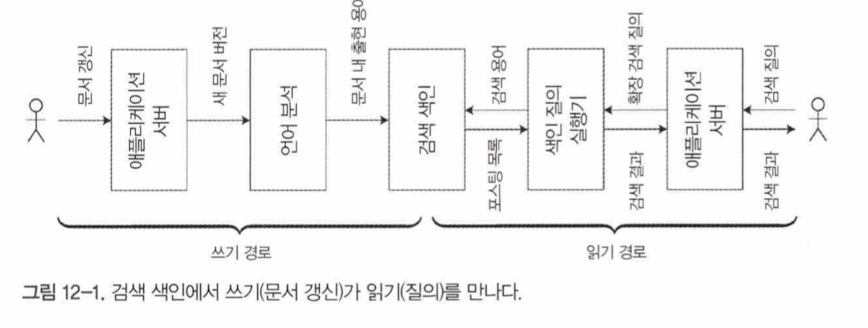

## 데이터 통합

데이터를 사용하는 모든 다른 상황에 적합한 소프트웨어가 있을 가능성은 낮다. 그래서 원하는 애플리케이션 기능을 제공하기 위해서는 반드시 여러 다른 소프트웨어를 함께 엮어 사용해야 한다.

### 파생 데이터에 특화된 도구의 결합

많은 애플리케이션은 요구사항을 만족하기 위해 여러 도구를 결합해 사용한다.

**데이터 플로에 대한 추론**

- 다른 데이터 접근 양식을 만족하기 위해 같은 데이터의 사본을 여러 저장소 시스템에 유지해야 할 때 입력과 출력을 분명히 할 필요가 있다.
- 어디서 데이터를 처음으로 기록하는 지, 어떤 표현형이 어떤 원본에서 파생되는 지, 데이터를 모두 올바른 장소로 올바른 형식으로 어떻게 넣는지 등에 대해 충분히 고려해야 함.
- 파생 데이터 시스템은 이벤트 로그를 기반으로 갱신하면 결정적이고 멱등성을 지녀 결함에서 복구하기 쉬워짐

**파생 데이터 대 분산 트랜잭션**

- 분산 트랜잭션은
    - 서로 다른 데이터 시스템 간 일관성을 유지하는 고전적인 방법.
    - 상호 배타적인 잠금을 사용해 쓰기 순서를 결정
    - 일반적으로 선형성 지원
- 파생데이터 시스템은?
    - CDC와 이벤트 소싱 - 순서를 결정하는 데 로그를 사용.
    - 로그 기반 시스템은 결정적 재시도와 멱등성을 기반으로 함.
    - 비동기로 갱신되기 때문에 기본적으로 동시간 갱신 보장을 하지 않는다.
- 저자 생각
    - XA 는 결함 대응에 취약하고 성능 면에서도 나쁘다. 유용성이 매우 제한적.
    - 로그 기반 파생 데이터가 이종 데이터 시스템을 통합하는 가장 장래성 있는 접근법.

**전체 순서화의 제약**

- 작은 시스템에선 이벤트 로그의 순서 전체를 보장하는 것이 가능함. 그러나 규모가 더 커지고 복잡한 작업부하가 발생하면 한계가드러난다.
    - 대부분의 경우 전체 순서가 정해진 로그를 구축할 때 순서를 결정 하려면 모든 이벤트가 **단일 리더 노드** 를 통해야 한다. 하지만 이벤트 처리량이 커지면 복수의 장비로 파티셔닝을 해야 함.
    - 여러 데이터센터가 **지역적으로 분산** 되어 있다면 데이터센터에 독립적 리더를 둔다. 두 가지 다른 데이터센터에서 나온 이벤트는 서로 순서가 정해지지 않는다.
    - 애플리케이션을 **마이크로서비스**로 배포한다고 가정할 때 서로 다른 두 서비스에서 발생하는 이벤트는 정해진 순서가 없다.
    - 사용자 입력이 들어올 때마다 서버의 확인 응답을 기다리지 않고 바로 갱신하는 앱은 이벤트의 순서가 서버와 클라이언트가 서로 다를 가능성이 높음.

**인과성 획득을 위한 이벤트 순서화**

- 이벤트 간 인과성이 없는 경우 전체 순서가 정해지지 않는것은 큰 문제가 아니다.
- 하지만 인과성이 확실히 없는지 판단하기 어렵고, 이런 경우 문제가 발생할 수 있다.
- 문제를 간단히 해결할 방법은 없다. 시간이 지나면 모든 이벤트가 전체 순서 브로드캐스트의 병목을 거치지 않고서도 인과적 의존성을 효율적으로 캡처하고 파생 상태를 정확히 유지하는 애플리케이션 개발 패턴이 등장할 것이다.

### 일괄 처리와 스트림 처리

저자 생각에 데이터 통합의 목표는 데이터를 올바른 장소에 올바른 형태로 두는 것이다. 일괄처리자와 스트림 처리자는 이 목표를 달성하기 위한 도구.

**파생 상태 유지 - 이 부분은뭘 말하고싶은거지?**

- 일괄 처리는 상당히 강력한 함수형 특징을 가진다.
    - 일괄 처리는 결정적이고 출력이 입력에만 의존하며 명시적 출력 외에는 다른 부수 효과가 없는 순수 함수를 장려하며 입력을 불변으로 간주하고 출력은추가 전용으로만 사용.
    - 스트림 처리도 유사하지만 연산자를 확장해 상태를 관리할 수 있고 내결함성을 지니게 한다.

**애플리케이션 발전을 위한 데이터 재처리**

- 일괄 처리와 스트림 처리는 모두 파생 데이터를 유지할 때 유용
    - 스트림 처리를 - 입력의 변화를 빠르게 파생 뷰에 반영할 수 있다.
    - 일괄 처리 - 누적된 과거 데이터를 재처리해 기존 데이터셋을 반영한 새 파생 뷰를 만들 수 있다
- 기존 데이터를 재처리하는 것은 시스템을 유지보수하기 위한 좋은 메커니즘. 새로운 기능 추가와 변경된 요구사항에 대응할 수 있다
    - 파생 뷰를 이용하여 점진적 발전이 가능
    - 이전 스키마와 새 스키마를 함께 유지해 같은 데이터를 기반으로 두 개의 독립적인 파생 뷰를 만들 수 있으며 점진적으로 새 뷰를 접근하는 비율을 늘려 기존 뷰를 대체할 수 있다.
- 점진적 이전의 장점은 처리의 모든 단계에서 뭔가 잘못됐을 때 쉽게 이전으로 되돌릴 수 있다는 점

**람다 아키텍처**

- 일괄 처리와 스트림 처리를 조합해 사용하는 방법
- 스트림 처리자는 이벤트를 소비해 근사 갱신을 뷰에 빠르게 반영하고 이후에 일괄 처리자가 같은이벤트 집합을 소비해 정확한 버전의 파생 뷰에 반영
- 람다아키텍처의 배경은
    - 일괄처리는 간단해서 버그가 생길 가능성이 적고 스트림 처리는 신뢰성이 떨어지고 내결함성을 확보하기 어렵다는 것
    - 일괄 처리가 느리고 정확한 알고리즘을 사용하는 반면 스트림 처리는 빠른 근사 알고리즘을 사용할 수 있다는 점
- 저자가 생각하는 람다 아키텍처의 문제
    - 일괄 처리와 스트림 처리 양쪽 프레임워크 에서 같은 로직을 유지하는데 상당한 노력이 필요함.
    - 스트림 파이프라인과 일괄 처리 파이프라인은 분리된 출력을 생산하기 때문에 사용자 요청에 대응하기 위해 출력을 병합해야 한다.
    - 전체 과거 데이터를 재처리할 수 있다는 점은 훌륭하지만 그 비용이 크다.

**일괄 처리와 스트림 처리의 통합**

- 최근에는 같은 시스템에서 일괄 처리 연산과 스트림 연산을 모두 구현함으로써 람다 아키텍처의 단점을 빼고 장점만 취할 수 있게 하는 작업이 진행되고 있고, 이미 사용 가능한 기능도 광범위하게 늘어나고 있다.
    - 최근 이벤트 스트림을 다루는 처리 엔진에서 과거 이벤트를 재생하는 능력
    - 스트림 처리자에서 사용되는 정확히 한 번 시맨틱 - 결함이 발생하더라도 결함이 없었던 상황과 동일한 출력을 내는 것을 보장
    - 처리 시간 기준이 아니라 이벤트 시간 기준으로 윈도를 처리하는 도구 - 과거 이벤트를 처리할 때 처리 시간은 의미가 없기 때문

## 데이터베이스 언번들링

추상화 수준에서보면 데이터베이스, 하둡, 운영체제는모두같은 기능을 수행 하지만 실제로는 많은 차이가 있음.

유닉스와 관계형 디비 사이의 긴장감이 수 세기 동안 있었으며, 저자는 이번 장에서 두철학을 화해시키려고 함(?)

### 데이터저장소 기술 구성하기

데이터베이스가 제공하는 다양한 기능에는

- 보조 색인
- 구체화뷰
- 복제 로그
- 전문 검색 색인

이 있다.

**색인 생성하기**

색인 생성하는 과정을 새 팔로워 복제본을 구축하는 과정과대단히 비슷하다. 또한 스트림에서변경 데이터캡처의 예비 과정과도 상당히 유사하다.

`CREATE INDEX` 실행 할 때마다 데이터베이스는 근본적으로 기존 데이터셋을 재처리해서 기존 데이터를 반영하는 새로운 뷰로서 색인을 파생한다.

**모든 것의 메타데이터베이스**

이런 관점에서볼때 전체 조직의 데이터플로가 거대한 데이터베이스처럼 느껴짐. 

- 일괄처리, 스트림 처리, ETL 처리 → 색인이나 구체화 뷰를 최신으로 유지하는 데이터베이스의 하위 시스템과 동일하게 작동
- 일괄 처리자, 스트림 처리자 → 트리거와 스토어드 프로시저, 구체화 뷰 유지 루틴

서로 다른 저장소와처리 도구를 사용하지만 하나의 응집된 시스템으로 구성할 수 있는 두가지 길

- 연합 데이터베이스: 읽기를 통합
    - 폴리스토어라고도 불림. 엄처안게 많은 하단 저자소 엔진과 처리 메서드를 통합해 질의하는 인터페이스를 제공.
    - 여러 시스템에 걸친 쓰기를 동기화하기는 좀 어려움.
- 언번들링 데이터베이스: 쓰기를 통합
    - 단일 데이터베이스 내에서 일관된 색인을 생성하는 것은 내장된 기능. 여러 시스템으로 구성됐을 때도 변경된 모든 데이터가 올바른 장소에 반영되도록 보장해야 한다.
    - 저장소 시스템들을 신뢰성 있게 결합하기쉽게 만드는 것으로, 언번들링 방식과 유사
    - 언번들링 접근법은 하나만 잘하는 작은 도구를 사용하는유닉스 전통을 따른다.

**언번들링이 동작하게 만들기**

쓰기를 동기화 하는 것은 어려운 엔지니어링 문제.

분산 트랜잭션 보단 멱등성을 기반으로 쓰기를 수행하는 비동기 이벤트로그를 사용하는 편이 훨씬 더 강력하고 현실적인 접근법이다.

멱등적 소비자가 사용하는 순서가 정해진 이벤트 로그는 단순한 추상화라서 이종 시스템에 걸쳐 구현하기도 훨씬 더 쉽다.

로그 기반 통합의 가장 큰 장점은 다양한구성 요소 간 **느슨한 결합**이다. 아래 두 가지 수준에서 이 장점이 명백히 드러난다.

- 시스템 수준에서 비동기 이벤트 스트림을 사용하면 전체 시스템이 개별 구성 요소의 장애나 성능 저하가 생겨도 잘 견디게 만들 수 있다
- 인적 수준에서 데이터 시스템을 언번들링하면 소프트웨어 구성 요소와 서비스를 다른 팀에서 각자 개발하고 개선하고 독립적으로 유지보수할 수 있다

**언번들링 대 통합 시스템**

- 언번들링의 목표는 특정 작업부하에 대한 성능 측면에서 개별 데이터베이스와 경쟁하는 것이 아님
- 몇개의 다른 데이터베이스를 결합해 단일 소프트웨어로 가능한 것보다 더 넓은 범위의 작업부하에 대해 좋은 성능을 달성하는 것.

**뭐가 빠졌지?**

- 언번들링 데이터베이스가 존재해서 유닉스파이프와 비슷하게 사용하면 좋겠다.(`mysql | elasticsearch`)
- 캐시를 사전 계산하고좀 더 쉽게 갱신할 수 있으면 좋을것이다.

### 데이터플로 주변 애플리케이션 설계

저장소와 처리시스템을 애플리케이션 코드로 조립하는 언번들링 데이터베이스 접근법을 “데이터베이스 인사이드 아웃” 접근법이라고 함.

**파생 함수로서의 애플리케이션 코드**

데이터셋이 다른 데이터셋으로 파생될 때는 변환 함수 몇가지를 거친다.

- 보조 색인
- 전문 검색 색인 → 단어 분리, 어간 추출, 기본형 처리, 철자 교정, 동의어 식별 등..
- 머신 러닝 시스템
- 캐시

보조 색인용 파생 함수와 같이 데이터베이스에 내장된 기능도 있고, 사용자가 정의해야 하는 코드도 있다.

**애플리케이션 코드와 상태의분리**

오늘날 대부분의웹 애플리케이션은상태 비저장 서비스로 배포된다. 상태는 데이터베이스에 저장하는 형태.

데이터베이스의 변경을 알아채려면 데이터베이스를 주기적으로 폴링 하느게 유일한 방법. 변경 데이터 구독은 이제 막 등장하기 시작한 기능.

**데이터플로: 상태 변경과 애플리케이션 코드 간 상호작용**

데이터베이스를 애플리케이션이직접 조작하는수동적 변수로 취급하는대신 상태와 상태 변경, 그리고 상태를 처리하는 코드 간의 상호작용과 협동에 관해 좀 더 생각해 볼 수 있다.

- 데이터베이스의 변경 로그를 구독 가능한 이벤트 스트림으로 취급하는 것
- 액터와 같은 메시지 전달 시스템

과 같은 개념들이 예시. 이를 통해 파생 데이터셋(캐시, 전문 검색색인, 머신러닝 또는 분석 시스템 등) 을 유지하는 것을 의미하는듯.

파생데이터를 유지하는 것이 전통적인 메시징 시스템의설계 목적인 비동기 작업 실행과는 같지 않다.

- 파생데이터는 상태 변경 순서가 중요할 때가 있다.
- 내결함성은 파생데이터의 핵심. 메시지 하나를 잃는것만으로 파생 데이터셋이 영구적으로 데이터 원본가 동기화가 깨진다. 메시지 전달 & 파생상태 갱신 양쪽 모두 신뢰성이 있어야한다.

애플리케이션 코드로 데이터베이스에 내장된 파생 함수가 일반적으로 지원하지 않는 임의 처리가가능함.

**스트림 처리자와 서비스**

스트림 연산자로 데이터플로 시스템을구성하는 것은 마이크로서비스 접근법과 유사한특징이 상당히 많다. 기반이 되는 통신 메커니즘이 다르긴 한데, 스트림 연산자로 구성한 시스템은단방향 비동기식 메시지 스트림을 사용한다.

데이터플로 시스템을 통해 뛰어난 성능을얻을 수 있다. 예를 들어 외화로 가격이 매겨진 쇼핑 사이트에서 결제를 할 때 환율을 알아야 하는데

- 미리 환율 갱신 스트림을 구독하고 환율이 바뀔 때마다 로컬 데이터베이스에 환율을 기록한다. 구매 처리가 들어올 때 단순히 로컬 데이터베이스에 질의

데이터플로 접근법은 훨씬 빠를 뿐 아니라 네트워크 요청을 하지 않고 다른 서비스 장애에도 훨씬 잘 버틸 수 있다. 

시간 의존성을 잘 처리 하긴 해야함.(시간에 따라 환율이 변경됨)

### 파생 상태 관찰하기

- 쓰기 경로 : 데이터의 여정 중 미리 계산된 부분
- 읽기 경로 : 데이터의 여정 중 누군가가 요청했을 때만 발생하는 부분
- 파생데이터셋은 읽기 경로와 쓰기 경로가 만나는 장소

**구체화 뷰와 캐싱**

- 전문검색을 예로 들면 쓰기 경로는 색인을 갱신하고 읽기 경로는 색인을 사용해 키워드를 찾는다.
- 읽기 경로와 쓰기 경로 사이엔 색인 외에 다른것도 있다.
    - 색인이 존재하지 않는다면 검색 질의는 모든 문서를 스캔
    - 모든 가능한 질의의 검색 결과를 미리 계산(현실적으로 불가능)
    - 공통적인 질의 집합 검색 결과 미리 계산 → 캐시
    - 어떤 방식을 사용하느냐에 따라 두 경로 사이의 경계가 옮겨짐

**오프라인 대응 가능한 상태 저장 클라이언트**

전통적인 웹 브라우저에서 발전(?)된 SPA는 상태 저장할 수 있는 능력을 많이 얻었다. 

- **오프라인우선** 앱 이라 하는데,
    - 로컬 데이터베이스를 이용해 가능한 많은 일을 하고
    - 네트워크 연결이 가능할 때 백그라운드에서원격 서버와 동기화한다.
- 장치의 상태를 서버 상태의 캐시로 생각하고
- 클라이언트 앱의 모델 객체는 원격 데이터센터의 상태를 로컬에 복제한 것
- 화면의 화소는 클라이언트 앱의 모델 객체를 보여주는 구체화 뷰 로 생각

**상태 변경을 클라이언트에게 푸시하기**

웹 페이지 로드 후 서버에서 데이터가 변경 되면 새로 로드될 때까지 브라우저는 해당 변경 사항을 알 수 없다. 신선도가 떨어지는 캐시를 가지게 되는데

최근엔 서버 전송 이벤트와 웹소켓 같은 기능을 사용해 서버가 클라이언트에게 메시지를 보내는 방식의 통신 채널을 제공한다.

장치가 오프라인이어서 서버 상태 변경 알림을 받지 못한 경우는 445쪽에 설명된것 처럼 소비자 오프셋 개념을 이용해 변경사항을 따라잡으면 된다.

**종단 간 이벤트스트림**

리액트 같은 상태 저장 클라이언트와 사용자인터페이스 개발용 최신 도구는 이미 내부적으로 사용자 입력을 표현하는 이벤트 스트림이나 서버 응답스트림을 구독하는 방식을 사용해 클라이언트 측 상태를 관리한다.

서버가 상태 변경 이벤트를 클라이언트 측 이벤트 파이프라인으로 푸시하게끔 프로그래밍 모델을 확장하는 것 또한 매우 자연스럽다.

단순히 요청/응답 상호작용 방식에서벗어나발행/구독 데이터플로 방식으로 변경해야함

**읽기도 이벤트다**

- 읽기 요청을 이벤트 스트림으로 표현하고 읽기 이벤트와 쓰기 이벤트 모두를 스트림 처리자를 통해 보내는 방법도 가능하다. 스트림 처리자는 읽기 결과를 출력 스트림으로 방출해 읽기 이벤트에 응답한다.
- 이방식은 스트림과 데이터베이스 사이의스트림 테이블 조인 수행과 동일
- 읽기 이벤트를 기록하면 인과적 의존성(사용자가특정 결정을 내리기 전에 봤던 것 재구성)을 추적하기가 더 용이함.(추가적인 저장소 필요, I/O 비용 더 발생)

**다중 파티션 데이터 처리**

- 단일 파티션에만 접근하는 질의를 처리하기위해 스트림을 통해 질의를 보내고 응답 스트림을 수집하는 노력은 과잉작업이 될 수 있다.
- 하지만 스트림 처리자가 이미 제공하는 메시지 라우팅과 파티셔닝, 그리고 조인용 인프라를 이용하면 이 개념이 여러 파티션의 데이터 통합이 필요한 복잡한질의를 분산 실행할 수 있는 가능성을 열어준다.
- 다중 파티션 조인 기능이 필요하다면 이 기능을 제공하는 데이터베이스를 사용하는 편이 더 간단하지만 스트림을 사용하면 기성 솔루션의 한계를 넘어서는 대규모애플리케이션을 구현하는 방안이 생긴다.

## 정확성을 목표로

### 데이터베이스에 관한 종단 간 논증

데이터베이스에서 직렬성 트랜잭션 같은 안전성 속성을 지원한다고 해도 애플리케이션의 버그로 인해 데이터 유실이 생길 수도 있다.

**연산자의 정확히 한 번 실행**

- 메시지 처리 중 뭔가 잘못된다면 포기하거나 재시도할 수 있다. 재시도 를 하게 되면 메시지를 두 번 처리 되고, 이는 데이터 손상의한 형태이다.
- 연산을 멱등으로 만드는 것이 가장 효과적인 접근법 중 하나.

**중복 억제**

- 중복 발생 & 중복 제거 필요성은 스트림 처리 외에도 많은 곳에서 일어남. 중복 제거를 위해 많은 노력을 했지만 충분하지 않다.
    - TCP는 네트워크 상에서 패킷을 잃어버렸는지 중복됐는 지 확인. 재전송 하거나중복 패킷을 제거. 하지만 이러한 처리는 TCP 연결 문맥 내에서만 작동함.(디비 중복 연산을 제거를 하지는 못함)
    - 데이터베이스 에선 2단계 커밋을 하기도 하지만 트랜잭션이 한번 실행되도록 보장하기에 충분하지 않다.

**연산식별자**

- 연산을 멱등적으로 만들기 위해 데이터베이스가 제공하는 트랜잭션 메커니즘에 의존하는 것은 충분하지않다.
- 연산의 고유 식별자(UUID 같은) 를 만들어 클라이언트 애플리케이션 내 수은 필드에 포함 혹은 유효한 모든 폼 필드의 해시 값을 계산해서 연산 ID 를 만든다.
- 같은 연산 ID 를 가지게 되면 한번만 연산을 실행 할 수 있다.

**종단 간 논증**

- **종단 간 논증** - 일반적인 원리의한 예로 중복 트랜잭션 억제 시나리오가있다.
    - 문제 기능은 통신 시스템의종단점에 위치한 애플리케이션의지식과 도움이 있어야만 완벽하고 정확하게 구현 가능하다. 따라서 문제 기능을 통신 시스템 자체 기능으로 제공하는 것은 불가능하다.
    - 중복 억제 기능을 문제 기능으로 볼 수 있다.
    - 중복 억제 기능에서의 해결책은 최종 사용자 클라이언트로 부터 데이터베이스에 이르는 모든 경로에 트랜잭션 식별자를 포함하는 방법.
- 종단 간 논증은 데이터 무결성 검사, 암호화에도 적용 가능하다.

**종단 간 사고를 데이터 시스템에 적용하기**

- 데이터시스템에는 트랜잭션이라는 강력한 안전성 속성을 지원하지만 앞서 살펴본것 처럼 트랜잭션 만으로는 애플리케이션에 데이터 손실이나 손상이 발생하지 않는다고말할 수 없다.(분산 트랜잭션은 값이 비싸기도 하다)
- 저자는 종단간 정확성 속성을 제공하기쉽게 만들어주고 대규모 분산 환경에서도 좋은 성능과 좋은 운영적 특성을 유지하는 내결함성 추상화를 탐구하는 것이 가치가 있다고 생각함.

### 제약 조건 강제하기

**유일성 제약 조건은 합의가 필요하다**

- 9장에서 분산설정으로 유일성제약 조건을강제하기 위해서는 합의가 필요하다는 점을 설명했다.
- 합의를 달성하는 가장 일반적인 방법은 단일노드를 리더로 만드는것.
    - 유일성이 필요한 값으로 파티셔닝 하면 확장 가능
- 비동기 마스터 복제는 제약조건을 강제 하기 위해선 동기식 코디네이션을 피할 수없다.

**로그기반 메시징의 유일성**

- 로그는 모든 소비자가 동일한순서로 메시지를 보도록 보장하고, 이 보장을 **전체 순서 브로드캐스트(total order broadcast)** 라 부른다. 이것은 합의와 동일하다

**다중 파티션 요청 처리**

- 여러 파티션에서 제약조건을 만족하면서 원자적 연산을 실행해야 할 떄
    - 데이터베이스의 전통적인 접근법에서는 트랜잭션을 실행 할 때 모든 파티션에 걸쳐 원자적 커밋이 필요하다.
    - 그러나 파티셔닝 된 로그를 사용 하면 원자적 커밋 없이도 동등한 정확성을 달성 할 수 있다.

### 적시성과 무결성

- 적시성
    - 사용자가 시스템을 항상 최신 상태로관측 가능하다는 의미. 일관성이 없는 상태는 일시적이고, 기다렸다 재시도 하면 결국 해소됨.
        - 적시성이 훼손되면 **최종적 일관성**이 보장 안됨
    - 무결성
        - 손상이 없다는 의미. 누락된 데이터도 없고모순된 데이터도, 잘못된 데이터도없다는 뜻.
        - 무결성이 훼손되면 **영구적 불일치**가 나타남.

**무결성**이 적시성보다 훨씬 중요하다고 필자는 얘기한다.

**데이터플로 시스템의 정확성**

- ACID 트랜잭션은 대개 적시성(예. 선형성)과 무결성(예. 원자적 커밋) 양쪽 모두 보장함.
- 데이터플로 시스템에는 적시성과 무결성을 분리한다.
    - 이벤트스트림을 비동기로처리할 때 소비자가반환하기 전에 명시적으로 메시지 도착을 기다리지 않으면 적시성은 보장 되지 않음.
    - 정확히 한 번 or 결과적으로 한번 시멘틱은 무결성을 보존하는 메커니즘.
        - 이벤트 유실 or 이벤트 중복 처리 되면 무결성이 깨짐
    - 내결함성 메시지 전달과 중복 억제는 결함 상황에서 데이터 세스템의 무결성을 지키는 데 매우 중요한 기능.
- 스트림 처리시스템은 분산 트랜잭션과 원자적 커밋 프로토콜 없이 무결성을 보존할 수 있다.(p.524)

**느슨하게 해석되는 제약조건**

- 많은 애플리케이션이 훨씬 완화된 유일성개념을 사용해 모든 이벤트를 단일 노드를 통해 특정 파티션으로 보내 처리하는 방식을 피한다.
    - 좌석 예약 을 할 때 보상 트랜잭션을 이용하여 다시 예약을 하도록
    - 재고보다 많은 상품을 주문하면 소비자에게 배송 지연을 사과하거나 가격 할인
    - 항공사에서 초과예약을 받거나
    - 잔고보다 더 많은 돈을 뺀다면 초과 인출 수수료 부과하고 빚진 돈을 갚으라고 요구
- 이렇게 사과 하는 것이 수용 가능하면 낙관적으로 쓰기 후 사후에 제약조건을 검사하는 방식이 합리적일 수 있다.
- 무결성이 반드시 필요함. 적시성은 사후에 문제 해결 가능.

**코디네이션 회피 시스템**

- 앞서 본 것 처럼
    - 원자적 커밋과 선형성, 파티션에 걸친 동기 코디네이션 없이도 파생 데이터에 대한무결성 보장을 유지할 수 있다.
    - 느슨한 제약조건을 사용해도 실제로 괜찮다.
    
    데이터 플로 시스템은 코디네이션 없이도 많은 애플리케이션용 데이터 관리 서비스를제공할 수 있고 여전히 무결성을 강력히 보장한다.
    
- 이런 **코디네이션 회피** 데이터세스템에는 많은 장점이 있다. 동기식 코디네이션이 필요한 시스템 보다 성능이 더 좋고 더 나은 내결함성을 지닌다.
- 중간 어딘가 적절한 지점을 찾아야 한다. 사과를 너무 많이 한다면 그것도 안좋으니.

### 믿어라. 하지만 확인하라.

**소프트웨어 버그가발생해도무결성 유지하기**

- 소프트웨어 버그의 위험성은 항상 존재한다. 디비조차도.
- 우리가 만드는 애플리케이션에는 더 심하다. 특히 트랜잭션 도중에 버그가 발생하는 경우 무결성이 깨질 수 있다.
- 따라서 애플리케이션에서 데이터베이스를 어떤 식으로든 정확하게 사용해야함.

**약속을 맹목적으로 믿지 마라**

- 버그를 고치고 오류의원인을 추적하기위해 데이터 무결성을 체크하는 방법이 필요하고, 이를 **감사(auditing)** 이라 함.
- 성숙한 여러 시스템은 가능성이 낮지만 뭔가 잘못될 가능성을 고려하고 위험을 관리하는 비슷한 경향이 있다.
- 맹목적으로 모든것이 잘 동작한다고 믿으면 안됨.

**감사 기능 설계**

- 사후에 트랜잭션 로그를 캡처해서 본다면 이 트랜잭션이 무엇을 뜻하는지 알기 어렵다. 왜 이런 변경을 수행했는지 알기 힘듦.
- 이벤트 기반 시스템은 더 나은 감사 기능을 제공한다.
- 데이터플로를 명시적으로 만들면 데이터의 유래가 더욱 명확해져 무결성 확인이 좀 더 수월해진다.
- 결정적이고 잘 정의한 데이터플로를 사용한다면 디버깅과 시스템에서 왜 그렇게 행동했는지 판별하기 위한 추적이 쉬워진다.

**다시 종단 간 논증**

- 시스템의 모든 개별 구성 요소가 절대로 손상되지 않는다고 완전히 믿기 어렵다면 최소한 데이터의 무결성만이라도 주기적으로 확인해야 한다.
- 데이터 시스템의무결성을 확인하는 방법은 종단간 방식이 최선이다.
- 종단 간 무결성 학인을 꾸준히 하면 시스템이 정확하다는 확신이 높아져 더 빠르게 옮겨갈 수 있다.

**감사 데이터 시스템용 도구**

- 감사로그로 데이터베이스 상태의 무결성을 보장하는것은 여전히 어렵다.
- 암호화 도구를 사용해 시스템의 무결성을 증명하려는 시도도 있음.
    - 암호화폐, 블록체인, 분산 원장(distributed ledger) 기술
- 암호화 감사 기능과 무결성 확인은 종종 머클 트리에 의존한다.
- 성능 불이익이 낮으면서도 암호화 감사 기능이 없는 시스템과 동등한 수준으로 확장 가능해지려면 좀 더 발전해야함.

## 옳은 일 하기

소프트웨어 개발에 윤리적 선택이 갈수록 중요해지고 있다. 기술은 그 자체로 좋거나 나쁜것이 아니다. 어떻게 사용하고 어떻게 사람들에게 영향을 주는가가 중요함.

### 예측 분석

날씨 예측이나 질병 확산 예측 분석을 하는 것은 중요하다. 또한 기결수의 재범 여부나 채무자의 채무 불이행 가능성 또는 보험 고객의 고액 청구 여부를 예측하기도 함. 

이런 예측은 개인의 삶에 직접적 영향을 준다.

문제에 신중히 접근하고 조금이라도 의심이 들면 아니오 라고 말하는 편이 낫지만 유죄의 증명 없이, 변론할 기회도 없이 사람을 사회 참여에서 배제시킬 수도 있다.

**편견과 차별**

- 사람은 편견을 가지기 쉬운데, 알고리즘 역시 편견이 있는 입력을 통해 학습해 편견을 증폭해 출력을 내보낼 가능성이 있다.
- 예측 분석 시스템은오직 과거로부터 추정한다. 과거가 차별적이라면 예측 분석 시스템은 차별을 성문화한다.
- 사람만이 가능한 도덕적 상상력을 통해 데이터모델을 도구로 사용해야 한다.

**책임과 의무**

- 알고리즘이 실수 했을 때 누가책임을 져야 하는가?
- 풍부한 데이터를 기반으로 예측을 한다고 해도 데이터는 통계적이다. 개별 사례에 대해 잘못된 판단을 할 수 있다.
- 의사결정에 데이터를 최우선으로 하는 맹목적 믿음은 망상일뿐 아니라절대적으로 위험하다.
- 데이터가 사람을 해치지 않게 하고 그 대신 긍정적 잠재력을 실현하는 방법을 찾아야 한다.

**피드백 루프**

- 추천시스템같은 경우도 사람들에게 즉각적으로 지대한 영향을 미치지 않는것 처럼 보인다.
- 하지만 추천 시스템은 에코 채임버가 돼 버릴지도 모른다. 선거 운동에서 소셜미디어 에코 채임버의 영향력은 이미 잘 알려져 있다.
- 예측 분석 시스템의 자기 강화 피드백 루프 때문에 치명적 문제가 발생할 수 있음.

### 사생활과 추적

데이터 수집 그 자체로 윤리적 문제가 있다.

**감시**

- 지금 우리는 사람이 사는 모든 공간에 인터넷이 연결된 마이크가적어도 한 개는 포함된 세상으로 빠르게 접근하고 있다.
- 이런 장치 중 다수가보안상 심각한 문제를 일으킬 수 있는 기록을 가지고 있다.
- 이런 기기로 수집한 데이터의 사용목적은 무엇일까? 단지 추천을 더잘하고 개인에게 더 적합한 마케팅을 하려는 목적이라고 생각 할 수도 있지만 지난 절의 예측 분석 논의와 연관지어 보면 과연 선의로만 생각 할 수 있을까?

**동의와 선택의 자유**

- 사용자가 사용자의 행동을 추적하는 데이터 수집에 동의했다고 해서 문제가 없다고 할 수 있을까?
- 사용자와 기업간의 관계는 매우 비대칭적이고 일방적이다. 데이터를 얼마나 제공하고 대가로 어떤 서비스를 받는지 협상할 수 있는 대화나 선택사항이 없다.
- 대중적으로 사용되는 서비스라면 그 서비스를 사용하지 않기 위해 지불해야 할 사회적 비용이 존재한다.

**사생활과 데이터 사용**

- 사생활 보호 의 뜻은 사실 누구에게 어떤 것을 보여줄 것인지, 어떤 것을 공개로 할 것인지, 어떤 것을 비밀로 할 것인지 고를 수 있는 자유를 가진다는 의미이다.
- 감시 인프라를 통해 데이터를 추출 한 후 데이터를 획득 한 기업은 “우리가 당신의 데이터를 올바르게 사용한다고 믿어주세요” 라고 말한다. ⇒ 무엇을 공개할지 여부를 결정할 권리가 기업에게 넘어갔다. 사생활 보호가 안된다고 보면 된다.
- 이런 식으로 개인의 사생활 권리르 ㄹ기업에 대규모로 이전하는 것은 역사적으로 전례가 없다.

**자산과 권력으로서의 데이터**

- 사용자가 서비스를 이용하면서 나오는 행동데이터는 서비스의 핵심 자산이다.
- 이런 데이터는 기업 뿐 아니라 정부 역시 원한다. 기업이 위험해지면 팔아치울수 잇는 자산 중 하나가 되기도 한다.
- 사람들에 대해 많은 데이터를 축적해놓은 기업이나 국가는 시민들에 대한 통제력이 강화된다.(그걸 추구하지 않을지라도)

**산업 혁명의 기억**

- 산업혁명을 통해 장기간에 걸쳐 경제 성장을 지속했고 생활 수준을 개선했다. 하지만 매연과 대기 오염, 폐기물에 의한수질 오염은 끔찍고, 피해는 힘없는자들이 주로 입었다.
- 이런 피해들로부터 보호해주는 수단이 확립되긴 했지만 상당한 시간이 걸렸다.
- 산업혁명의 어두운 면을 관리할 필요가 있었던것 처럼 정보화시대에도 이러한 어두운면을 관리해줘야 한다.

**법률과 자기 규제**

- 오늘날 인터넷 맥락에 맞는 법률이나 규제가 갱신되어야 한다.
- 사용자를 존중, 존엄, 대리의 자격이 있는 인간이라는 점을 염두에 둬야 한다.
- 각 개인은 자신의사생활을 보호할 수 있어야 한다. 데이터 통제권이 있어야 하며 감시를 통해 통제권을 훔쳐서는 안된다.
- 정확히 어떻게 이를 달성할지는 아직 해결되지 않은 문제이지만 문화 태도 전반에 걸친 변화가 필요하다.
