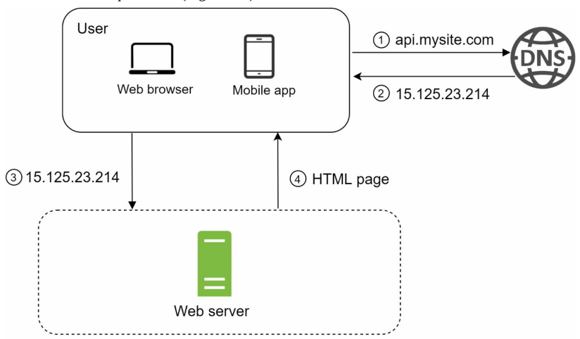
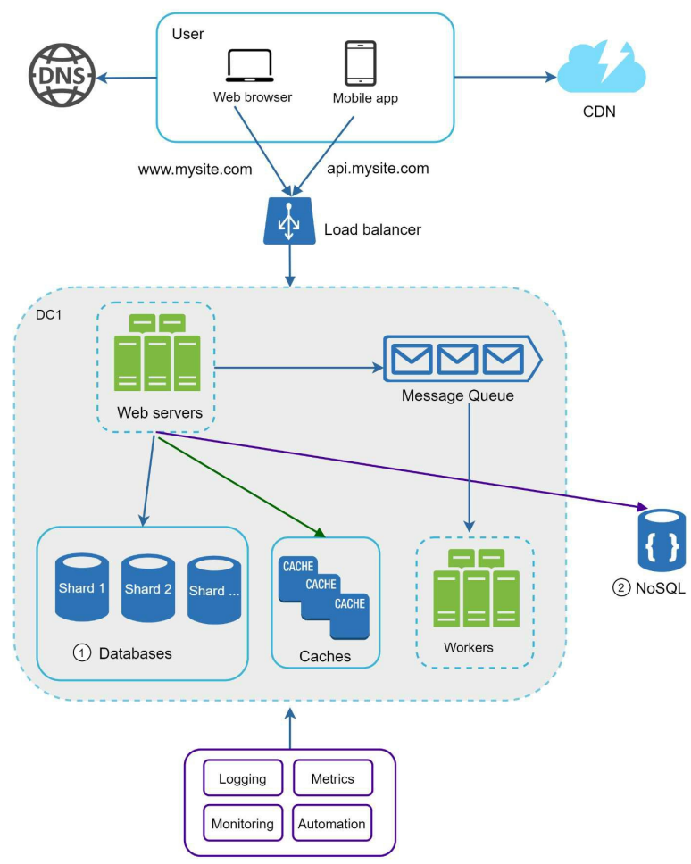

# ch01. 사용자 수에 따른 규모 확장성
## 내용 정리
- 단일 서버 응답 요청 흐름
    - 
- 데이터베이스
    - 확장: 서버 여러대 (웹계층), 데이터베이스 (데이터 계층)
- 로드 밸런서 
- 캐시: expire, 일관성 유지, 장애 (-> 분산), 크기, eviction
- CDN: 비용, expire (TTL), 장애, invalidation (무효화 -> param date)
- session (client): sticky session -> nosql 에 사용자 인증 정보
- data center: geoDNS (사용자 위치에 따라), DR, 해결할것 (트래픽 우회, 데이터 동기화, 테스트&배포)
- message queue: 느슨한 결합을 위해, 독립적 확장
- 로그, 매트릭, 테스트 자동화 (CI/CD)
- DB
    - 수직적(scale up) vs 수평적
        - 샤딩: 작은 단위로 분할
        - 샤딩 도입 후 새 문제: 재샤딩 (너무 많아짐, 불균등), 유명인사(celebrity), 조인
    - 
## 인상 깊은 대목, 자기 생각, 주요 포인트, 추가 자료 등
- 요약
    - 스타트업 성장기: 한대 -> 여러 서버 -> DB -> cache -> CDN 
        - 다 갖추고 시작하는 기본 틀 (얼마나 각 부분에서 더 고려할지)
    - 도메인/시스템 보고 고려할것: 메시지큐, 데이터센터 이중화, DB 샤딩

- 추가 자료
    - aws: 천만 사용자를 위한 클라우드 아키텍처, 5년간의 여정 (발표 유툽)
        - https://aws.amazon.com/ko/blogs/korea/5-years-scalling-up-to-10-million-users/
    - multi master
        - https://en.wikipedia.org/wiki/Multi-master_replication