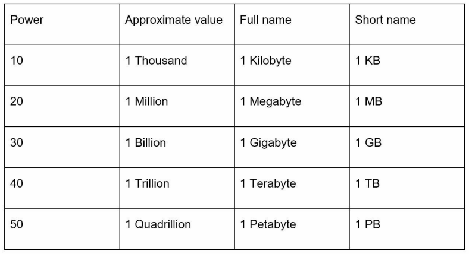
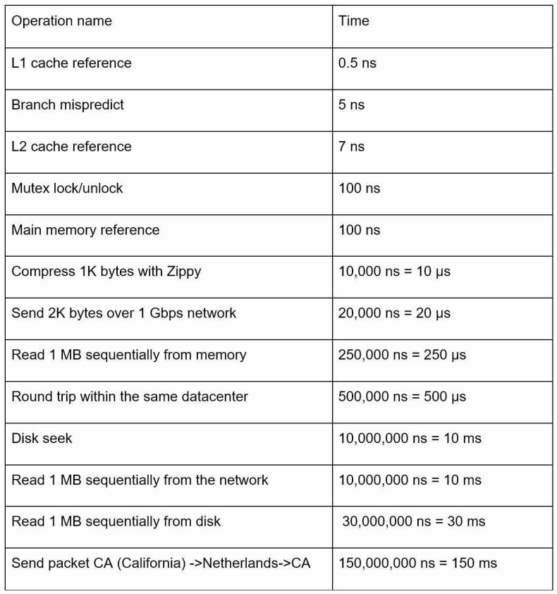

# ch02. 개략적인 규모 추정
## 내용 정리

- 2제곱 기본 외우기
    - 
    - 
        - memory는 빠른데, 디스크 느림
        - 디스크 담색 (seek) 피하기
        - 압축 알고리즘은 빠르다 (-> 전송 전 압축)
        - 데이터 센터간 주고 받는 시간은 느리다.

- 올바른 절차 외우기
    - 근사치로 계산 (QPS, TPS 등 트래픽)
    - 가정 적어두기 (+ 이야기해서 정리)
    - 단위 붙이기
    - 규모 추정 문제 대략적인 부분 외우기 (QPS, 저장소 요구랑, 서버 수 등)

## 인상 깊은 대목, 자기 생각, 주요 포인트, 추가 자료 등
- 2 제곱근 기본적인 부분 체크
- 올바른 절차 외우기 (가정)

- 자료
    - 기본 알고리즘 시간 복잡도: http://infotechgems.blogspot.com/2011/11/java-collections-performance-time.html